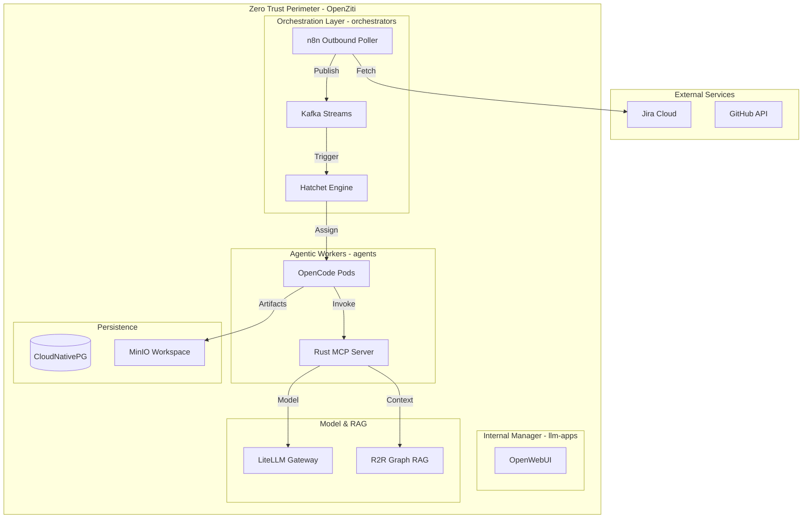
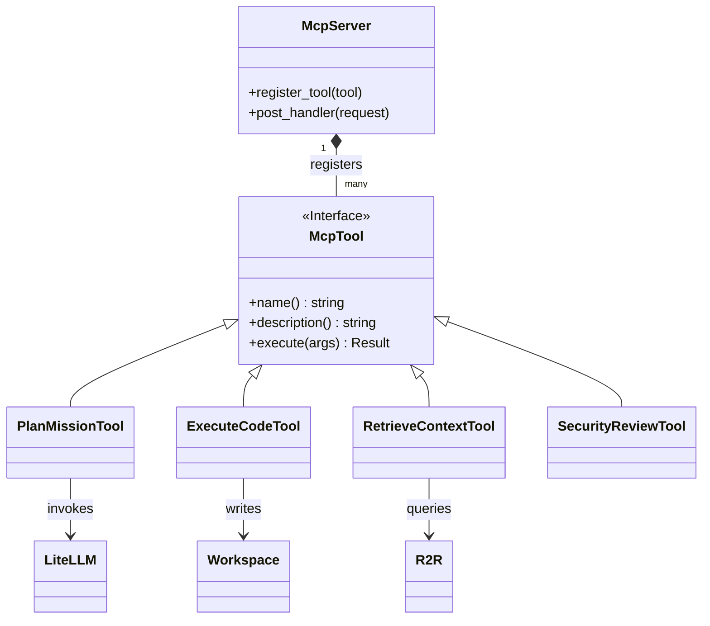

# 🏗️ Architecture: Dark Gravity CA/CD

## 🛡️ Zero Trust Architecture (ZTA)

The system operates strictly within a **Zero Trust** perimeter. No inbound traffic is allowed, and all outbound traffic to external APIs (Jira, GitHub) is strictly governed by **OpenZiti** and Kubernetes **NetworkPolicies**.

### 🛠️ High-Level System Diagram

---

## 🏗️ Rust Workspace Components

The codebase is organized as a modular Rust workspace under `crates/`.

| Crate | Responsibility | Key Dependencies |
| :--- | :--- | :--- |
| `factory-core` | Shared domain models, core types, and utility functions. | `serde`, `uuid` |
| `factory-application` | High-level application logic and business workflows. | `factory-core` |
| `factory-infrastructure` | External integrations: LiteLLM, R2R, Kafka, MinIO clients. | `reqwest`, `async-trait` |
| `factory-mcp-server` | MCP (Model Context Protocol) server. Exposes tools via HTTP. | `axum`, `tokio` |
| `factory-cli` | Developer CLI for local testing and management. | `clap` |

---

## 🛠️ MCP Server & Tooling Lifecycle

The `factory-mcp-server` is the "Hands" of the factory. It provides a standardized interface for agents to interact with the cluster and external services.

### Key Tools
1. **PlanMissionTool**: Uses LLM to decompose high-level goals into a Directed Acyclic Graph (DAG) of tasks.
2. **ExecuteCodeTool**: Generates and executes code in a sandboxed environment (using temporary pods or Firecracker).
3. **RetrieveContextTool**: Connects to the R2R Graph RAG system to fetch relevant code patterns.
4. **SecurityReviewTool**: Analyzes code for vulnerabilities and architectural violations.

---

## 🔐 Security & Governance

- **OIDC Authentication**: All user access to **OpenWebUI** and **LiteLLM** is federated via Keycloak.
- **Sealed Secrets**: API tokens (GitHub, Jira, LiteLLM) are NEVER stored in plain text. They are encrypted using the **Bitnami Sealed Secrets** controller before being committed to GitOps.
- **Micro-segmentation**: Only the `n8n` pods have internet egress. Agents are strictly internal-only.
