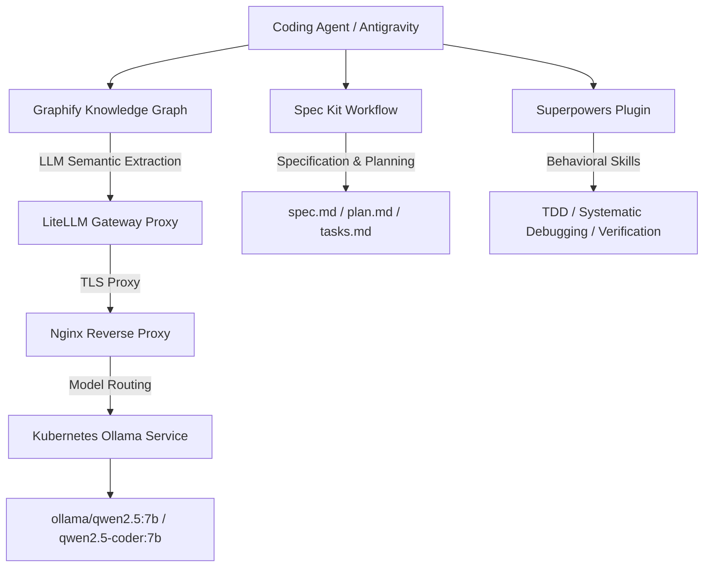
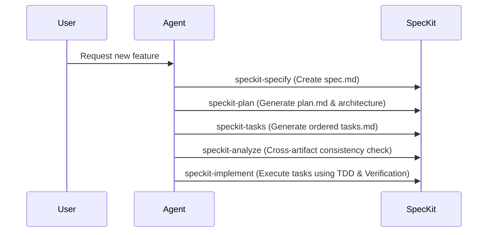
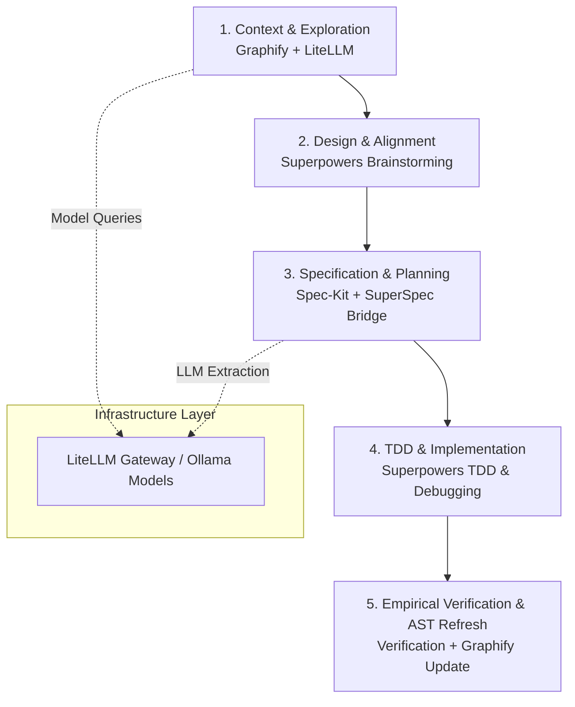

# Comprehensive Setup Guide: Spec Kit, Superpowers, Graphify, and LiteLLM Gateway Integration

This document provides a step-by-step installation, configuration, and operational guide for integrating **Spec Kit**, **Superpowers**, and **Graphify** powered by an internal **LiteLLM Gateway** (with models like `ollama/qwen2.5:7b` and `ollama/qwen2.5-coder:7b`).

---

## Architecture Overview



---

## 1. LiteLLM Gateway Setup & Model Configuration

The LiteLLM Gateway acts as a central OpenAI-compatible endpoint (`https://litellm.ziti/v1` or `http://litellm.llm-apps.svc.cluster.local/v1`) providing unified access to local and cloud LLMs.

### 1.1 LiteLLM Model Routing ConfigMap

In `gitops_internal_lgcorzo/infrastructure/llm-apps/litellm/litellm-config-cm.yaml`:

```yaml
apiVersion: v1
kind: ConfigMap
metadata:
  name: litellm-config
  namespace: llm-apps
data:
  config.yaml: |
    model_list:
      - model_name: ollama/qwen2.5:7b
        litellm_params:
          model: ollama_chat/qwen2.5:7b
          api_base: "http://ollama-service.llm-apps.svc.cluster.local:11434"
          api_key: "EMPTY"
          num_ctx: 16384

      - model_name: ollama/qwen2.5-coder:7b
        litellm_params:
          model: ollama_chat/qwen2.5-coder:7b
          api_base: "http://ollama-service.llm-apps.svc.cluster.local:11434"
          api_key: "EMPTY"
          num_ctx: 32768
```

### 1.2 Nginx Reverse Proxy ConfigMap (`client_max_body_size`)

To prevent `HTTP 413 Request Entity Too Large` errors when Graphify or Spec Kit sends large context batches:

In `gitops_internal_lgcorzo/infrastructure/llm-apps/litellm/litellm-nginx-config-cm.yaml`:

```nginx
http {
    include       mime.types;
    default_type  application/octet-stream;
    sendfile        on;
    keepalive_timeout  65;
    client_max_body_size 100M;  # Required for large LLM payloads
    ...
}
```

### 1.3 LiteLLM Environment Variables

Set the following environment variables in your shell or agent environment:

```bash
export OPENAI_BASE_URL="https://litellm.ziti/v1"
export OPENAI_API_KEY="sk-1234"
export OPENAI_MODEL="ollama/qwen2.5:7b"
export LITELLM_API_BASE="https://litellm.ziti/v1"
```

---

## 2. Graphify Knowledge Graph Setup

Graphify parses your repository into a navigable AST knowledge graph and uses LiteLLM Gateway models for semantic extraction on markdown, documentation, and images.

### 2.1 Installation

Install Graphify using `uv` or `pip`:

```bash
uv tool install graphifyy
# or: pip install graphifyy
```

### 2.2 Register Agent Hooks

To integrate Graphify into your coding assistant environment:

```bash
graphify antigravity install
# or for Codex: graphify codex install
```

### 2.3 AST-Only Graph Update (Free / No LLM Cost)

To update code symbols, dependencies, and file relationships without invoking LLMs:

```bash
graphify update .
```

### 2.4 Semantic Graph Extraction via LiteLLM Gateway

When running full semantic extraction over documentation using `ollama/qwen2.5:7b` via LiteLLM:

```bash
python3 -c '
import httpx, urllib3
urllib3.disable_warnings()
# Bypass internal self-signed TLS verification for LiteLLM gateway
_orig = httpx.Client.__init__
httpx.Client.__init__ = lambda self, *a, **kw: _orig(self, *a, **{**kw, "verify": False})

import os, sys
os.environ["OPENAI_BASE_URL"] = "https://litellm.ziti/v1"
os.environ["OPENAI_MODEL"] = "ollama/qwen2.5:7b"
os.environ["OPENAI_API_KEY"] = "sk-1234"

from graphify.__main__ import main
sys.argv = ["graphify", "extract", ".", "--backend", "openai", "--token-budget", "15000"]
main()
'
```

---

## 3. Superpowers Plugin Setup

Superpowers provides behavioral skills for structured development, plan execution, and verification.

### 3.1 Installation

Ensure Superpowers is placed in your global customization root (`~/.gemini/config/plugins/superpowers`) or project customization root (`.agents/`):

```bash
mkdir -p ~/.gemini/config/plugins/superpowers
```

### 3.2 Key Superpowers Skills

| Skill | Purpose |
| :--- | :--- |
| `brainstorming` | Explores user intent, requirements, and design choices prior to writing code. |
| `writing-plans` | Converts feature requirements into actionable `implementation_plan.md`. |
| `executing-plans` | Executes implementation plans with review checkpoints. |
| `subagent-driven-development` | Dispatches independent tasks to specialized parallel subagents. |
| `systematic-debugging` | Enforces root-cause investigation before applying bug fixes. |
| `test-driven-development` | Enforces Red-Green-Refactor TDD cycle. |
| `verification-before-completion` | Requires empirical proof (tests passing, clean builds) before marking work complete. |

---

## 4. Spec Kit Workflow Setup

Spec Kit standardizes specification-driven development using `.specify/` specs, implementation plans, and ordered task lists.

### 4.1 Installation & SuperSpec Integration

Add Spec Kit to your environment:
```bash
uv tool install specify-cli --from git+https://github.com/github/spec-kit.git
specify init --here --integration agy
```

#### Connecting Spec-Kit with Superpowers via SuperSpec (`WangX0111/superspec`)

**SuperSpec** ([WangX0111/superspec](https://github.com/WangX0111/superspec)) es el puente comunitario específico que conecta **Spec-Kit** con **Superpowers** mediante la inyección de directrices en la carpeta `.specify/extensions/superspec/`.

Al integrar SuperSpec en su proyecto:
- **Inyección de Directrices:** Las guías metodológicas de Superpowers (como TDD, Depuración Sistemática, Brainstorming y Verificación antes de finalizar) se inyectan dentro de la estructura de la extensión `.specify/extensions/superspec/`.
- **Ejecución Guiada:** Durante los comandos de Spec-Kit (`speckit-specify`, `speckit-plan`, `speckit-tasks`, `speckit-implement`), el agente lee y aplica automáticamente estas directrices inyectadas, asegurando la máxima calidad técnica sin salirse de la especificación.

**Comando de instalación de SuperSpec:**
```bash
mkdir -p .specify/extensions/superspec
curl -L https://github.com/WangX0111/superspec/archive/refs/heads/main.zip -o superspec.zip
unzip -o superspec.zip -d /tmp/superspec_temp
cp -r /tmp/superspec_temp/superspec-main/* .specify/extensions/superspec/
rm -rf superspec.zip /tmp/superspec_temp
```

### 4.1 Repository Configuration

Add Spec Kit artifacts to `.gitignore` if scratch specs shouldn't be committed to version control:

```gitignore
# Spec Kit
.specify/
.agents/
```

### 4.2 Spec Kit Command Lifecycle



1. `/speckit-specify` — Create or update feature specification.
2. `/speckit-plan` — Generate design artifacts and implementation plan.
3. `/speckit-tasks` — Build dependency-ordered `tasks.md`.
4. `/speckit-analyze` — Run quality check across `spec.md`, `plan.md`, and `tasks.md`.
5. `/speckit-implement` — Execute tasks sequentially with automated verification.

---

## 5. Integrated End-to-End Development Workflow

When all components (**LiteLLM Gateway**, **Graphify**, **Superpowers**, **Spec-Kit**, and **SuperSpec**) are installed and configured, the autonomous factory operates under a unified 5-phase execution workflow:



### Phase-by-Phase Execution Guide

#### Phase 1: Context & Architecture Exploration
- **Tools**: `Graphify`, `code-review-graph`, `LiteLLM Gateway`
- **Action**: Before modifying code, query the AST Knowledge Graph to inspect existing symbols, callers, and module boundaries without consuming high token counts.
- **Commands**:
  ```bash
  graphify query "Explain the architecture and main dependencies of module X"
  code-review-graph detect-changes
  ```

#### Phase 2: Requirements & Design Alignment
- **Tools**: `Superpowers` (`brainstorming` skill)
- **Action**: Explore user intent, business requirements, and potential edge cases before writing formal specs. Clarify architectural choices and trade-offs.

#### Phase 3: Specification & Task Planning
- **Tools**: `Spec-Kit`, `SuperSpec` (`WangX0111/superspec` injected into `.specify/extensions/superspec/`)
- **Action**: Run the Spec-Kit pipeline. SuperSpec injects Superpowers guidelines into each artifact generation step, ensuring strict governance and zero hallucinations.
- **Pipeline Execution**:
  1. `/speckit-specify` — Define business intent and requirement contracts in `spec.md`.
  2. `/speckit-plan` — Design system architecture and component structure in `plan.md`.
  3. `/speckit-tasks` — Decompose requirements into atomic, dependency-ordered tasks in `tasks.md`.
  4. `/speckit-analyze` — Execute cross-artifact consistency validation across `spec.md`, `plan.md`, and `tasks.md`.

#### Phase 4: Test-Driven Implementation & Debugging
- **Tools**: `Superpowers` (`test-driven-development`, `systematic-debugging`), `Spec-Kit` (`/speckit-implement`)
- **Action**: Execute tasks sequentially from `tasks.md`:
  - **TDD Cycle**: Write failing tests first (Red), implement code to pass (Green), and refactor cleanly (Refactor).
  - **Systematic Debugging**: If tests or compilation fail, analyze logs and trace root causes before modifying code.

#### Phase 5: Verification & Knowledge Graph Synchronization
- **Tools**: `Superpowers` (`verification-before-completion`), `Graphify` (`graphify update .`)
- **Action**:
  1. Run automated build and test suites (`cargo test`, `pytest`, `npm test`) to obtain empirical proof of success.
  2. Execute AST graph update to keep the project's knowledge graph in sync with the new code changes without incurring LLM API costs:
     ```bash
     graphify update .
     ```

---

## 6. Verification & Best Practices

1. **Verify Gateway Status**:
   ```bash
   curl -k -H "Authorization: Bearer sk-1234" https://litellm.ziti/v1/models
   ```
2. **Always Run AST Updates After Code Changes**:
   ```bash
   graphify update .
   ```
3. **Enforce Verification Before Completion**:
   Never mark tasks complete without running builds and unit tests (`cargo test`, `pytest`, `npm test`).


   https://dev.to/mir_mursalin_ankur/graphify-code-review-graph-build-a-self-updating-knowledge-graph-for-claude-code-and-other-ai-j1m
