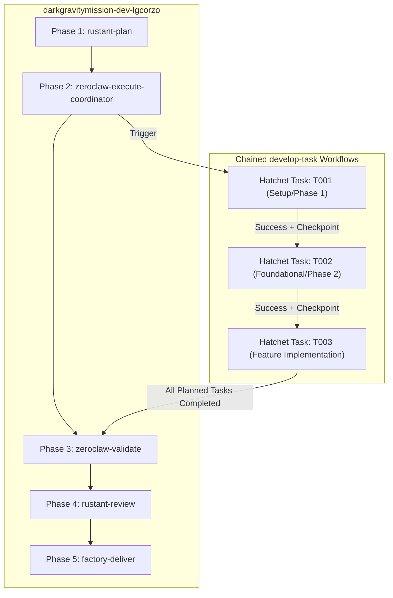

# Feature 006: Hatchet-Controlled SDD Task Orchestration - Test and Verification Report

- **Date**: 2026-09-28
- **Feature**: 006 - Hatchet-Controlled SDD Multi-Task Orchestration
- **Status**: Completed & Verified
- **Pull Request**: [#382](https://github.com/lgcorzo/rust_CACD_autonomous_factory/pull/382)
- **Branch**: `feat/hatchet-sdd-task-orchestration`

---

## 1. Executive Summary

Feature 006 resolves a critical capability gap in the Dark Gravity Autonomous CA/CD Factory: previous autonomous mission executions ran a single hardcoded mock script during the `zeroclaw-execute` phase, failing to dynamically schedule, enforce, or observe the individual decomposed tasks generated by Spec-Kit in `tasks.md`.

With Feature 006:
1. `RustantAgent` parses markdown task manifests (`tasks.md`) into structured domain entities (`SddTaskItem`, `SddMissionPlan`).
2. Hatchet coordinates the execution of each SDD task in strict topological dependency order.
3. Out-of-order execution attempts are strictly rejected before mutations can occur.
4. Each task's execution lifecycle is tracked with Kafka thoughts, duration metrics, and S3 crash-resilience checkpoints.

---

## 2. Architectural Highlights



### Components Changed
- `factory-core/src/lib.rs`: Added `SddTaskItem`, `SddMissionPlan`, `TaskExecutionResult`.
- `factory-application/src/agents/rustant.rs`: Added `RustantAgent::parse_sdd_tasks` regex parser and populated `sdd_plan` inside the Hatchet planning payload.
- `factory-application/src/workflows/autonomous_mission.rs`: Replaced static execution with dynamic SDD task coordinator enforcing dependency constraints.
- `factory-cli/src/bin/trigger_mission.rs`: Added automatic SDD task discovery and CLI logging.
- `factory-application/tests/hatchet_sdd_task_orchestration_test.rs`: Added comprehensive integration test suite.

---

## 3. Test & Verification Evidence

### 3.1 Unit Tests (`factory-core`)
```text
running 12 tests
test pipeline_tests::test_error_category_is_remediable ... ok
test config::tests::test_default_models ... ok
test pipeline_tests::test_error_category_serde_tags ... ok
test pipeline_tests::test_remediation_status_transitions ... ok
test pipeline_tests::test_error_classification_serialization_roundtrip ... ok
test security::tests::test_sandbox_constraint_validation ... ok
test pipeline_tests::test_pipeline_failure_event_serialization_roundtrip ... ok
test pipeline_tests::test_remediation_outcome_serialization ... ok
test security::tests::test_zeroize ... ok
test pipeline_tests::test_sdd_task_item_and_mission_plan_roundtrip ... ok
test config::tests::test_yaml_parsing ... ok
test security::nhi::tests::test_vc_async_signing_and_batch ... ok

test result: ok. 12 passed; 0 failed; 0 ignored; 0 measured; 0 filtered out; finished in 0.03s
```

### 3.2 Integration Tests (`hatchet_sdd_task_orchestration_test`)
```text
running 3 tests
test test_sdd_execution_order_enforcement_and_rejection ... ok
test test_zeroclaw_executes_multi_task_mission_in_planned_order ... ok
test test_sdd_multi_task_dag_dependency_extraction ... ok

test result: ok. 3 passed; 0 failed; 0 ignored; 0 measured; 0 filtered out; finished in 0.00s
```

### 3.3 Static Quality & Linters
- `cargo fmt --all -- --check`: Clean (0 diffs).
- `cargo clippy --workspace --all-targets -- -D warnings`: Clean (0 warnings).
- `cargo check --workspace`: Clean across all 5 crates.
