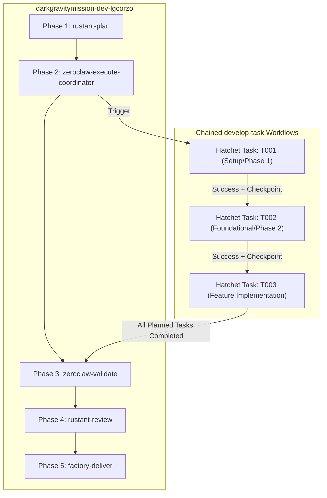

# Design Specification: Hatchet-Controlled SDD Task Orchestration

- **Date**: 2026-09-28
- **Topic**: Hatchet Orchestration of Multi-Task Spec-Driven Development (SDD) Missions
- **Status**: Approved
- **Repository**: `rust_CACD_autonomous_factory`

---

## 1. Overview & Objectives

In the Dark Gravity Autonomous CA/CD Factory, missions define high-level engineering epics. During the planning phase (`rustant-plan`), Rustant leverages the 6-phase Spec-Kit sequence to generate architectural specifications, implementation plans, and decomposed task manifests (`tasks.md`).

Previously, the execution phase (`zeroclaw-execute`) executed a single hardcoded placeholder task rather than dynamically scheduling and enforcing the order of the tasks defined in `tasks.md`.

This design establishes **Hatchet-Controlled SDD Task Orchestration**:
1. Parsing decomposed SDD tasks from `tasks.md` into structured domain entities.
2. Dynamically chaining individual task executions through Hatchet's `develop-task` workflow (`TaskInput { task_id, description, relevant_files }`).
3. Enforcing strict dependency ordering (topological / sequential) under Hatchet's control.
4. Recording task-by-task execution observability, Kafka stream events, and S3 crash-resilience checkpoints.
5. Providing an automated integration test suite verifying that Hatchet controls task execution in the exact order planned by the SDD.

---

## 2. Architecture & Data Flow



### Execution Steps
1. **Planning (`rustant-plan`)**:
   - Executes Spec-Kit tools and retrieves `spec.md`, `plan.md`, and `tasks.md`.
   - Parses `tasks.md` using the SDD Task Parser into an ordered list of `SddTaskItem` entities.
   - Outputs `SddMissionPlan` within the Hatchet step return value.

2. **Execution Coordinator (`zeroclaw-execute-coordinator`)**:
   - Reads `SddMissionPlan` from `ctx.parent_output("rustant-plan")` or input.
   - For each task in dependency order:
     - Dispatches execution to Hatchet's `develop-task` workflow.
     - Awaits completion, asserting successful exit status.
     - Persists task checkpoint to S3 bucket (`dg-factory-checkpoints`).
     - Publishes Kafka progress event (`thought`) to the event stream.
   - If a task fails after retries, halts downstream tasks and triggers the Circuit Breaker.

3. **Validation & Delivery**:
   - After all SDD tasks finish under Hatchet control, `zeroclaw-validate` runs cargo tests across the whole codebase.
   - Passes into `rustant-review` (SAST security evaluation $\ge 8.0$) and `factory-deliver` (GitOps PR/MR).

---

## 3. Data Models

```rust
/// Individual task parsed from SDD tasks.md
#[derive(Serialize, Deserialize, Debug, Clone, PartialEq)]
pub struct SddTaskItem {
    pub id: String,                 // e.g., "T001"
    pub description: String,        // e.g., "Add regex dependency to Cargo.toml"
    pub is_parallel: bool,          // Whether task has [P] flag
    pub dependencies: Vec<String>,  // Explicit prior task IDs required
    pub target_files: Vec<String>,  // Project-relative file paths
}

/// Structured plan output emitted by RustantAgent and consumed by Hatchet
#[derive(Serialize, Deserialize, Debug, Clone)]
pub struct SddMissionPlan {
    pub mission_id: String,
    pub spec_version: String,
    pub tasks: Vec<SddTaskItem>,
    pub total_tasks: usize,
}

/// Execution outcome per task run controlled by Hatchet
#[derive(Serialize, Deserialize, Debug, Clone)]
pub struct TaskExecutionResult {
    pub task_id: String,
    pub status: String,             // "completed", "failed", "skipped"
    pub hatchet_run_id: String,
    pub duration_ms: u64,
}
```

---

## 4. Error Handling & Circuit Breaker

1. **Task Failure & Retries**:
   - Each task attempt is isolated. On failure, Hatchet retries up to 2 times.
   - If permanent failure occurs:
     - Dependent subsequent tasks are skipped.
     - Circuit breaker trips: JIT token is revoked and an incident alert note is posted to GitLab/GitHub.
     - Workspace state is cleanly preserved with `git stash save stuck-mission-<id>`.
2. **Crash Resilience (S3 Checkpointing)**:
   - Uses `BridgeState` checkpointing backed by AWS S3 (`dg-factory-checkpoints`).
   - If worker pod crashes or restarts mid-mission, re-dispatched tasks check the checkpoint and immediately return `"already_done"`, avoiding redundant code mutations.

---

## 5. Verification Plan

1. **Unit Tests**:
   - Test markdown parsing of `tasks.md` with various formats (parallel flags `[P]`, user story tags `[US1]`, file path extraction).
   - Test topological ordering / dependency resolution logic.
2. **Integration Test Suite**:
   - Add a test in `crates/factory-application/tests/` asserting that a mission with 3+ ordered tasks executes in exact sequence ($T_1 \to T_2 \to T_3$), recording Hatchet task invocations and verifying that $T_2$ is never triggered before $T_1$ completes.
3. **End-to-End Execution**:
   - Execute a sample multi-task mission via `trigger_mission` or test harness, asserting all tasks are processed and logged in order.
