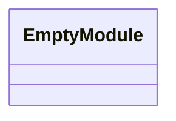
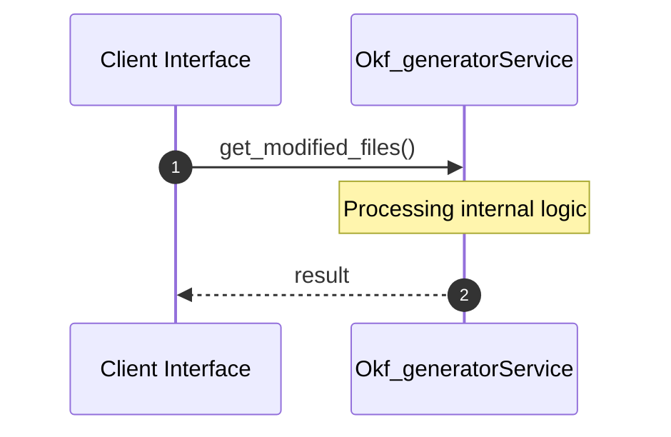

# File: okf_generator.py

**Source Path:** `.agents/tools/okf_generator.py`

## Overview

### Purpose
Provides implementation for okf_generator.py.

### Responsibilities
* Handles logic related to okf_generator.

### Dependencies
* re, sys, os, subprocess

### Imported modules
*

### Exported classes
* None

### Exported interfaces
* None

### Exported functions
* get_modified_files, get_git_hash, generate_mermaid_class_diagram, process_file, update_index

## Public API

### Exported Classes / Structs / Interfaces

### Exported Functions

#### `get_modified_files() -> None`
Executes get_modified_files.

#### `get_git_hash() -> None`
Executes get_git_hash.

#### `generate_mermaid_class_diagram(content (Any)) -> None`
Executes generate_mermaid_class_diagram.

#### `process_file(file_path (Any)) -> None`
Executes process_file.

#### `update_index(new_wiki_names (Any)) -> None`
Executes update_index.

## Internal architecture



## Execution flow & Sequence explanation




## Examples

```
// Example usage of okf_generator.py components
import { ... } from '.agents/tools/okf_generator.py';
```


## Cross References
* **Parent module:** `.agents/tools`
* **Dependencies:** re, sys, os, subprocess
