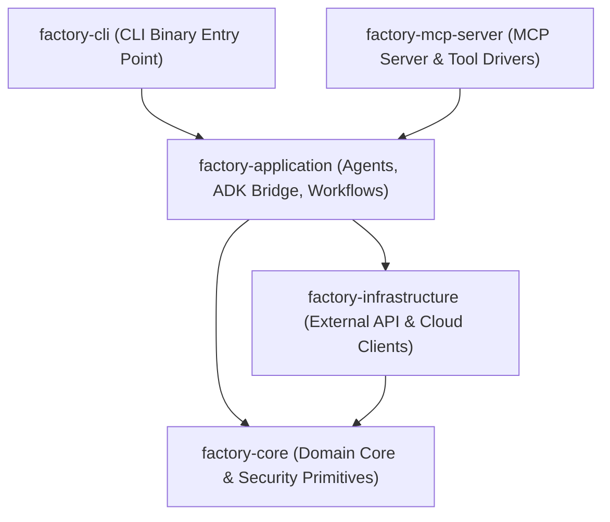

# ISO 42010 Component View: Subsystems & UML 2.0 Class Diagrams

## 1. Crate Hierarchy & Dependency Boundaries

The `rust_CACD_autonomous_factory` repository is organized into five decoupled Rust crates, enforcing clean layered domain boundaries:

---

## 2. UML 2.0 Class & Trait Diagram: Core Abstractions & Security

```mermaid
classDiagram
    direction BT

    class CodeSurgeryExecutor {
        <<interface>>
        +apply_patch(mission_id: &str, patch: &SurgicalPatch)* Result~ExecutionResult, FactoryError~
        +verify_syntax(file_path: &Path)* Result~bool, FactoryError~
    }

    class SecurityValidator {
        <<interface>>
        +validate_signature(data: &[u8], signature: &str)* Result~bool~
        +audit_content(content: &str)* Result~AuditResult~
    }

    class Ed25519SecurityValidator {
        +public_key: VerifyingKey
        +validate_signature(data: &[u8], signature: &str) Result~bool~
        +audit_content(content: &str) Result~AuditResult~
    }

    class SecurityBounds {
        <<interface>>
        +validate_token(token: &JitToken)* Result~bool~
        +issue_jit_token(audience: &str)* Result~JitToken~
        +wipe_token_from_memory(token: &mut JitToken)
    }

    class SandboxDriver {
        <<interface>>
        +execute(code: &str, language: &str)* Result~ExecutionResult~
        +execute_surgery(id: &str, patch: &SurgicalPatch) Result~ExecutionResult~
    }

    class SubprocessDriver {
        +execute(code: &str, language: &str) Result~ExecutionResult~
    }

    class GvisorK8sDriver {
        +execute(code: &str, language: &str) Result~ExecutionResult~
    }

    class NativeSurgerySandboxDriver {
        +execution_engine: Arc~CodeSurgeryExecutor~
        +execute_surgery(id: &str, patch: &SurgicalPatch) Result~ExecutionResult~
    }

    SecurityValidator <|.. Ed25519SecurityValidator : Realization
    SandboxDriver <|.. SubprocessDriver : Realization
    SandboxDriver <|.. GvisorK8sDriver : Realization
    SandboxDriver <|.. NativeSurgerySandboxDriver : Realization
```

---

## 3. Subsystem Breakdown & Source Line Citations

### 1. `factory-core`
- **Purpose**: Defines domain models (`Mission`, `Task`, `Outputs`, `Metadata`), errors (`FactoryError`), security models (`Ed25519SecurityValidator`, `JitToken`), and code surgery trait (`CodeSurgeryExecutor`).
- **File References**:
  - `crates/factory-core/src/lib.rs:L1-L139`
  - `crates/factory-core/src/executor.rs:L1-L28`
  - `crates/factory-core/src/security.rs:L1-L72`
  - `crates/factory-core/src/error.rs:L1-L45`

### 2. `factory-infrastructure`
- **Purpose**: Implements external cloud integrations: Aethalgard webhooks (`HttpAethalgardClient`), OpenZiti network, Kafka messaging, HashiCorp Vault, AWS S3/R2 storage, and Sentry telemetry.
- **File References**:
  - `crates/factory-infrastructure/src/aethalgard.rs:L1-L56`
  - `crates/factory-infrastructure/src/ziti.rs:L1-L50`
  - `crates/factory-infrastructure/src/kafka.rs:L1-L65`

### 3. `factory-application`
- **Purpose**: Encapsulates agent roles (`Rustant`, `ZeroClaw`, `QAObserver`, `Auditor`, `FinOps`, `DocAgent`), ADK bridge state machine (`AdkDriver`), and workflow orchestrators (`AutonomousMission`, `DevelopTask`).
- **File References**:
  - `crates/factory-application/src/agents/mod.rs:L1-L80`
  - `crates/factory-application/src/bridge/adk_driver.rs:L1-L110`
  - `crates/factory-application/src/workflows/mod.rs:L1-L95`

### 4. `factory-mcp-server`
- **Purpose**: Exposes Model Context Protocol JSON-RPC endpoints, sandbox driver implementations (`NativeSurgerySandboxDriver`, `SubprocessDriver`, `GvisorK8sDriver`), and MCP tool handlers.
- **File References**:
  - `crates/factory-mcp-server/src/sandbox.rs:L1-L190`
  - `crates/factory-mcp-server/src/protocol.rs:L1-L120`
  - `crates/factory-mcp-server/src/main.rs:L1-L80`
