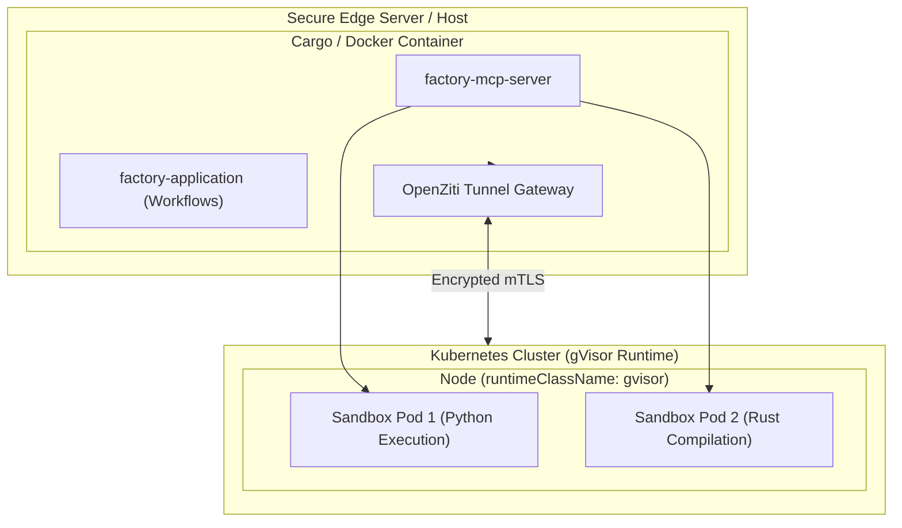

# ISO 42010 Deployment View: Infrastructure & Sandbox Topologies

## 1. Physical & Virtual Deployment Topology

The `rust_CACD_autonomous_factory` architecture supports hybrid containerized deployments across bare-metal Linux servers and Kubernetes clusters with gVisor kernel isolation:

---

## 2. Cargo Workspace Compilation Targets

The multi-crate repository is compiled using standard Rust toolchains (`cargo build --release`). Primary binary compilation targets:

| Binary Name | Source Entry Point | Package Crate | Purpose / Target |
| :--- | :--- | :--- | :--- |
| `factory-mcp-server` | `crates/factory-mcp-server/src/main.rs:L1-L80` | `factory-mcp-server` | Model Context Protocol JSON-RPC Server |
| `factory-cli` | `crates/factory-cli/src/main.rs:L1-L85` | `factory-cli` | Factory Control CLI Tool |
| `trigger_mission` | `crates/factory-cli/src/bin/trigger_mission.rs:L1-L50` | `factory-cli` | Autonomous Mission Trigger CLI Binary |

---

## 3. Sandbox Driver Configuration Matrix

The execution engine supports two sandbox modes defined in `crates/factory-mcp-server/src/sandbox.rs:L113-L117`:

1. **`SandboxMode::Subprocess`**: Local process invocation (`Command::new("python3")`, `ts-node`, `go run`, `rustc`) with a strict 30-second execution timeout (`crates/factory-mcp-server/src/sandbox.rs:L54`).
2. **`SandboxMode::GvisorK8s`**: Isolated Kubernetes Pod execution utilizing `runtimeClassName: gvisor` to prevent container breakout vulnerabilities (`crates/factory-mcp-server/src/sandbox.rs:L121-L175`).
