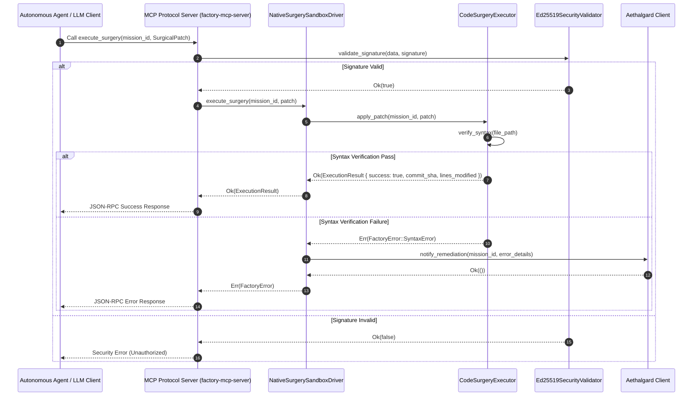
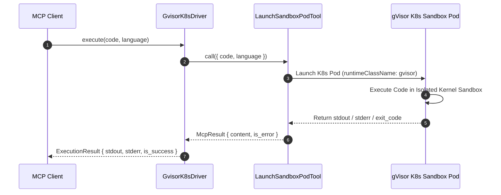

# ISO 42010 Sequence View: Execution Flows & Interaction Diagrams

## 1. Code Surgery Execution Flow

This sequence depicts an autonomous agent requesting surgical patch execution through the MCP server interface down to the `NativeSurgerySandboxDriver` and `CodeSurgeryExecutor`:

---

## 2. gVisor Sandboxed Code Execution Sequence

When untrusted code is executed via the `GvisorK8sDriver`, the system launches a Kubernetes sandboxed pod isolated via gVisor kernel virtualization:

---

## 3. Key Interaction Line Citations

- **MCP Tool Dispatch**: `crates/factory-mcp-server/src/sandbox.rs:L35-L47`
- **Signature & Security Audit**: `crates/factory-core/src/security.rs:L31-L54`
- **Aethalgard Remediation Webhook**: `crates/factory-infrastructure/src/aethalgard.rs:L27-L54`
- **Subprocess Driver Timeout Handling**: `crates/factory-mcp-server/src/sandbox.rs:L52-L111`
