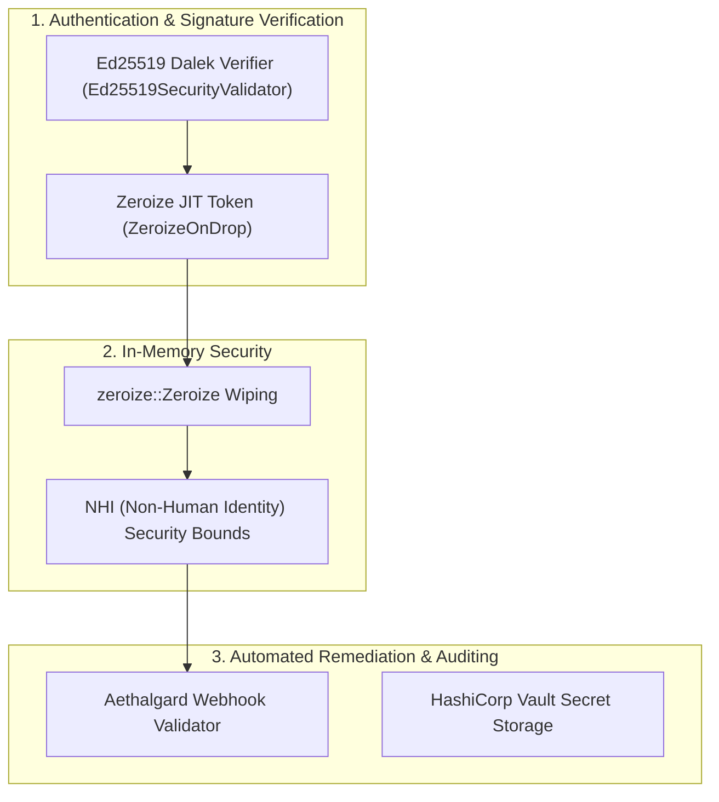

# ISO 42010 Security View: Cryptography, Memory Hygiene & Remediation

## 1. Zero-Trust Architectural Security Model

Security in `rust_CACD_autonomous_factory` is designed around cryptographic verification, zero-trust network encapsulation, automatic RAM memory zeroization, and gVisor kernel sandboxing.



---

## 2. In-Memory Secret Hygiene: `JitToken` Zeroization

Tokens issued for non-human identity (NHI) agents derive from `JitToken` (`crates/factory-core/src/security.rs:L56-L61`).
To guarantee secret destruction when tokens go out of scope, `JitToken` implements `zeroize::Zeroize` and `zeroize::ZeroizeOnDrop`:

```rust
// crates/factory-core/src/security.rs:L56-L61
#[derive(
    Debug, Clone, serde::Serialize, serde::Deserialize, zeroize::Zeroize, zeroize::ZeroizeOnDrop,
)]
pub struct JitToken {
    pub token: String,
}
```

When a `JitToken` instance drops, Rust's `Drop` trait automatically fills the token buffer in memory with zero bytes, eliminating memory dump leaks.

---

## 3. Cryptographic Signature Validation

All incoming agent requests or patch dispatches are authenticated using URL-safe Base64-encoded Ed25519 signatures (`crates/factory-core/src/security.rs:L26-L46`).

### Signature Verification Contract:
`validate_signature(data: &[u8], signature: &str) -> Result<bool>`
- **Decodes**: Converts URL-safe Base64 signature buffer.
- **Validates**: Uses `ed25519_dalek::VerifyingKey` to check `Signature::from_slice`.
- **Failsafe**: Returns `FactoryError::Security` on format or decoding errors.

---

## 4. Automated Aethalgard Remediation Webhook

When an execution failure or security violation occurs during code surgery, `factory-infrastructure` fires an automated JSON-RPC notification to the Aethalgard security monitoring service (`crates/factory-infrastructure/src/aethalgard.rs:L27-L54`).

### Payload Structure:
```json
{
  "jsonrpc": "2.0",
  "method": "notify_remediation",
  "params": {
    "mission_id": "mission-123",
    "error": "Syntax verification error in src/executor.rs",
    "source": "dark-gravity-factory"
  },
  "id": "uuid-v4"
}
```
