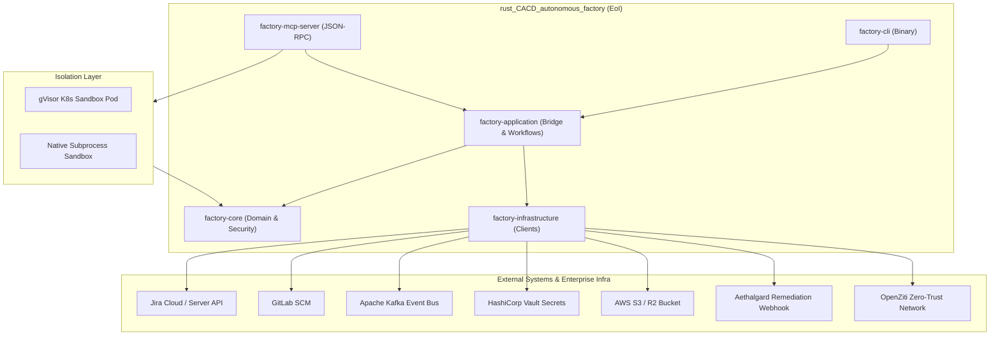

# ISO 42010 Context View: System Boundaries & External Interfaces

## 1. System Boundary Definition

The `rust_CACD_autonomous_factory` forms an autonomous code synthesis, verification, and execution engine operating within a secure, zero-trust infrastructure perimeter.

---

## 2. External Actor & Interface Specification

| External System | Protocol / Format | Interface Purpose | Implementation File Citation |
| :--- | :--- | :--- | :--- |
| **Aethalgard Remediation Service** | JSON-RPC 2.0 over HTTP POST | Dispatches automated remediation notifications on mission failures | `crates/factory-infrastructure/src/aethalgard.rs:L32-L54` |
| **Model Context Protocol (MCP) Clients** | JSON-RPC 2.0 over stdio / HTTP | Provides tools for code execution, code surgery, indexing, Jira search, and security reviews | `crates/factory-mcp-server/src/protocol.rs:L1-L120` |
| **OpenZiti Network Overlay** | Ziti C/Rust SDK | Establishes encrypted zero-trust microservice tunnels without public IP exposure | `crates/factory-infrastructure/src/ziti.rs:L1-L50` |
| **Apache Kafka** | Kafka Protocol | Broadcasts mission lifecycle events, audit telemetry, and QA status | `crates/factory-infrastructure/src/kafka.rs:L1-L65` |
| **gVisor Kubernetes Cluster** | Kubernetes K8s API / Custom Pod Spec | Runs un-trusted code executions inside kernel-isolated gVisor containers | `crates/factory-mcp-server/src/sandbox.rs:L121-L175` |
