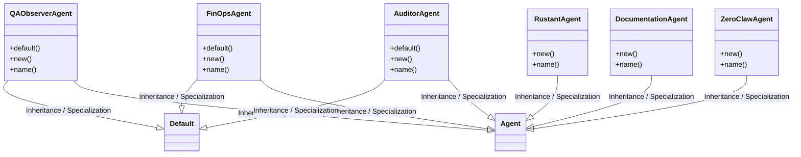
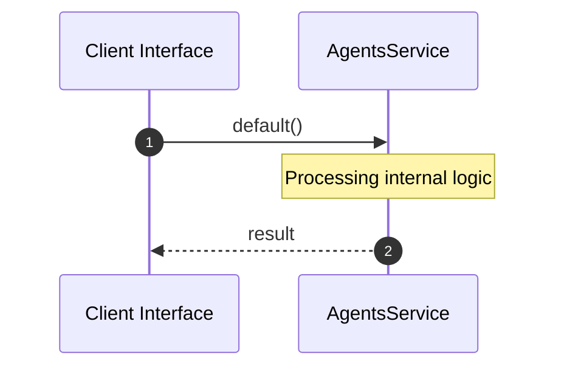

# Module Name: agents

* **Source Directory Reference:** `crates/factory-application/src/agents/`
* **Package Dependency:** [std, auditor, hatchet_sdk, super, uuid, zeroclaw, crate, serde_json, async_trait, factory_infrastructure, qa_observer, rustant, reqwest, doc_agent, factory_core, finops]

## 1. Executive Summary & Purpose
Technical architecture and class hierarchy for the `agents` module, documenting its core responsibilities and structural design.

## 2. UML 2.0 Class & Inheritance Architecture (Deterministic)
The following class diagram models the object-oriented structure, explicit inheritance hierarchies, and polymorphic interface implementations derived from local AST analysis:

## 3. Package & Class Relations

* **Inheritance & Polymorphism:** Detailed breakdown of abstract base classes, interfaces, and concrete overrides within `crates/factory-application/src/agents`.
* **Dependencies:** How classes within this package collaborate externally.

## 4. Execution Flow & Runtime Behavior

The following sequence diagram outlines the execution lifecycle and message passing during core operations:

---

* **Source Citations:**
* Class `QAObserverAgent`: `crates/factory-application/src/agents/qa_observer.rs:14`
  * Method `default`: `crates/factory-application/src/agents/qa_observer.rs:23`
  * Method `new`: `crates/factory-application/src/agents/qa_observer.rs:33`
  * Method `name`: `crates/factory-application/src/agents/qa_observer.rs:149`
* Method `monitor_crashes`: `crates/factory-application/src/agents/qa_observer.rs:51`
* Method `execute`: `crates/factory-application/src/agents/qa_observer.rs:153`
* Class `RustantAgent`: `crates/factory-application/src/agents/rustant.rs:7`
  * Method `new`: `crates/factory-application/src/agents/rustant.rs:13`
  * Method `name`: `crates/factory-application/src/agents/rustant.rs:135`
* Method `plan_mission`: `crates/factory-application/src/agents/rustant.rs:20`
* Method `review_mission`: `crates/factory-application/src/agents/rustant.rs:111`
* Method `execute`: `crates/factory-application/src/agents/rustant.rs:139`
* Class `DocumentationAgent`: `crates/factory-application/src/agents/doc_agent.rs:8`
  * Method `new`: `crates/factory-application/src/agents/doc_agent.rs:15`
  * Method `name`: `crates/factory-application/src/agents/doc_agent.rs:225`
* Method `run_post_merge_pipeline`: `crates/factory-application/src/agents/doc_agent.rs:27`
* Method `verify_osr`: `crates/factory-application/src/agents/doc_agent.rs:148`
* Method `extract_code_deltas`: `crates/factory-application/src/agents/doc_agent.rs:171`
* Method `generate_hazitek_report`: `crates/factory-application/src/agents/doc_agent.rs:186`
* Method `execute`: `crates/factory-application/src/agents/doc_agent.rs:229`
* Method `test_generate_hazitek_report`: `crates/factory-application/src/agents/doc_agent.rs:240`
* Class `FinOpsAgent`: `crates/factory-application/src/agents/finops.rs:12`
  * Method `default`: `crates/factory-application/src/agents/finops.rs:20`
  * Method `new`: `crates/factory-application/src/agents/finops.rs:50`
  * Method `name`: `crates/factory-application/src/agents/finops.rs:168`
* Method `monitor_budget`: `crates/factory-application/src/agents/finops.rs:59`
* Method `execute`: `crates/factory-application/src/agents/finops.rs:172`
* Method `test_tag`: `crates/factory-application/src/agents/finops.rs:183`
* Method `test_finops_agent_strips_v1_suffix`: `crates/factory-application/src/agents/finops.rs:194`
* Method `test_finops_agent_empty_url_guard`: `crates/factory-application/src/agents/finops.rs:208`
* Class `AuditorAgent`: `crates/factory-application/src/agents/auditor.rs:5`
  * Method `default`: `crates/factory-application/src/agents/auditor.rs:8`
  * Method `new`: `crates/factory-application/src/agents/auditor.rs:14`
  * Method `name`: `crates/factory-application/src/agents/auditor.rs:224`
* Method `analyze_dag_logs`: `crates/factory-application/src/agents/auditor.rs:19`
* Method `audit_mission`: `crates/factory-application/src/agents/auditor.rs:73`
* Method `evaluate_prompts`: `crates/factory-application/src/agents/auditor.rs:165`
* Method `execute`: `crates/factory-application/src/agents/auditor.rs:228`
* Method `test_auditor_agent`: `crates/factory-application/src/agents/auditor.rs:240`
* Class `ZeroClawAgent`: `crates/factory-application/src/agents/zeroclaw.rs:7`
  * Method `new`: `crates/factory-application/src/agents/zeroclaw.rs:13`
  * Method `name`: `crates/factory-application/src/agents/zeroclaw.rs:212`
* Method `execute_task`: `crates/factory-application/src/agents/zeroclaw.rs:24`
* Method `validate_mission`: `crates/factory-application/src/agents/zeroclaw.rs:131`
* Method `introspect_k8s`: `crates/factory-application/src/agents/zeroclaw.rs:195`
* Method `execute`: `crates/factory-application/src/agents/zeroclaw.rs:216`
