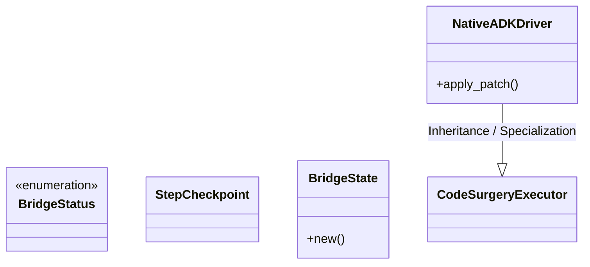
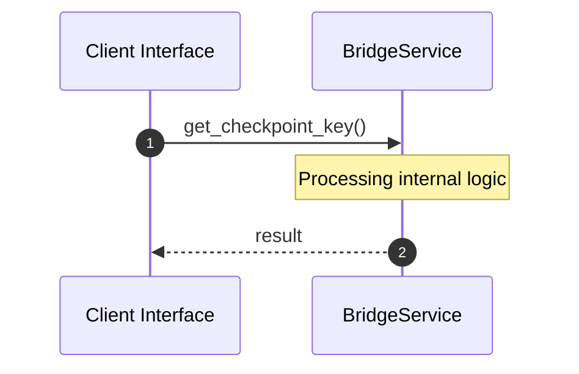

# Module Name: bridge

* **Source Directory Reference:** `crates/factory-application/src/bridge/`
* **Package Dependency:** [std, adk_driver, factory_core, chrono, async_trait, state, serde]

## 1. Executive Summary & Purpose
Technical architecture and class hierarchy for the `bridge` module, documenting its core responsibilities and structural design.

## 2. UML 2.0 Class & Inheritance Architecture (Deterministic)
The following class diagram models the object-oriented structure, explicit inheritance hierarchies, and polymorphic interface implementations derived from local AST analysis:

## 3. Package & Class Relations

* **Inheritance & Polymorphism:** Detailed breakdown of abstract base classes, interfaces, and concrete overrides within `crates/factory-application/src/bridge`.
* **Dependencies:** How classes within this package collaborate externally.

## 4. Execution Flow & Runtime Behavior

The following sequence diagram outlines the execution lifecycle and message passing during core operations:

---

* **Source Citations:**
* Class `BridgeStatus`: `crates/factory-application/src/bridge/state.rs:6`
* Class `StepCheckpoint`: `crates/factory-application/src/bridge/state.rs:15`
* Class `BridgeState`: `crates/factory-application/src/bridge/state.rs:23`
  * Method `new`: `crates/factory-application/src/bridge/state.rs:33`
* Method `get_checkpoint_key`: `crates/factory-application/src/bridge/state.rs:47`
* Method `load_checkpoint`: `crates/factory-application/src/bridge/state.rs:51`
* Method `save_checkpoint`: `crates/factory-application/src/bridge/state.rs:70`
* Class `NativeADKDriver`: `crates/factory-application/src/bridge/adk_driver.rs:6`
  * Method `apply_patch`: `crates/factory-application/src/bridge/adk_driver.rs:12`
* Method `verify_syntax`: `crates/factory-application/src/bridge/adk_driver.rs:41`
