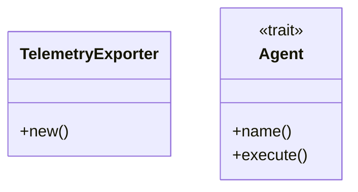
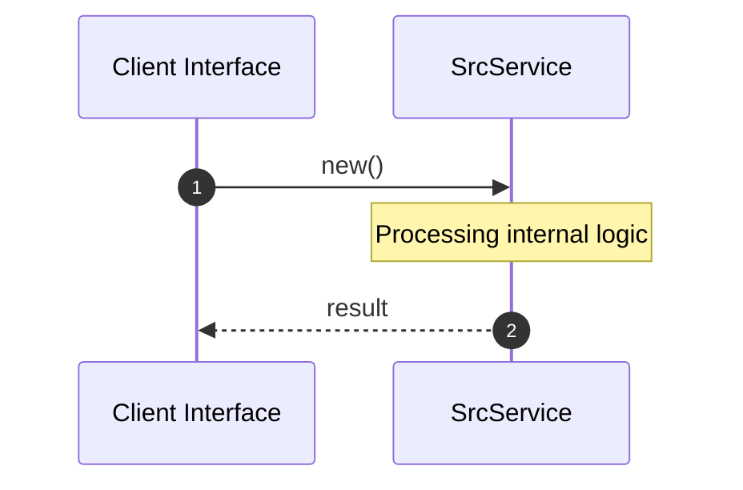

# Module Name: src

* **Source Directory Reference:** `crates/factory-application/src/`
* **Package Dependency:** [rdkafka, async_trait, reqwest, serde_json, std]

## 1. Executive Summary & Purpose
Technical architecture and class hierarchy for the `src` module, documenting its core responsibilities and structural design.

## 2. UML 2.0 Class & Inheritance Architecture (Deterministic)
The following class diagram models the object-oriented structure, explicit inheritance hierarchies, and polymorphic interface implementations derived from local AST analysis:

## 3. Package & Class Relations

* **Inheritance & Polymorphism:** Detailed breakdown of abstract base classes, interfaces, and concrete overrides within `crates/factory-application/src`.
* **Dependencies:** How classes within this package collaborate externally.

## 4. Execution Flow & Runtime Behavior

The following sequence diagram outlines the execution lifecycle and message passing during core operations:

---

* **Source Citations:**
* Class `TelemetryExporter`: `crates/factory-application/src/telemetry_export.rs:7`
  * Method `new`: `crates/factory-application/src/telemetry_export.rs:14`
* Method `start_export_loop`: `crates/factory-application/src/telemetry_export.rs:23`
* Method `push_to_openwebui`: `crates/factory-application/src/telemetry_export.rs:70`
* Class `Agent`: `crates/factory-application/src/lib.rs:6`
  * Method `name`: `crates/factory-application/src/lib.rs:7`
  * Method `execute`: `crates/factory-application/src/lib.rs:8`
