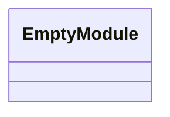
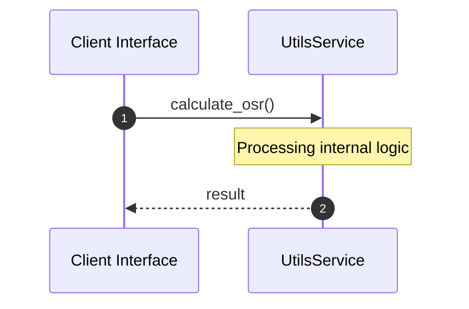

# Module Name: utils

* **Source Directory Reference:** `crates/factory-application/src/utils/`
* **Package Dependency:** [super]

## 1. Executive Summary & Purpose
Technical architecture and class hierarchy for the `utils` module, documenting its core responsibilities and structural design.

## 2. UML 2.0 Class & Inheritance Architecture (Deterministic)
The following class diagram models the object-oriented structure, explicit inheritance hierarchies, and polymorphic interface implementations derived from local AST analysis:

## 3. Package & Class Relations

* **Inheritance & Polymorphism:** Detailed breakdown of abstract base classes, interfaces, and concrete overrides within `crates/factory-application/src/utils`.
* **Dependencies:** How classes within this package collaborate externally.

## 4. Execution Flow & Runtime Behavior

The following sequence diagram outlines the execution lifecycle and message passing during core operations:

---

* **Source Citations:**
* Method `calculate_osr`: `crates/factory-application/src/utils/osr.rs:1`
* Method `levenshtein_distance`: `crates/factory-application/src/utils/osr.rs:12`
* Method `test_verify_osr_calculation`: `crates/factory-application/src/utils/osr.rs:44`
