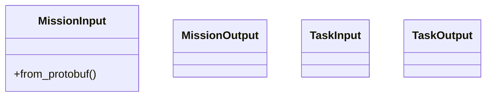
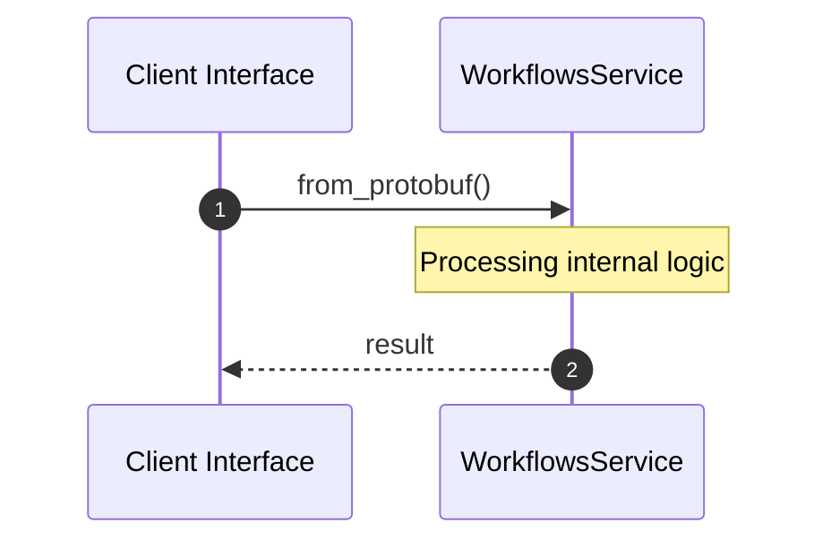

# Module Name: workflows

* **Source Directory Reference:** `crates/factory-application/src/workflows/`
* **Package Dependency:** [std, prost, super, hatchet_sdk, uuid, factory_core, crate, develop_task, factory_infrastructure, autonomous_mission, serde]

## 1. Executive Summary & Purpose
Technical architecture and class hierarchy for the `workflows` module, documenting its core responsibilities and structural design.

## 2. UML 2.0 Class & Inheritance Architecture (Deterministic)
The following class diagram models the object-oriented structure, explicit inheritance hierarchies, and polymorphic interface implementations derived from local AST analysis:

## 3. Package & Class Relations

* **Inheritance & Polymorphism:** Detailed breakdown of abstract base classes, interfaces, and concrete overrides within `crates/factory-application/src/workflows`.
* **Dependencies:** How classes within this package collaborate externally.

## 4. Execution Flow & Runtime Behavior

The following sequence diagram outlines the execution lifecycle and message passing during core operations:

---

* **Source Citations:**
* Class `MissionInput`: `crates/factory-application/src/workflows/autonomous_mission.rs:13`
  * Method `from_protobuf`: `crates/factory-application/src/workflows/autonomous_mission.rs:20`
* Class `MissionOutput`: `crates/factory-application/src/workflows/autonomous_mission.rs:41`
* Method `create_mission_workflow`: `crates/factory-application/src/workflows/autonomous_mission.rs:48`
* Method `test_mission_input_from_protobuf`: `crates/factory-application/src/workflows/autonomous_mission.rs:418`
* Class `TaskInput`: `crates/factory-application/src/workflows/develop_task.rs:9`
* Class `TaskOutput`: `crates/factory-application/src/workflows/develop_task.rs:16`
* Method `create_develop_task_workflow`: `crates/factory-application/src/workflows/develop_task.rs:20`
