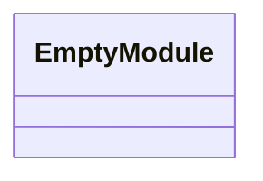
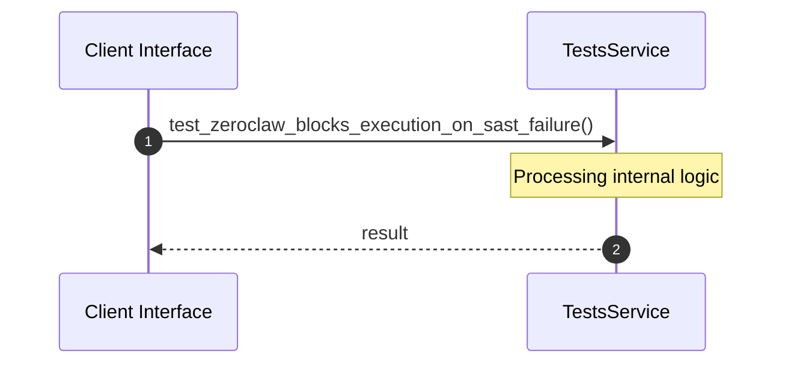

# Module Name: tests

* **Source Directory Reference:** `crates/factory-application/tests/`
* **Package Dependency:** [serde_json, std, factory_application, factory_infrastructure]

## 1. Executive Summary & Purpose
Technical architecture and class hierarchy for the `tests` module, documenting its core responsibilities and structural design.

## 2. UML 2.0 Class & Inheritance Architecture (Deterministic)
The following class diagram models the object-oriented structure, explicit inheritance hierarchies, and polymorphic interface implementations derived from local AST analysis:

## 3. Package & Class Relations

* **Inheritance & Polymorphism:** Detailed breakdown of abstract base classes, interfaces, and concrete overrides within `crates/factory-application/tests`.
* **Dependencies:** How classes within this package collaborate externally.

## 4. Execution Flow & Runtime Behavior

The following sequence diagram outlines the execution lifecycle and message passing during core operations:

---

* **Source Citations:**
* Method `test_zeroclaw_blocks_execution_on_sast_failure`: `crates/factory-application/tests/zeroclaw_sast_integration.rs:7`
* Method `test_zeroclaw_allows_execution_on_sast_pass`: `crates/factory-application/tests/zeroclaw_sast_integration.rs:54`
* Method `test_rustant_agent_with_mock_mcp`: `crates/factory-application/tests/workflow_tests.rs:7`
* Method `test_bridge_state_crash_resilience`: `crates/factory-application/tests/bridge_test.rs:4`
