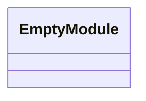
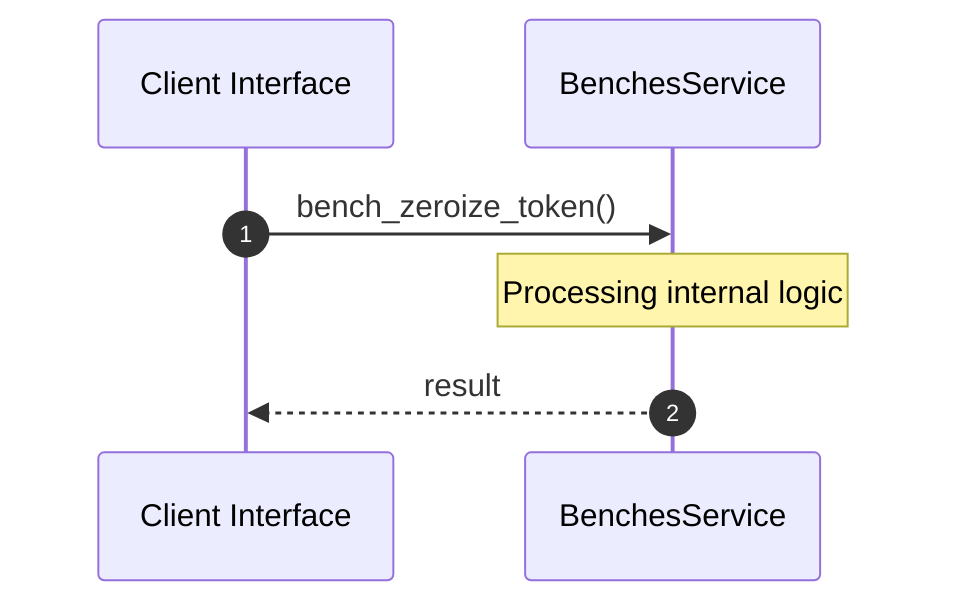

# Module Name: benches

* **Source Directory Reference:** `crates/factory-core/benches/`
* **Package Dependency:** [factory_core, criterion, zeroize]

## 1. Executive Summary & Purpose
Technical architecture and class hierarchy for the `benches` module, documenting its core responsibilities and structural design.

## 2. UML 2.0 Class & Inheritance Architecture (Deterministic)
The following class diagram models the object-oriented structure, explicit inheritance hierarchies, and polymorphic interface implementations derived from local AST analysis:

## 3. Package & Class Relations

* **Inheritance & Polymorphism:** Detailed breakdown of abstract base classes, interfaces, and concrete overrides within `crates/factory-core/benches`.
* **Dependencies:** How classes within this package collaborate externally.

## 4. Execution Flow & Runtime Behavior

The following sequence diagram outlines the execution lifecycle and message passing during core operations:

---

* **Source Citations:**
* Method `bench_zeroize_token`: `crates/factory-core/benches/zeroize_benchmark.rs:5`
