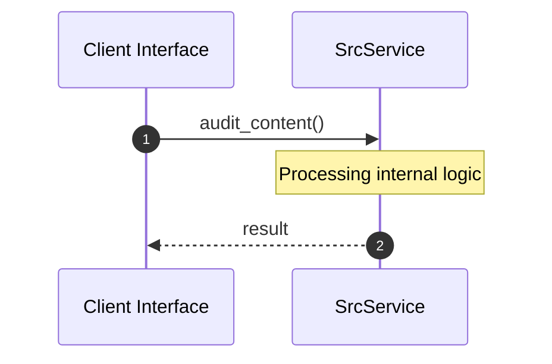

# Module Name: src

* **Source Directory Reference:** `crates/factory-core/src/`
* **Package Dependency:** [serde, thiserror, chrono, ed25519_dalek, crate, base64, uuid, std, async_trait, zeroize]

## 1. Executive Summary & Purpose
Technical architecture and class hierarchy for the `src` module, documenting its core responsibilities and structural design.

## 2. UML 2.0 Class & Inheritance Architecture (Deterministic)
The following class diagram models the object-oriented structure, explicit inheritance hierarchies, and polymorphic interface implementations derived from local AST analysis:

```mermaid
classDiagram
    direction BT
    class FactoryError {
        <<enumeration>>
    }
    class SurgicalPatch {
    }
    class ExecutionResult {
    }
    class CodeSurgeryExecutor {
        <<trait>>
        +apply_patch()
        +verify_syntax()
    }
    class Metadata {
    }
    class Inputs {
    }
    class Outputs {
    }
    class Targets {
    }
    class Mission {
    }
    class MissionStatus {
        <<enumeration>>
    }
    class Task {
    }
    class TaskStatus {
        <<enumeration>>
    }
    class SHAPValues {
    }
    class FeatureImportances {
    }
    class SpecArtifact {
    }
    class OsrMetric {
    }
    class FinOpsTag {
    }
    class ComplianceReport {
    }
    class UserFeedbackPayload {
    }
    class SandboxConstraint {
    }
    class SecurityValidator {
        <<trait>>
        +validate_signature()
        +audit_content()
    }
    class AuditResult {
    }
    class Ed25519SecurityValidator {
        +validate_signature()
    }
    SecurityValidator <|-- Ed25519SecurityValidator : Inheritance / Specialization
    class JitToken {
    }
    class SecurityBounds {
        <<trait>>
        +validate_token()
        +issue_jit_token()
        +wipe_token_from_memory()
    }

```

## 3. Package & Class Relations

* **Inheritance & Polymorphism:** Detailed breakdown of abstract base classes, interfaces, and concrete overrides within `crates/factory-core/src`.
* **Dependencies:** How classes within this package collaborate externally.

## 4. Execution Flow & Runtime Behavior

The following sequence diagram outlines the execution lifecycle and message passing during core operations:

---

* **Source Citations:**
* Class `FactoryError`: `crates/factory-core/src/error.rs:4`
* Class `SurgicalPatch`: `crates/factory-core/src/executor.rs:6`
* Class `ExecutionResult`: `crates/factory-core/src/executor.rs:13`
* Class `CodeSurgeryExecutor`: `crates/factory-core/src/executor.rs:20`
  * Method `apply_patch`: `crates/factory-core/src/executor.rs:21`
  * Method `verify_syntax`: `crates/factory-core/src/executor.rs:26`
* Class `Metadata`: `crates/factory-core/src/lib.rs:12`
* Class `Inputs`: `crates/factory-core/src/lib.rs:21`
* Class `Outputs`: `crates/factory-core/src/lib.rs:27`
* Class `Targets`: `crates/factory-core/src/lib.rs:34`
* Class `Mission`: `crates/factory-core/src/lib.rs:41`
* Class `MissionStatus`: `crates/factory-core/src/lib.rs:52`
* Class `Task`: `crates/factory-core/src/lib.rs:61`
* Class `TaskStatus`: `crates/factory-core/src/lib.rs:72`
* Class `SHAPValues`: `crates/factory-core/src/lib.rs:81`
* Class `FeatureImportances`: `crates/factory-core/src/lib.rs:89`
* Class `SpecArtifact`: `crates/factory-core/src/lib.rs:95`
* Class `OsrMetric`: `crates/factory-core/src/lib.rs:102`
* Class `FinOpsTag`: `crates/factory-core/src/lib.rs:110`
* Class `ComplianceReport`: `crates/factory-core/src/lib.rs:119`
* Class `UserFeedbackPayload`: `crates/factory-core/src/lib.rs:126`
* Class `SandboxConstraint`: `crates/factory-core/src/security.rs:7`
* Class `SecurityValidator`: `crates/factory-core/src/security.rs:15`
  * Method `validate_signature`: `crates/factory-core/src/security.rs:16`
  * Method `audit_content`: `crates/factory-core/src/security.rs:17`
* Class `AuditResult`: `crates/factory-core/src/security.rs:21`
* Class `Ed25519SecurityValidator`: `crates/factory-core/src/security.rs:26`
  * Method `validate_signature`: `crates/factory-core/src/security.rs:32`
* Class `JitToken`: `crates/factory-core/src/security.rs:59`
* Class `SecurityBounds`: `crates/factory-core/src/security.rs:64`
  * Method `validate_token`: `crates/factory-core/src/security.rs:65`
  * Method `issue_jit_token`: `crates/factory-core/src/security.rs:66`
  * Method `wipe_token_from_memory`: `crates/factory-core/src/security.rs:67`
* Method `audit_content`: `crates/factory-core/src/security.rs:47`
