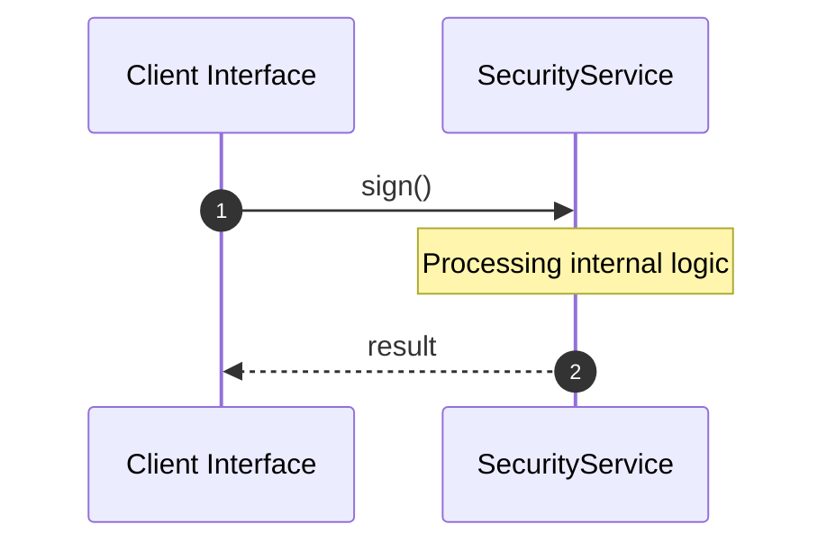

# Module Name: security

* **Source Directory Reference:** `crates/factory-core/src/security/`
* **Package Dependency:** [serde, super, rand, chrono, ed25519_dalek, base64]

## 1. Executive Summary & Purpose
Technical architecture and class hierarchy for the `security` module, documenting its core responsibilities and structural design.

## 2. UML 2.0 Class & Inheritance Architecture (Deterministic)
The following class diagram models the object-oriented structure, explicit inheritance hierarchies, and polymorphic interface implementations derived from local AST analysis:

## 3. Package & Class Relations

* **Inheritance & Polymorphism:** Detailed breakdown of abstract base classes, interfaces, and concrete overrides within `crates/factory-core/src/security`.
* **Dependencies:** How classes within this package collaborate externally.

## 4. Execution Flow & Runtime Behavior

The following sequence diagram outlines the execution lifecycle and message passing during core operations:

---

* **Source Citations:**
* Class `AgentSubject`: `crates/factory-core/src/security/nhi.rs:5`
* Class `CryptographicProof`: `crates/factory-core/src/security/nhi.rs:12`
* Class `VerifiableCredential`: `crates/factory-core/src/security/nhi.rs:21`
  * Method `new`: `crates/factory-core/src/security/nhi.rs:34`
* Method `sign`: `crates/factory-core/src/security/nhi.rs:50`
* Method `sign_async`: `crates/factory-core/src/security/nhi.rs:96`
* Method `sign_batch_async`: `crates/factory-core/src/security/nhi.rs:117`
* Method `test_vc_async_signing_and_batch`: `crates/factory-core/src/security/nhi.rs:155`
