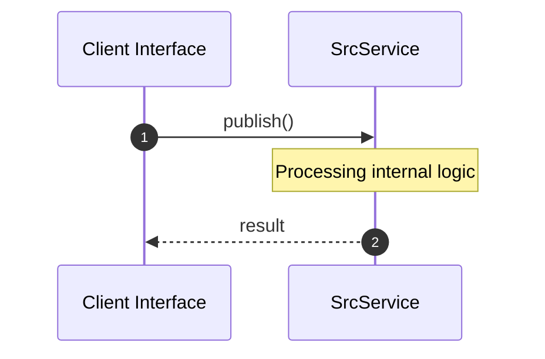

# Module Name: src

* **Source Directory Reference:** `crates/factory-infrastructure/src/`
* **Package Dependency:** [aethalgard, s3, reqwest, futures_util, serde_json, mcp_client, tokio, rdkafka, r2r, anyhow, serde, wiremock, kafka, factory_core, ziti, gitlab, async_trait, ed25519_dalek, std, chrono, aws_sdk_s3, sentry, super, jira, rand, crate]

## 1. Executive Summary & Purpose
Technical architecture and class hierarchy for the `src` module, documenting its core responsibilities and structural design.

## 2. UML 2.0 Class & Inheritance Architecture (Deterministic)
The following class diagram models the object-oriented structure, explicit inheritance hierarchies, and polymorphic interface implementations derived from local AST analysis:

```mermaid
classDiagram
    direction BT
    class KafkaClient {
        <<trait>>
        +publish()
        +publish_thought()
    }
    class RdKafkaClient {
        +new()
        +publish()
    }
    KafkaClient <|-- RdKafkaClient : Inheritance / Specialization
    class SimpleMockKafkaClient {
        +new()
        +publish()
    }
    KafkaClient <|-- SimpleMockKafkaClient : Inheritance / Specialization
    class McpClient {
        <<trait>>
        +call_tool_json()
    }
    class McpHttpClient {
        +call_tool_json()
        +new()
    }
    McpClient <|-- McpHttpClient : Inheritance / Specialization
    class McpSseClient {
        +new()
        +call_tool_json()
    }
    McpClient <|-- McpSseClient : Inheritance / Specialization
    class GitlabIssue {
    }
    class GitlabClient {
        <<trait>>
        +create_issue()
    }
    class HttpGitlabClient {
        +new()
        +create_issue()
    }
    GitlabClient <|-- HttpGitlabClient : Inheritance / Specialization
    class Ed25519Validator {
        +new()
        +validate_signature()
    }
    SecurityValidator <|-- Ed25519Validator : Inheritance / Specialization
    class ZitiIdentity {
        <<trait>>
        +get_token()
        +service_name()
    }
    class OpenZitiIdentity {
        +new()
        +get_token()
    }
    ZitiIdentity <|-- OpenZitiIdentity : Inheritance / Specialization
    class AethalgardClient {
        <<trait>>
        +notify_remediation()
    }
    class HttpAethalgardClient {
        +new()
        +notify_remediation()
    }
    AethalgardClient <|-- HttpAethalgardClient : Inheritance / Specialization
    class CrashEvent {
    }
    class SentryClient {
        <<trait>>
        +fetch_recent_crashes()
    }
    class HttpSentryClient {
        +new()
        +fetch_recent_crashes()
    }
    SentryClient <|-- HttpSentryClient : Inheritance / Specialization
    class VaultSecurityBounds {
        +new()
        +validate_token()
    }
    SecurityBounds <|-- VaultSecurityBounds : Inheritance / Specialization
    class S3Storage {
        <<trait>>
        +put_object()
        +get_object()
    }
    class JiraClient {
        <<trait>>
        +search_issues()
    }
    class HttpJiraClient {
        +new()
        +search_issues()
    }
    JiraClient <|-- HttpJiraClient : Inheritance / Specialization
    class R2rClient {
        <<trait>>
        +search()
        +push_osr_metric()
    }
    class HttpR2rClient {
        +new()
        +search()
    }
    R2rClient <|-- HttpR2rClient : Inheritance / Specialization
    class AwsS3Storage {
        +new()
        +put_object()
    }
    S3Storage <|-- AwsS3Storage : Inheritance / Specialization

```

## 3. Package & Class Relations

* **Inheritance & Polymorphism:** Detailed breakdown of abstract base classes, interfaces, and concrete overrides within `crates/factory-infrastructure/src`.
* **Dependencies:** How classes within this package collaborate externally.

## 4. Execution Flow & Runtime Behavior

The following sequence diagram outlines the execution lifecycle and message passing during core operations:

---

* **Source Citations:**
* Class `KafkaClient`: `crates/factory-infrastructure/src/kafka.rs:8`
  * Method `publish`: `crates/factory-infrastructure/src/kafka.rs:9`
  * Method `publish_thought`: `crates/factory-infrastructure/src/kafka.rs:10`
* Class `RdKafkaClient`: `crates/factory-infrastructure/src/kafka.rs:27`
  * Method `new`: `crates/factory-infrastructure/src/kafka.rs:32`
  * Method `publish`: `crates/factory-infrastructure/src/kafka.rs:43`
* Class `SimpleMockKafkaClient`: `crates/factory-infrastructure/src/kafka.rs:54`
  * Method `new`: `crates/factory-infrastructure/src/kafka.rs:58`
  * Method `publish`: `crates/factory-infrastructure/src/kafka.rs:66`
* Class `McpClient`: `crates/factory-infrastructure/src/mcp_client.rs:8`
  * Method `call_tool_json`: `crates/factory-infrastructure/src/mcp_client.rs:9`
* Class `McpHttpClient`: `crates/factory-infrastructure/src/mcp_client.rs:12`
  * Method `call_tool_json`: `crates/factory-infrastructure/src/mcp_client.rs:19`
  * Method `new`: `crates/factory-infrastructure/src/mcp_client.rs:64`
* Class `McpSseClient`: `crates/factory-infrastructure/src/mcp_client.rs:73`
  * Method `new`: `crates/factory-infrastructure/src/mcp_client.rs:80`
  * Method `call_tool_json`: `crates/factory-infrastructure/src/mcp_client.rs:131`
* Method `get_session_url`: `crates/factory-infrastructure/src/mcp_client.rs:88`
* Method `test_call_tool_http_success`: `crates/factory-infrastructure/src/mcp_client.rs:179`
* Method `test_call_tool_sse_success`: `crates/factory-infrastructure/src/mcp_client.rs:200`
* Class `GitlabIssue`: `crates/factory-infrastructure/src/gitlab.rs:5`
* Class `GitlabClient`: `crates/factory-infrastructure/src/gitlab.rs:15`
  * Method `create_issue`: `crates/factory-infrastructure/src/gitlab.rs:16`
* Class `HttpGitlabClient`: `crates/factory-infrastructure/src/gitlab.rs:24`
  * Method `new`: `crates/factory-infrastructure/src/gitlab.rs:31`
  * Method `create_issue`: `crates/factory-infrastructure/src/gitlab.rs:42`
* Method `test_gitlab_create_issue_success`: `crates/factory-infrastructure/src/gitlab.rs:88`
* Method `test_gitlab_create_issue_unauthorized`: `crates/factory-infrastructure/src/gitlab.rs:127`
* Class `Ed25519Validator`: `crates/factory-infrastructure/src/security_validator.rs:7`
  * Method `new`: `crates/factory-infrastructure/src/security_validator.rs:13`
  * Method `validate_signature`: `crates/factory-infrastructure/src/security_validator.rs:32`
* Method `audit_content`: `crates/factory-infrastructure/src/security_validator.rs:60`
* Method `test_ed25519_signature_validation`: `crates/factory-infrastructure/src/security_validator.rs:94`
* Class `ZitiIdentity`: `crates/factory-infrastructure/src/ziti.rs:5`
  * Method `get_token`: `crates/factory-infrastructure/src/ziti.rs:6`
  * Method `service_name`: `crates/factory-infrastructure/src/ziti.rs:7`
* Class `OpenZitiIdentity`: `crates/factory-infrastructure/src/ziti.rs:10`
  * Method `new`: `crates/factory-infrastructure/src/ziti.rs:16`
  * Method `get_token`: `crates/factory-infrastructure/src/ziti.rs:26`
* Method `service_name`: `crates/factory-infrastructure/src/ziti.rs:66`
* Method `test_open_ziti_identity_new`: `crates/factory-infrastructure/src/ziti.rs:76`
* Method `test_open_ziti_identity_trait_methods`: `crates/factory-infrastructure/src/ziti.rs:86`
* Class `AethalgardClient`: `crates/factory-infrastructure/src/aethalgard.rs:6`
  * Method `notify_remediation`: `crates/factory-infrastructure/src/aethalgard.rs:7`
* Class `HttpAethalgardClient`: `crates/factory-infrastructure/src/aethalgard.rs:11`
  * Method `new`: `crates/factory-infrastructure/src/aethalgard.rs:17`
  * Method `notify_remediation`: `crates/factory-infrastructure/src/aethalgard.rs:27`
* Class `CrashEvent`: `crates/factory-infrastructure/src/sentry.rs:5`
* Class `SentryClient`: `crates/factory-infrastructure/src/sentry.rs:16`
  * Method `fetch_recent_crashes`: `crates/factory-infrastructure/src/sentry.rs:17`
* Class `HttpSentryClient`: `crates/factory-infrastructure/src/sentry.rs:24`
  * Method `new`: `crates/factory-infrastructure/src/sentry.rs:31`
  * Method `fetch_recent_crashes`: `crates/factory-infrastructure/src/sentry.rs:42`
* Method `test_sentry_fetch_success`: `crates/factory-infrastructure/src/sentry.rs:96`
* Method `test_sentry_fetch_unauthorized`: `crates/factory-infrastructure/src/sentry.rs:130`
* Method `test_sentry_fetch_prepends_org_slug`: `crates/factory-infrastructure/src/sentry.rs:146`
* Class `VaultSecurityBounds`: `crates/factory-infrastructure/src/vault.rs:6`
  * Method `new`: `crates/factory-infrastructure/src/vault.rs:13`
  * Method `validate_token`: `crates/factory-infrastructure/src/vault.rs:24`
* Method `issue_jit_token`: `crates/factory-infrastructure/src/vault.rs:60`
* Method `test_vault_issue_and_validate`: `crates/factory-infrastructure/src/vault.rs:107`
* Class `S3Storage`: `crates/factory-infrastructure/src/lib.rs:3`
  * Method `put_object`: `crates/factory-infrastructure/src/lib.rs:4`
  * Method `get_object`: `crates/factory-infrastructure/src/lib.rs:5`
* Class `JiraClient`: `crates/factory-infrastructure/src/jira.rs:5`
  * Method `search_issues`: `crates/factory-infrastructure/src/jira.rs:6`
* Class `HttpJiraClient`: `crates/factory-infrastructure/src/jira.rs:9`
  * Method `new`: `crates/factory-infrastructure/src/jira.rs:17`
  * Method `search_issues`: `crates/factory-infrastructure/src/jira.rs:29`
* Method `test_jira_search_success`: `crates/factory-infrastructure/src/jira.rs:79`
* Method `test_jira_search_no_results`: `crates/factory-infrastructure/src/jira.rs:110`
* Method `test_jira_search_unauthorized`: `crates/factory-infrastructure/src/jira.rs:130`
* Method `test_jira_search_server_error`: `crates/factory-infrastructure/src/jira.rs:148`
* Class `R2rClient`: `crates/factory-infrastructure/src/r2r.rs:6`
  * Method `search`: `crates/factory-infrastructure/src/r2r.rs:7`
  * Method `push_osr_metric`: `crates/factory-infrastructure/src/r2r.rs:8`
* Class `HttpR2rClient`: `crates/factory-infrastructure/src/r2r.rs:11`
  * Method `new`: `crates/factory-infrastructure/src/r2r.rs:19`
  * Method `search`: `crates/factory-infrastructure/src/r2r.rs:64`
* Method `get_token`: `crates/factory-infrastructure/src/r2r.rs:28`
* Method `push_osr_metric`: `crates/factory-infrastructure/src/r2r.rs:116`
* Method `test_r2r_search_success`: `crates/factory-infrastructure/src/r2r.rs:159`
* Method `test_r2r_login_failure`: `crates/factory-infrastructure/src/r2r.rs:202`
* Method `test_r2r_search_failure_after_login`: `crates/factory-infrastructure/src/r2r.rs:221`
* Class `AwsS3Storage`: `crates/factory-infrastructure/src/s3.rs:6`
  * Method `new`: `crates/factory-infrastructure/src/s3.rs:11`
  * Method `put_object`: `crates/factory-infrastructure/src/s3.rs:20`
* Method `get_object`: `crates/factory-infrastructure/src/s3.rs:31`
