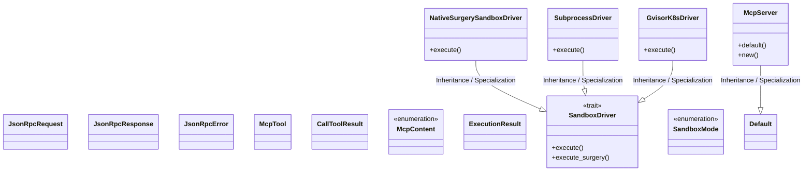
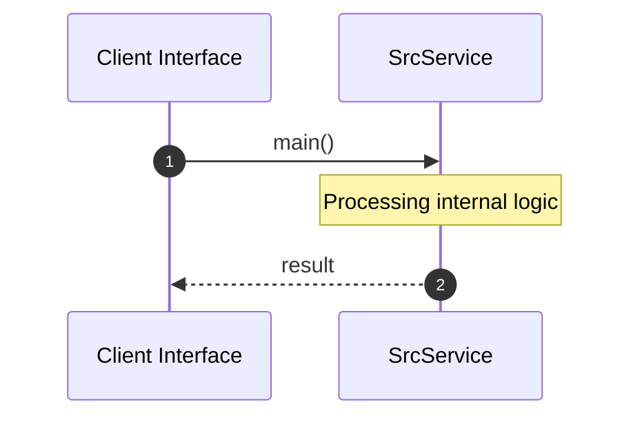

# Module Name: src

* **Source Directory Reference:** `crates/factory-mcp-server/src/`
* **Package Dependency:** [std, axum, factory_mcp_server, tower_http, super, factory_core, crate, async_trait, serde_json, factory_infrastructure, reqwest, async_openai, tokio_stream, tokio, serde]

## 1. Executive Summary & Purpose
Technical architecture and class hierarchy for the `src` module, documenting its core responsibilities and structural design.

## 2. UML 2.0 Class & Inheritance Architecture (Deterministic)
The following class diagram models the object-oriented structure, explicit inheritance hierarchies, and polymorphic interface implementations derived from local AST analysis:

## 3. Package & Class Relations

* **Inheritance & Polymorphism:** Detailed breakdown of abstract base classes, interfaces, and concrete overrides within `crates/factory-mcp-server/src`.
* **Dependencies:** How classes within this package collaborate externally.

## 4. Execution Flow & Runtime Behavior

The following sequence diagram outlines the execution lifecycle and message passing during core operations:

---

* **Source Citations:**
* Class `JsonRpcRequest`: `crates/factory-mcp-server/src/protocol.rs:4`
* Class `JsonRpcResponse`: `crates/factory-mcp-server/src/protocol.rs:14`
* Class `JsonRpcError`: `crates/factory-mcp-server/src/protocol.rs:25`
* Class `McpTool`: `crates/factory-mcp-server/src/protocol.rs:33`
* Class `CallToolResult`: `crates/factory-mcp-server/src/protocol.rs:41`
* Class `McpContent`: `crates/factory-mcp-server/src/protocol.rs:49`
* Method `main`: `crates/factory-mcp-server/src/main.rs:11`
* Method `handle_feedback`: `crates/factory-mcp-server/src/feedback_route.rs:11`
* Method `main`: `crates/factory-mcp-server/src/scratch.rs:5`
* Class `ExecutionResult`: `crates/factory-mcp-server/src/sandbox.rs:8`
* Class `SandboxDriver`: `crates/factory-mcp-server/src/sandbox.rs:16`
  * Method `execute`: `crates/factory-mcp-server/src/sandbox.rs:17`
  * Method `execute_surgery`: `crates/factory-mcp-server/src/sandbox.rs:19`
* Class `NativeSurgerySandboxDriver`: `crates/factory-mcp-server/src/sandbox.rs:30`
  * Method `execute`: `crates/factory-mcp-server/src/sandbox.rs:36`
* Class `SubprocessDriver`: `crates/factory-mcp-server/src/sandbox.rs:49`
  * Method `execute`: `crates/factory-mcp-server/src/sandbox.rs:53`
* Class `SandboxMode`: `crates/factory-mcp-server/src/sandbox.rs:114`
* Class `GvisorK8sDriver`: `crates/factory-mcp-server/src/sandbox.rs:119`
  * Method `execute`: `crates/factory-mcp-server/src/sandbox.rs:123`
* Method `execute_surgery`: `crates/factory-mcp-server/src/sandbox.rs:40`
* Method `test_subprocess_driver_timeout`: `crates/factory-mcp-server/src/sandbox.rs:182`
* Class `McpServer`: `crates/factory-mcp-server/src/lib.rs:23`
  * Method `default`: `crates/factory-mcp-server/src/lib.rs:29`
  * Method `new`: `crates/factory-mcp-server/src/lib.rs:35`
* Method `add_tool`: `crates/factory-mcp-server/src/lib.rs:42`
* Method `register_default_tools`: `crates/factory-mcp-server/src/lib.rs:46`
* Method `handle_request`: `crates/factory-mcp-server/src/lib.rs:128`
* Method `handle_list_tools`: `crates/factory-mcp-server/src/lib.rs:161`
* Method `handle_call_tool`: `crates/factory-mcp-server/src/lib.rs:180`
* Method `sse_handler`: `crates/factory-mcp-server/src/lib.rs:204`
* Method `post_handler`: `crates/factory-mcp-server/src/lib.rs:232`
* Method `error_response`: `crates/factory-mcp-server/src/lib.rs:250`
* Method `ax_keep_alive`: `crates/factory-mcp-server/src/lib.rs:264`
* Method `test_list_tools`: `crates/factory-mcp-server/src/lib.rs:277`
* Method `test_call_tool_not_found`: `crates/factory-mcp-server/src/lib.rs:306`
* Method `test_call_tool_error_sanitization`: `crates/factory-mcp-server/src/lib.rs:321`
* Method `test_call_tool_success`: `crates/factory-mcp-server/src/lib.rs:348`
