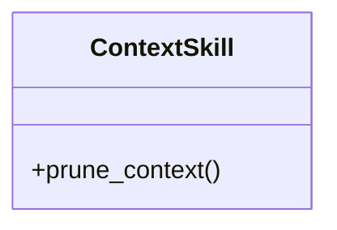
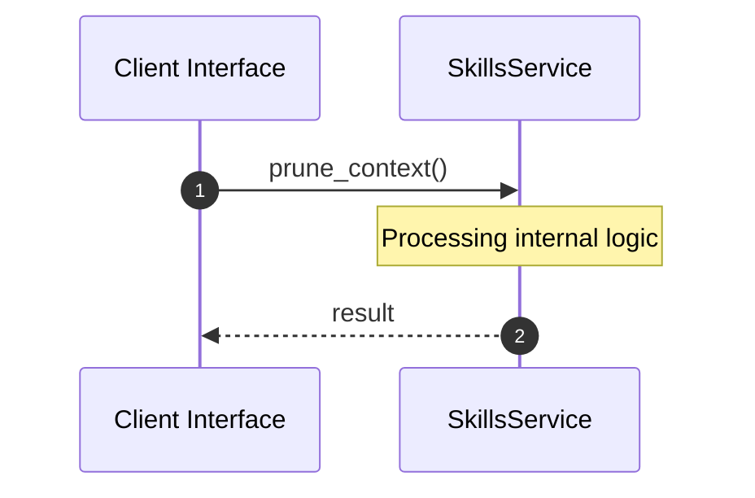

# Module Name: skills

* **Source Directory Reference:** `crates/factory-mcp-server/src/skills/`
* **Package Dependency:** [serde_json, super]

## 1. Executive Summary & Purpose
Technical architecture and class hierarchy for the `skills` module, documenting its core responsibilities and structural design.

## 2. UML 2.0 Class & Inheritance Architecture (Deterministic)
The following class diagram models the object-oriented structure, explicit inheritance hierarchies, and polymorphic interface implementations derived from local AST analysis:

## 3. Package & Class Relations

* **Inheritance & Polymorphism:** Detailed breakdown of abstract base classes, interfaces, and concrete overrides within `crates/factory-mcp-server/src/skills`.
* **Dependencies:** How classes within this package collaborate externally.

## 4. Execution Flow & Runtime Behavior

The following sequence diagram outlines the execution lifecycle and message passing during core operations:

---

* **Source Citations:**
* Class `ContextSkill`: `crates/factory-mcp-server/src/skills/context.rs:3`
  * Method `prune_context`: `crates/factory-mcp-server/src/skills/context.rs:6`
* Method `format_for_llm`: `crates/factory-mcp-server/src/skills/context.rs:26`
* Method `test_prune_context_no_pruning`: `crates/factory-mcp-server/src/skills/context.rs:40`
* Method `test_prune_context_with_newline`: `crates/factory-mcp-server/src/skills/context.rs:47`
* Method `test_prune_context_without_newline`: `crates/factory-mcp-server/src/skills/context.rs:56`
* Method `test_prune_context_empty`: `crates/factory-mcp-server/src/skills/context.rs:63`
* Method `test_prune_context_max_zero`: `crates/factory-mcp-server/src/skills/context.rs:69`
* Method `test_format_for_llm`: `crates/factory-mcp-server/src/skills/context.rs:75`
* Method `test_prune_context_unicode_boundary`: `crates/factory-mcp-server/src/skills/context.rs:85`
* Method `test_prune_context_unicode_invalid_boundary`: `crates/factory-mcp-server/src/skills/context.rs:93`
