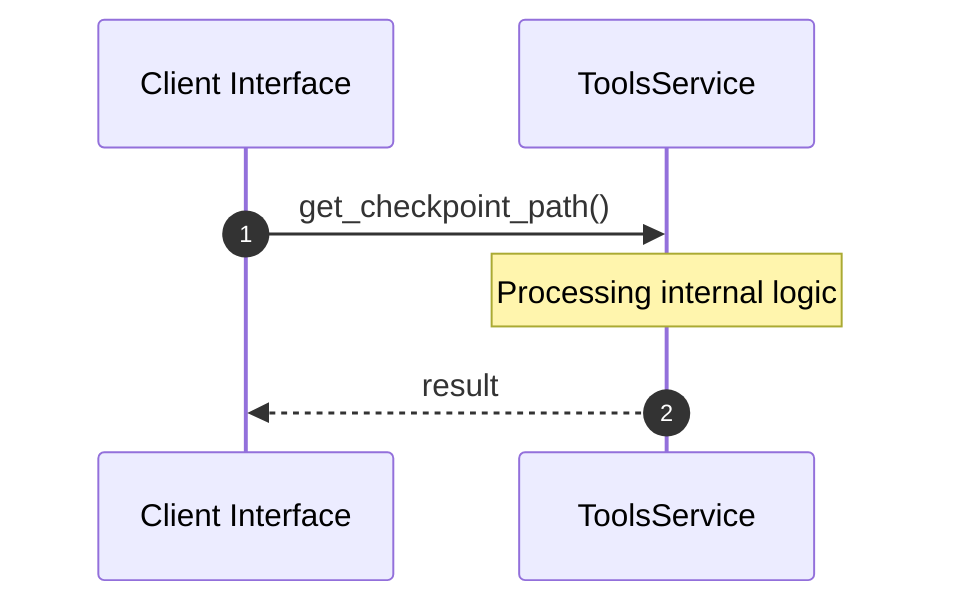

# Module Name: tools

* **Source Directory Reference:** `crates/factory-mcp-server/src/tools/`
* **Package Dependency:** [security_review, spec_kit_tool, search_jira, reqwest, k8s_openapi, serde_json, bridge, index_code, tokio, serde, run_tests, execute_code, kube, async_openai, factory_core, async_trait, factory_infrastructure, std, chrono, update_mission_status, retrieve_context, spec_kit_tasks_to_issues, super, plan_mission, launch_sandbox_pod, crate]

## 1. Executive Summary & Purpose
Technical architecture and class hierarchy for the `tools` module, documenting its core responsibilities and structural design.

## 2. UML 2.0 Class & Inheritance Architecture (Deterministic)
The following class diagram models the object-oriented structure, explicit inheritance hierarchies, and polymorphic interface implementations derived from local AST analysis:

```mermaid
classDiagram
    direction BT
    class BridgeTool {
        +get_checkpoint_path()
        +name()
    }
    Tool <|-- BridgeTool : Inheritance / Specialization
    class PlanMissionTool {
        +new()
        +name()
    }
    Tool <|-- PlanMissionTool : Inheritance / Specialization
    class RunTestsTool {
        +new()
        +name()
    }
    Tool <|-- RunTestsTool : Inheritance / Specialization
    class ExecuteCodeTool {
        +new()
        +name()
    }
    Tool <|-- ExecuteCodeTool : Inheritance / Specialization
    class UpdateMissionStatusTool {
        +new()
        +name()
    }
    Tool <|-- UpdateMissionStatusTool : Inheritance / Specialization
    class IndexCodeTool {
        +new()
        +name()
    }
    Tool <|-- IndexCodeTool : Inheritance / Specialization
    class RetrieveContextTool {
        +new()
        +name()
    }
    Tool <|-- RetrieveContextTool : Inheritance / Specialization
    class ManualMockR2rClient {
        +search()
    }
    R2rClient <|-- ManualMockR2rClient : Inheritance / Specialization
    class SpecKitCommand {
        <<enumeration>>
    }
    class SpecProvider {
        <<trait>>
        +invoke()
    }
    class MockSpecProvider {
        +new()
        +default()
        +invoke()
    }
    Default <|-- MockSpecProvider : Inheritance / Specialization
    SpecProvider <|-- MockSpecProvider : Inheritance / Specialization
    class CliSpecProvider {
        +new()
        +invoke()
    }
    SpecProvider <|-- CliSpecProvider : Inheritance / Specialization
    class SpecKitTool {
        +new()
        +name()
    }
    Tool <|-- SpecKitTool : Inheritance / Specialization
    class SearchJiraTool {
        +new()
        +name()
    }
    Tool <|-- SearchJiraTool : Inheritance / Specialization
    class ManualMockJiraClient {
        +search_issues()
    }
    JiraClient <|-- ManualMockJiraClient : Inheritance / Specialization
    class Tool {
        <<trait>>
        +name()
        +description()
        +input_schema()
        +call()
    }
    class SpecKitTasksToIssuesTool {
        +new()
        +name()
    }
    Tool <|-- SpecKitTasksToIssuesTool : Inheritance / Specialization
    class SecurityReviewTool {
        +new()
        +default()
        +name()
    }
    Default <|-- SecurityReviewTool : Inheritance / Specialization
    Tool <|-- SecurityReviewTool : Inheritance / Specialization
    class SandboxJobSpec {
    }
    class LaunchSandboxPodTool {
        +new()
        +default()
        +name()
    }
    Default <|-- LaunchSandboxPodTool : Inheritance / Specialization
    Tool <|-- LaunchSandboxPodTool : Inheritance / Specialization

```

## 3. Package & Class Relations

* **Inheritance & Polymorphism:** Detailed breakdown of abstract base classes, interfaces, and concrete overrides within `crates/factory-mcp-server/src/tools`.
* **Dependencies:** How classes within this package collaborate externally.

## 4. Execution Flow & Runtime Behavior

The following sequence diagram outlines the execution lifecycle and message passing during core operations:

---

* **Source Citations:**
* Class `BridgeTool`: `crates/factory-mcp-server/src/tools/bridge.rs:8`
  * Method `get_checkpoint_path`: `crates/factory-mcp-server/src/tools/bridge.rs:11`
  * Method `name`: `crates/factory-mcp-server/src/tools/bridge.rs:46`
* Method `load_state`: `crates/factory-mcp-server/src/tools/bridge.rs:15`
* Method `save_state`: `crates/factory-mcp-server/src/tools/bridge.rs:29`
* Method `description`: `crates/factory-mcp-server/src/tools/bridge.rs:50`
* Method `input_schema`: `crates/factory-mcp-server/src/tools/bridge.rs:54`
* Method `call`: `crates/factory-mcp-server/src/tools/bridge.rs:76`
* Class `PlanMissionTool`: `crates/factory-mcp-server/src/tools/plan_mission.rs:17`
  * Method `new`: `crates/factory-mcp-server/src/tools/plan_mission.rs:23`
  * Method `name`: `crates/factory-mcp-server/src/tools/plan_mission.rs:49`
* Method `description`: `crates/factory-mcp-server/src/tools/plan_mission.rs:53`
* Method `input_schema`: `crates/factory-mcp-server/src/tools/plan_mission.rs:57`
* Method `call`: `crates/factory-mcp-server/src/tools/plan_mission.rs:67`
* Class `RunTestsTool`: `crates/factory-mcp-server/src/tools/run_tests.rs:8`
  * Method `new`: `crates/factory-mcp-server/src/tools/run_tests.rs:14`
  * Method `name`: `crates/factory-mcp-server/src/tools/run_tests.rs:21`
* Method `description`: `crates/factory-mcp-server/src/tools/run_tests.rs:25`
* Method `input_schema`: `crates/factory-mcp-server/src/tools/run_tests.rs:29`
* Method `call`: `crates/factory-mcp-server/src/tools/run_tests.rs:40`
* Class `ExecuteCodeTool`: `crates/factory-mcp-server/src/tools/execute_code.rs:8`
  * Method `new`: `crates/factory-mcp-server/src/tools/execute_code.rs:14`
  * Method `name`: `crates/factory-mcp-server/src/tools/execute_code.rs:21`
* Method `description`: `crates/factory-mcp-server/src/tools/execute_code.rs:25`
* Method `input_schema`: `crates/factory-mcp-server/src/tools/execute_code.rs:29`
* Method `call`: `crates/factory-mcp-server/src/tools/execute_code.rs:40`
* Class `UpdateMissionStatusTool`: `crates/factory-mcp-server/src/tools/update_mission_status.rs:9`
  * Method `new`: `crates/factory-mcp-server/src/tools/update_mission_status.rs:14`
  * Method `name`: `crates/factory-mcp-server/src/tools/update_mission_status.rs:21`
* Method `description`: `crates/factory-mcp-server/src/tools/update_mission_status.rs:25`
* Method `input_schema`: `crates/factory-mcp-server/src/tools/update_mission_status.rs:30`
* Method `call`: `crates/factory-mcp-server/src/tools/update_mission_status.rs:44`
* Class `IndexCodeTool`: `crates/factory-mcp-server/src/tools/index_code.rs:6`
  * Method `new`: `crates/factory-mcp-server/src/tools/index_code.rs:12`
  * Method `name`: `crates/factory-mcp-server/src/tools/index_code.rs:22`
* Method `description`: `crates/factory-mcp-server/src/tools/index_code.rs:26`
* Method `input_schema`: `crates/factory-mcp-server/src/tools/index_code.rs:30`
* Method `call`: `crates/factory-mcp-server/src/tools/index_code.rs:41`
* Method `test_index_code_tool_missing_content`: `crates/factory-mcp-server/src/tools/index_code.rs:87`
* Class `RetrieveContextTool`: `crates/factory-mcp-server/src/tools/retrieve_context.rs:8`
  * Method `new`: `crates/factory-mcp-server/src/tools/retrieve_context.rs:13`
  * Method `name`: `crates/factory-mcp-server/src/tools/retrieve_context.rs:20`
* Class `ManualMockR2rClient`: `crates/factory-mcp-server/src/tools/retrieve_context.rs:62`
  * Method `search`: `crates/factory-mcp-server/src/tools/retrieve_context.rs:68`
* Method `description`: `crates/factory-mcp-server/src/tools/retrieve_context.rs:24`
* Method `input_schema`: `crates/factory-mcp-server/src/tools/retrieve_context.rs:28`
* Method `call`: `crates/factory-mcp-server/src/tools/retrieve_context.rs:38`
* Method `push_osr_metric`: `crates/factory-mcp-server/src/tools/retrieve_context.rs:76`
* Method `test_retrieve_context_tool_success`: `crates/factory-mcp-server/src/tools/retrieve_context.rs:82`
* Method `test_retrieve_context_tool_failure`: `crates/factory-mcp-server/src/tools/retrieve_context.rs:95`
* Class `SpecKitCommand`: `crates/factory-mcp-server/src/tools/spec_kit_tool.rs:10`
* Class `SpecProvider`: `crates/factory-mcp-server/src/tools/spec_kit_tool.rs:34`
  * Method `invoke`: `crates/factory-mcp-server/src/tools/spec_kit_tool.rs:35`
* Class `MockSpecProvider`: `crates/factory-mcp-server/src/tools/spec_kit_tool.rs:39`
  * Method `new`: `crates/factory-mcp-server/src/tools/spec_kit_tool.rs:44`
  * Method `default`: `crates/factory-mcp-server/src/tools/spec_kit_tool.rs:50`
  * Method `invoke`: `crates/factory-mcp-server/src/tools/spec_kit_tool.rs:59`
* Class `CliSpecProvider`: `crates/factory-mcp-server/src/tools/spec_kit_tool.rs:104`
  * Method `new`: `crates/factory-mcp-server/src/tools/spec_kit_tool.rs:110`
  * Method `invoke`: `crates/factory-mcp-server/src/tools/spec_kit_tool.rs:120`
* Class `SpecKitTool`: `crates/factory-mcp-server/src/tools/spec_kit_tool.rs:155`
  * Method `new`: `crates/factory-mcp-server/src/tools/spec_kit_tool.rs:160`
  * Method `name`: `crates/factory-mcp-server/src/tools/spec_kit_tool.rs:185`
* Method `with_provider`: `crates/factory-mcp-server/src/tools/spec_kit_tool.rs:170`
* Method `invoke_spec_kit`: `crates/factory-mcp-server/src/tools/spec_kit_tool.rs:174`
* Method `description`: `crates/factory-mcp-server/src/tools/spec_kit_tool.rs:189`
* Method `input_schema`: `crates/factory-mcp-server/src/tools/spec_kit_tool.rs:193`
* Method `call`: `crates/factory-mcp-server/src/tools/spec_kit_tool.rs:213`
* Method `test_mock_spec_provider`: `crates/factory-mcp-server/src/tools/spec_kit_tool.rs:251`
* Method `test_cli_spec_provider_fallback`: `crates/factory-mcp-server/src/tools/spec_kit_tool.rs:295`
* Method `test_spec_kit_tool_mock_mode`: `crates/factory-mcp-server/src/tools/spec_kit_tool.rs:318`
* Class `SearchJiraTool`: `crates/factory-mcp-server/src/tools/search_jira.rs:8`
  * Method `new`: `crates/factory-mcp-server/src/tools/search_jira.rs:13`
  * Method `name`: `crates/factory-mcp-server/src/tools/search_jira.rs:20`
* Class `ManualMockJiraClient`: `crates/factory-mcp-server/src/tools/search_jira.rs:62`
  * Method `search_issues`: `crates/factory-mcp-server/src/tools/search_jira.rs:68`
* Method `description`: `crates/factory-mcp-server/src/tools/search_jira.rs:24`
* Method `input_schema`: `crates/factory-mcp-server/src/tools/search_jira.rs:28`
* Method `call`: `crates/factory-mcp-server/src/tools/search_jira.rs:38`
* Method `test_search_jira_tool_success`: `crates/factory-mcp-server/src/tools/search_jira.rs:78`
* Method `test_search_jira_tool_failure`: `crates/factory-mcp-server/src/tools/search_jira.rs:91`
* Class `Tool`: `crates/factory-mcp-server/src/tools/mod.rs:7`
  * Method `name`: `crates/factory-mcp-server/src/tools/mod.rs:8`
  * Method `description`: `crates/factory-mcp-server/src/tools/mod.rs:9`
  * Method `input_schema`: `crates/factory-mcp-server/src/tools/mod.rs:10`
  * Method `call`: `crates/factory-mcp-server/src/tools/mod.rs:12`
* Class `SpecKitTasksToIssuesTool`: `crates/factory-mcp-server/src/tools/spec_kit_tasks_to_issues.rs:8`
  * Method `new`: `crates/factory-mcp-server/src/tools/spec_kit_tasks_to_issues.rs:13`
  * Method `name`: `crates/factory-mcp-server/src/tools/spec_kit_tasks_to_issues.rs:20`
* Method `description`: `crates/factory-mcp-server/src/tools/spec_kit_tasks_to_issues.rs:24`
* Method `input_schema`: `crates/factory-mcp-server/src/tools/spec_kit_tasks_to_issues.rs:29`
* Method `call`: `crates/factory-mcp-server/src/tools/spec_kit_tasks_to_issues.rs:42`
* Class `SecurityReviewTool`: `crates/factory-mcp-server/src/tools/security_review.rs:9`
  * Method `new`: `crates/factory-mcp-server/src/tools/security_review.rs:15`
  * Method `default`: `crates/factory-mcp-server/src/tools/security_review.rs:32`
  * Method `name`: `crates/factory-mcp-server/src/tools/security_review.rs:39`
* Method `description`: `crates/factory-mcp-server/src/tools/security_review.rs:43`
* Method `input_schema`: `crates/factory-mcp-server/src/tools/security_review.rs:47`
* Method `call`: `crates/factory-mcp-server/src/tools/security_review.rs:57`
* Class `SandboxJobSpec`: `crates/factory-mcp-server/src/tools/launch_sandbox_pod.rs:12`
* Class `LaunchSandboxPodTool`: `crates/factory-mcp-server/src/tools/launch_sandbox_pod.rs:17`
  * Method `new`: `crates/factory-mcp-server/src/tools/launch_sandbox_pod.rs:20`
  * Method `default`: `crates/factory-mcp-server/src/tools/launch_sandbox_pod.rs:26`
  * Method `name`: `crates/factory-mcp-server/src/tools/launch_sandbox_pod.rs:33`
* Method `description`: `crates/factory-mcp-server/src/tools/launch_sandbox_pod.rs:37`
* Method `input_schema`: `crates/factory-mcp-server/src/tools/launch_sandbox_pod.rs:41`
* Method `call`: `crates/factory-mcp-server/src/tools/launch_sandbox_pod.rs:52`
