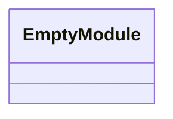
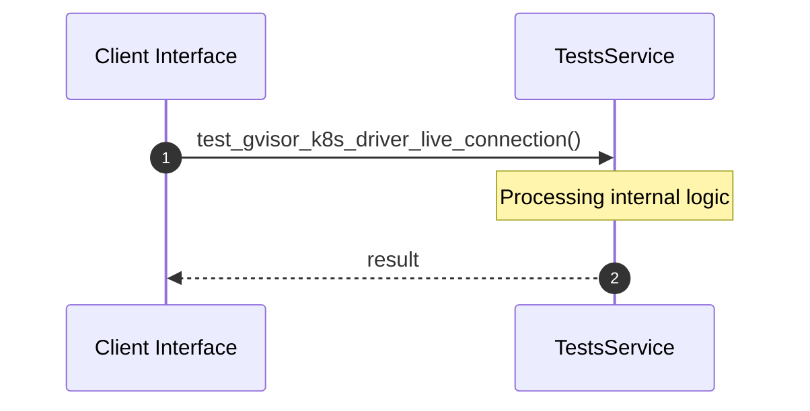

# Module Name: tests

* **Source Directory Reference:** `crates/factory-mcp-server/tests/`
* **Package Dependency:** [k8s_openapi, serde_json, factory_mcp_server, kube]

## 1. Executive Summary & Purpose
Technical architecture and class hierarchy for the `tests` module, documenting its core responsibilities and structural design.

## 2. UML 2.0 Class & Inheritance Architecture (Deterministic)
The following class diagram models the object-oriented structure, explicit inheritance hierarchies, and polymorphic interface implementations derived from local AST analysis:

## 3. Package & Class Relations

* **Inheritance & Polymorphism:** Detailed breakdown of abstract base classes, interfaces, and concrete overrides within `crates/factory-mcp-server/tests`.
* **Dependencies:** How classes within this package collaborate externally.

## 4. Execution Flow & Runtime Behavior

The following sequence diagram outlines the execution lifecycle and message passing during core operations:

---

* **Source Citations:**
* Method `test_gvisor_k8s_driver_live_connection`: `crates/factory-mcp-server/tests/gvisor_integration.rs:10`
* Method `test_security_review_sql_injection`: `crates/factory-mcp-server/tests/security_tests.rs:8`
* Method `test_security_review_command_injection`: `crates/factory-mcp-server/tests/security_tests.rs:29`
* Method `test_security_review_hardcoded_secret`: `crates/factory-mcp-server/tests/security_tests.rs:50`
* Method `test_security_review_safe_code`: `crates/factory-mcp-server/tests/security_tests.rs:70`
