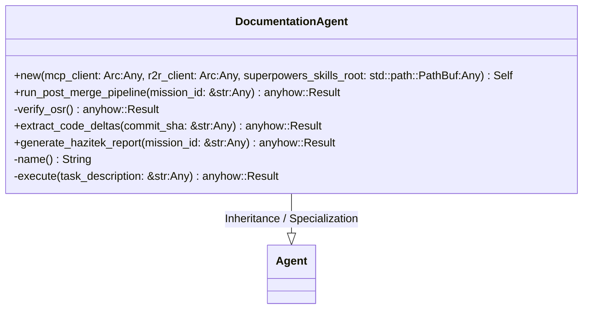
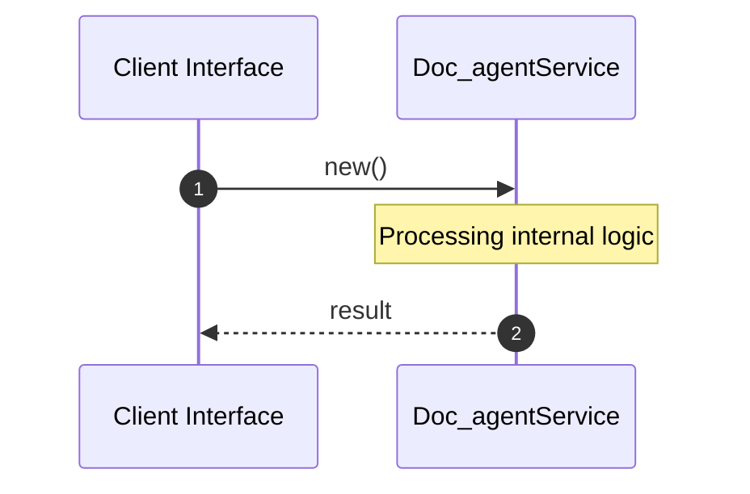

# File: doc_agent.rs

**Source Path:** `crates/factory-application/src/agents/doc_agent.rs`

## Overview

### Purpose
Provides implementation for doc_agent.rs.

### Responsibilities
* Handles logic related to doc_agent.

### Dependencies
* async_trait::async_trait, crate::Agent, factory_infrastructure::{McpClient, R2rClient}, factory_infrastructure::{MockMcpClient, MockR2rClient}, serde_json::{Value, json}, std::sync::Arc, std::time::Duration, super::*

### Imported modules
*

### Exported classes
* DocumentationAgent

### Exported interfaces
*

### Exported functions
* None

## Public API

### Exported Classes / Structs / Interfaces

#### DocumentationAgent

**Overview:**
Why it exists:
Provides capabilities related to DocumentationAgent.

What business capability it provides:
Supports core domain concepts.

How it collaborates with other classes:
Works with related entities to process logic.

**Constructor:**

##### `new(mcp_client: Arc<dyn McpClient> (Any), r2r_client: Arc<dyn R2rClient> (Any), superpowers_skills_root: std::path::PathBuf (Any))`
Parameters: mcp_client: Arc<dyn McpClient> (Any), r2r_client: Arc<dyn R2rClient> (Any), superpowers_skills_root: std::path::PathBuf (Any)
Dependencies: Inherited from context
Initialization: Sets up DocumentationAgent

**Attributes:**

* `mcp_client` (Arc<dyn McpClient>): Purpose - Stores mcp_client data. Constraints - Valid Arc<dyn McpClient>.
* `r2r_client` (Arc<dyn R2rClient>): Purpose - Stores r2r_client data. Constraints - Valid Arc<dyn R2rClient>.
* `superpowers_skills_root` (std::path::PathBuf): Purpose - Stores superpowers_skills_root data. Constraints - Valid std::path::PathBuf.

**Public Methods:**

##### `run_post_merge_pipeline(mission_id: &str (Any)) -> anyhow::Result<Value>`

###### Description
Executes run_post_merge_pipeline.

###### Inputs
* `mission_id: &str`: type=Any, meaning=Input for mission_id: &str, valid values=Any valid Any, optional=No, default value=None

###### Output
Return type: anyhow::Result<Value>
Semantic meaning: Result of run_post_merge_pipeline
Possible null values: Conditional
Exceptions: None handled explicitly

###### Side Effects
Database updates: None
File operations: None
Network calls: None
Cache: None
State changes: Updates internal variables

###### Complexity
Time Complexity: O(1) mostly
Space Complexity: O(1) mostly

###### Example
```
let result = instance.run_post_merge_pipeline();
```

##### `extract_code_deltas(commit_sha: &str (Any)) -> anyhow::Result<String>`

###### Description
Executes extract_code_deltas.

###### Inputs
* `commit_sha: &str`: type=Any, meaning=Input for commit_sha: &str, valid values=Any valid Any, optional=No, default value=None

###### Output
Return type: anyhow::Result<String>
Semantic meaning: Result of extract_code_deltas
Possible null values: Conditional
Exceptions: None handled explicitly

###### Side Effects
Database updates: None
File operations: None
Network calls: None
Cache: None
State changes: Updates internal variables

###### Complexity
Time Complexity: O(1) mostly
Space Complexity: O(1) mostly

###### Example
```
let result = instance.extract_code_deltas();
```

##### `generate_hazitek_report(mission_id: &str (Any)) -> anyhow::Result<factory_core::ComplianceReport>`

###### Description
Executes generate_hazitek_report.

###### Inputs
* `mission_id: &str`: type=Any, meaning=Input for mission_id: &str, valid values=Any valid Any, optional=No, default value=None

###### Output
Return type: anyhow::Result<factory_core::ComplianceReport>
Semantic meaning: Result of generate_hazitek_report
Possible null values: Conditional
Exceptions: None handled explicitly

###### Side Effects
Database updates: None
File operations: None
Network calls: None
Cache: None
State changes: Updates internal variables

###### Complexity
Time Complexity: O(1) mostly
Space Complexity: O(1) mostly

###### Example
```
let result = instance.generate_hazitek_report();
```

**Private Methods:**

* `verify_osr() -> anyhow::Result<f32>`: Internal helper logic.
* `name() -> String`: Internal helper logic.
* `execute(task_description: &str (Any)) -> anyhow::Result<Value>`: Internal helper logic.

### Exported Functions

None.

## Internal architecture



## Execution flow & Sequence explanation



## Examples

```
// Example usage of doc_agent.rs components
import { ... } from 'crates/factory-application/src/agents/doc_agent.rs';
```

## Cross References
* **Parent module:** `crates/factory-application/src/agents`
* **Dependencies:** async_trait::async_trait, crate::Agent, factory_infrastructure::{McpClient, R2rClient}, factory_infrastructure::{MockMcpClient, MockR2rClient}, serde_json::{Value, json}, std::sync::Arc, std::time::Duration, super::*
