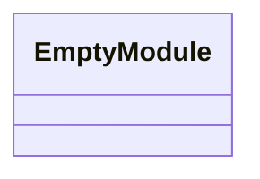
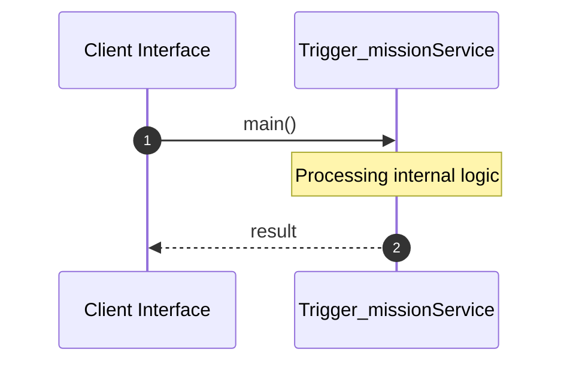

# File: trigger_mission.rs

**Source Path:** `crates/factory-cli/src/bin/trigger_mission.rs`

## Overview

### Purpose
Provides implementation for trigger_mission.rs.

### Responsibilities
* Handles logic related to trigger_mission.

### Dependencies
* hatchet_sdk::Hatchet, hatchet_sdk::Runnable, factory_application::workflows::autonomous_mission::MissionInput

### Imported modules
*

### Exported classes
* None

### Exported interfaces
* None

### Exported functions
*

## Public API

### Exported Classes / Structs / Interfaces

### Exported Functions

None.

## Internal architecture



## Execution flow & Sequence explanation



## Examples

```
// Example usage of trigger_mission.rs components
import { ... } from 'crates/factory-cli/src/bin/trigger_mission.rs';
```

## Cross References
* **Parent module:** `crates/factory-cli/src/bin`
* **Dependencies:** hatchet_sdk::Hatchet, hatchet_sdk::Runnable, factory_application::workflows::autonomous_mission::MissionInput
