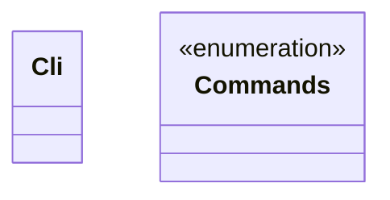
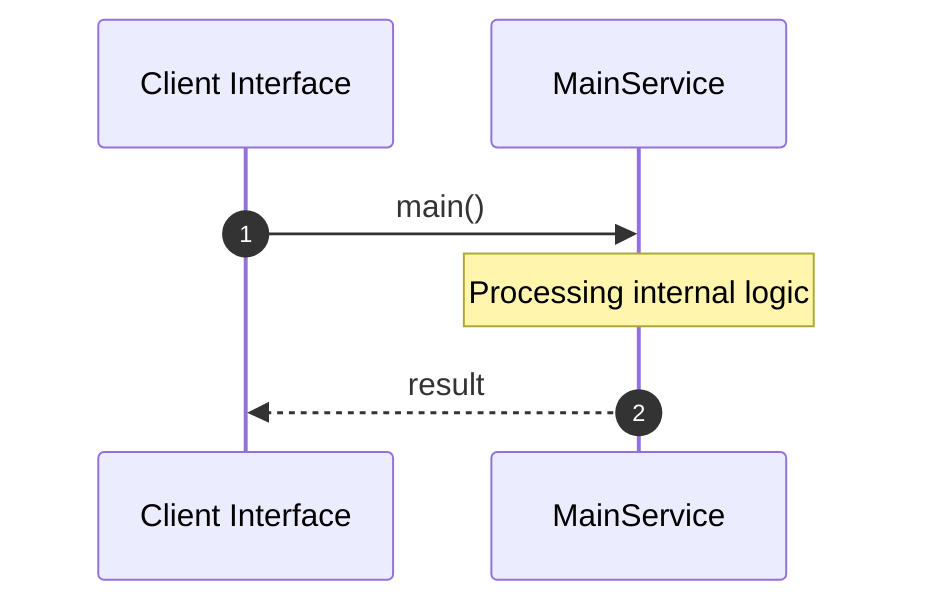

# File: main.rs

**Source Path:** `crates/factory-cli/src/main.rs`

## Overview

### Purpose
Provides implementation for main.rs.

### Responsibilities
* Handles logic related to main.

### Dependencies
* factory_infrastructure::r2r::R2rClient, clap::{Parser, Subcommand}

### Imported modules
*

### Exported classes
* Cli

### Exported interfaces
*

### Exported functions
*

## Public API

### Exported Classes / Structs / Interfaces

#### Cli

**Overview:**
Why it exists:
Provides capabilities related to Cli.

What business capability it provides:
Supports core domain concepts.

How it collaborates with other classes:
Works with related entities to process logic.

**Constructor:**

Default constructor.

**Attributes:**

* `command` (Commands): Purpose - Stores command data. Constraints - Valid Commands.

**Public Methods:**

None.

**Private Methods:**

None.

#### Commands

**Overview:**
Why it exists:
Provides capabilities related to Commands.

What business capability it provides:
Supports core domain concepts.

How it collaborates with other classes:
Works with related entities to process logic.

**Constructor:**

Default constructor.

**Attributes:**

None.

**Public Methods:**

None.

**Private Methods:**

None.

### Exported Functions

None.

## Internal architecture



## Execution flow & Sequence explanation




## Examples

```
// Example usage of main.rs components
import { ... } from 'crates/factory-cli/src/main.rs';
```


## Cross References
* **Parent module:** `crates/factory-cli/src`
* **Dependencies:** factory_infrastructure::r2r::R2rClient, clap::{Parser, Subcommand}
