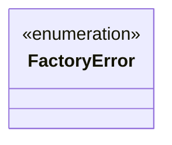
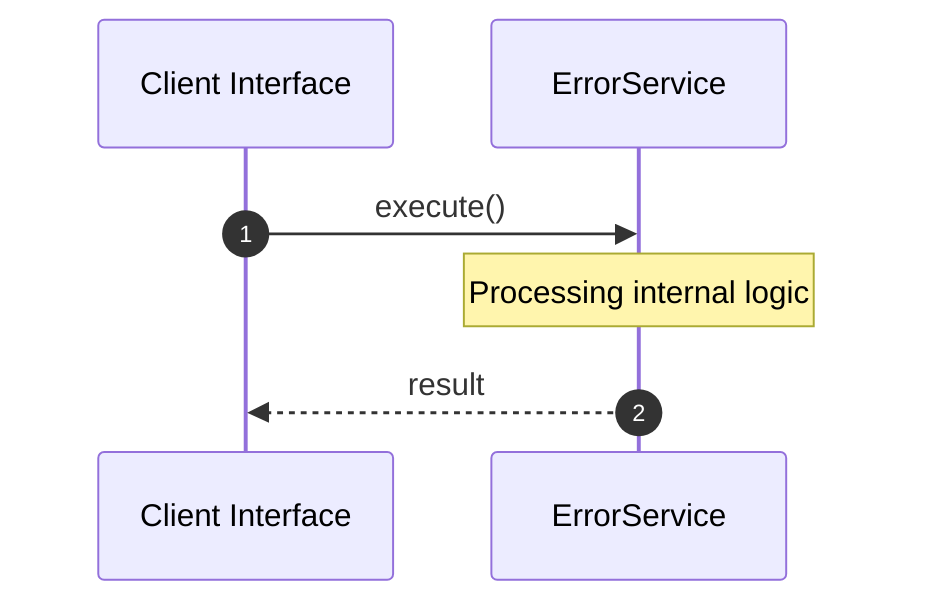

# File: error.rs

**Source Path:** `crates/factory-core/src/error.rs`

## Overview

### Purpose
Provides implementation for error.rs.

### Responsibilities
* Handles logic related to error.

### Dependencies
* thiserror::Error

### Imported modules
*

### Exported classes
*

### Exported interfaces
*

### Exported functions
* None

## Public API

### Exported Classes / Structs / Interfaces

#### FactoryError

**Overview:**
Why it exists:
Provides capabilities related to FactoryError.

What business capability it provides:
Supports core domain concepts.

How it collaborates with other classes:
Works with related entities to process logic.

**Constructor:**

Default constructor.

**Attributes:**

None.

**Public Methods:**

None.

**Private Methods:**

None.

### Exported Functions

None.

## Internal architecture



## Execution flow & Sequence explanation



## Examples

```
// Example usage of error.rs components
import { ... } from 'crates/factory-core/src/error.rs';
```

## Cross References
* **Parent module:** `crates/factory-core/src`
* **Dependencies:** thiserror::Error
