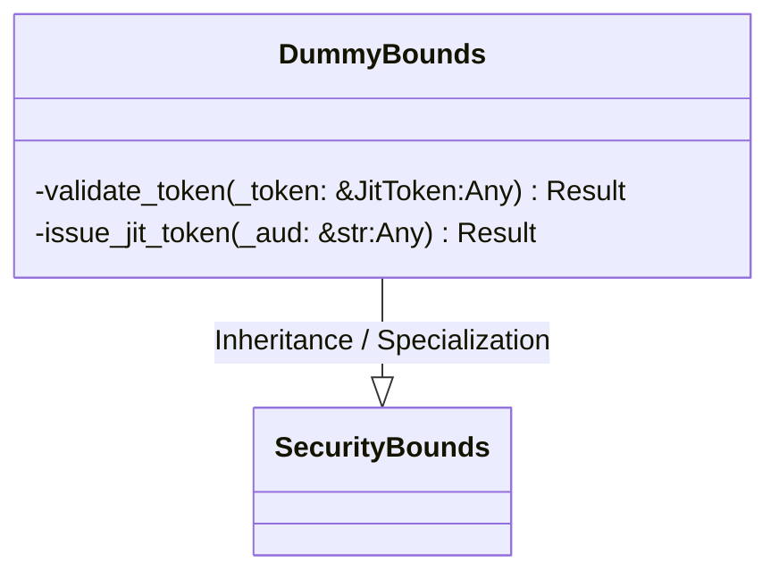
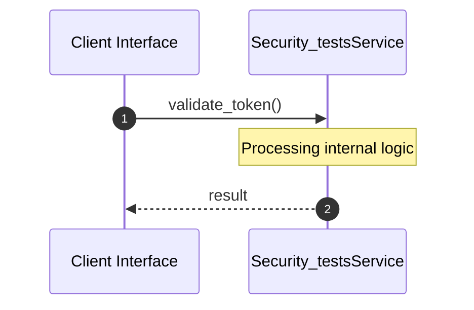

# File: security_tests.rs

**Source Path:** `crates/factory-core/tests/security_tests.rs`

## Overview

### Purpose
Provides implementation for security_tests.rs.

### Responsibilities
* Handles logic related to security_tests.

### Dependencies
* factory_core::security::JitToken, factory_core::security::SecurityBounds, factory_core::error::Result

### Imported modules
*

### Exported classes
* DummyBounds

### Exported interfaces
*

### Exported functions
*

## Public API

### Exported Classes / Structs / Interfaces

#### DummyBounds

**Overview:**
Why it exists:
Provides capabilities related to DummyBounds.

What business capability it provides:
Supports core domain concepts.

How it collaborates with other classes:
Works with related entities to process logic.

**Constructor:**

Default constructor.

**Attributes:**

None.

**Public Methods:**

None.

**Private Methods:**

* `validate_token(_token: &JitToken (Any)) -> Result<bool>`: Internal helper logic.
* `issue_jit_token(_aud: &str (Any)) -> Result<JitToken>`: Internal helper logic.

### Exported Functions

None.

## Internal architecture



## Execution flow & Sequence explanation




## Examples

```
// Example usage of security_tests.rs components
import { ... } from 'crates/factory-core/tests/security_tests.rs';
```


## Cross References
* **Parent module:** `crates/factory-core/tests`
* **Dependencies:** factory_core::security::JitToken, factory_core::security::SecurityBounds, factory_core::error::Result
