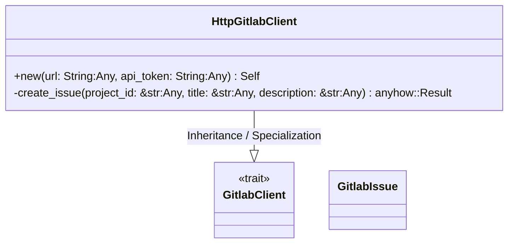
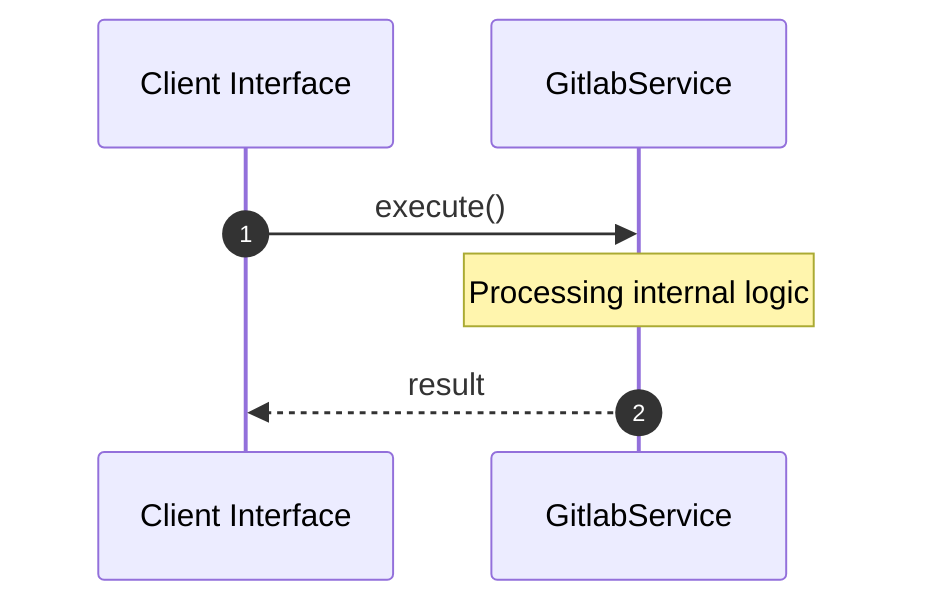

# File: gitlab.rs

**Source Path:** `crates/factory-infrastructure/src/gitlab.rs`

## Overview

### Purpose
Provides implementation for gitlab.rs.

### Responsibilities
* Handles logic related to gitlab.

### Dependencies
* async_trait::async_trait, serde::{Deserialize, Serialize}, serde_json::json, super::*, wiremock::matchers::{body_json, header, method, path}, wiremock::{Mock, MockServer, ResponseTemplate}

### Imported modules
*

### Exported classes
* GitlabIssue, HttpGitlabClient

### Exported interfaces
* GitlabClient

### Exported functions
* None

## Public API

### Exported Classes / Structs / Interfaces

#### GitlabClient

**Overview:**
Why it exists:
Provides capabilities related to GitlabClient.

What business capability it provides:
Supports core domain concepts.

How it collaborates with other classes:
Works with related entities to process logic.

**Constructor:**

Default constructor.

**Attributes:**

None.

**Public Methods:**

None.

**Private Methods:**

None.

#### GitlabIssue

**Overview:**
Why it exists:
Provides capabilities related to GitlabIssue.

What business capability it provides:
Supports core domain concepts.

How it collaborates with other classes:
Works with related entities to process logic.

**Constructor:**

Default constructor.

**Attributes:**

* `id` (u64): Purpose - Stores id data. Constraints - Valid u64.
* `iid` (u64): Purpose - Stores iid data. Constraints - Valid u64.
* `title` (String): Purpose - Stores title data. Constraints - Valid String.
* `description` (Option<String>): Purpose - Stores description data. Constraints - Valid Option<String>.
* `web_url` (String): Purpose - Stores web_url data. Constraints - Valid String.

**Public Methods:**

None.

**Private Methods:**

None.

#### HttpGitlabClient

**Overview:**
Why it exists:
Provides capabilities related to HttpGitlabClient.

What business capability it provides:
Supports core domain concepts.

How it collaborates with other classes:
Works with related entities to process logic.

**Constructor:**

##### `new(url: String (Any), api_token: String (Any))`
Parameters: url: String (Any), api_token: String (Any)
Dependencies: Inherited from context
Initialization: Sets up HttpGitlabClient

**Attributes:**

* `url` (String): Purpose - Stores url data. Constraints - Valid String.
* `api_token` (String): Purpose - Stores api_token data. Constraints - Valid String.
* `client` (reqwest::Client): Purpose - Stores client data. Constraints - Valid reqwest::Client.

**Public Methods:**

None.

**Private Methods:**

* `create_issue(project_id: &str (Any), title: &str (Any), description: &str (Any)) -> anyhow::Result<GitlabIssue>`: Internal helper logic.

### Exported Functions

None.

## Internal architecture



## Execution flow & Sequence explanation



## Examples

```
// Example usage of gitlab.rs components
import { ... } from 'crates/factory-infrastructure/src/gitlab.rs';
```

## Cross References
* **Parent module:** `crates/factory-infrastructure/src`
* **Dependencies:** async_trait::async_trait, serde::{Deserialize, Serialize}, serde_json::json, super::*, wiremock::matchers::{body_json, header, method, path}, wiremock::{Mock, MockServer, ResponseTemplate}
