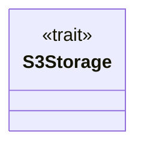
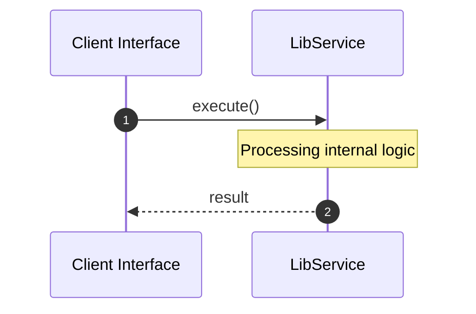

# File: lib.rs

**Source Path:** `crates/factory-infrastructure/src/lib.rs`

## Overview

### Purpose
Provides implementation for lib.rs.

### Responsibilities
* Handles logic related to lib.

### Dependencies
* pub jira::MockJiraClient, pub s3::AwsS3Storage, pub gitlab::MockGitlabClient, pub aethalgard::{AethalgardClient, HttpAethalgardClient}, pub kafka::{KafkaClient, RdKafkaClient}, pub mcp_client::{McpClient, McpHttpClient, McpSseClient}, pub jira::{HttpJiraClient, JiraClient}, pub mcp_client::MockMcpClient, pub gitlab::{GitlabClient, GitlabIssue, HttpGitlabClient}, pub aethalgard::MockAethalgardClient, pub kafka::{KafkaClient, RdKafkaClient, SimpleMockKafkaClient}, pub r2r::{HttpR2rClient, R2rClient}, pub sentry::{CrashEvent, HttpSentryClient, SentryClient}, pub ziti::MockZitiIdentity, pub ziti::{OpenZitiIdentity, ZitiIdentity}, pub r2r::MockR2rClient, pub sentry::MockSentryClient

### Imported modules
*

### Exported classes
*

### Exported interfaces
* S3Storage

### Exported functions
* None

## Public API

### Exported Classes / Structs / Interfaces

#### S3Storage

**Overview:**
Why it exists:
Provides capabilities related to S3Storage.

What business capability it provides:
Supports core domain concepts.

How it collaborates with other classes:
Works with related entities to process logic.

**Constructor:**

Default constructor.

**Attributes:**

None.

**Public Methods:**

None.

**Private Methods:**

None.

### Exported Functions

None.

## Internal architecture



## Execution flow & Sequence explanation




## Examples

```
// Example usage of lib.rs components
import { ... } from 'crates/factory-infrastructure/src/lib.rs';
```


## Cross References
* **Parent module:** `crates/factory-infrastructure/src`
* **Dependencies:** pub jira::MockJiraClient, pub s3::AwsS3Storage, pub gitlab::MockGitlabClient, pub aethalgard::{AethalgardClient, HttpAethalgardClient}, pub kafka::{KafkaClient, RdKafkaClient}, pub mcp_client::{McpClient, McpHttpClient, McpSseClient}, pub jira::{HttpJiraClient, JiraClient}, pub mcp_client::MockMcpClient, pub gitlab::{GitlabClient, GitlabIssue, HttpGitlabClient}, pub aethalgard::MockAethalgardClient, pub kafka::{KafkaClient, RdKafkaClient, SimpleMockKafkaClient}, pub r2r::{HttpR2rClient, R2rClient}, pub sentry::{CrashEvent, HttpSentryClient, SentryClient}, pub ziti::MockZitiIdentity, pub ziti::{OpenZitiIdentity, ZitiIdentity}, pub r2r::MockR2rClient, pub sentry::MockSentryClient
