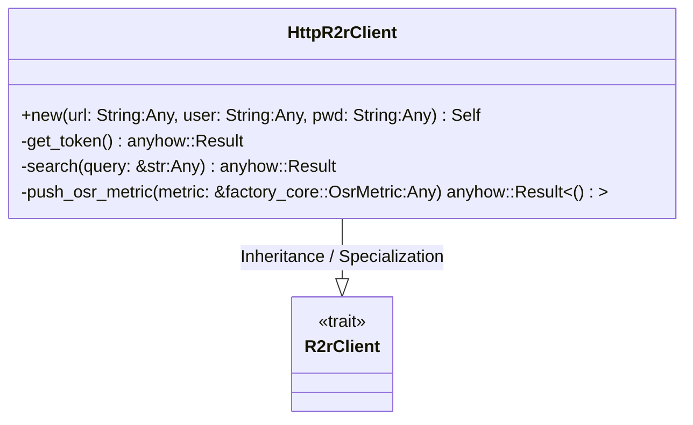
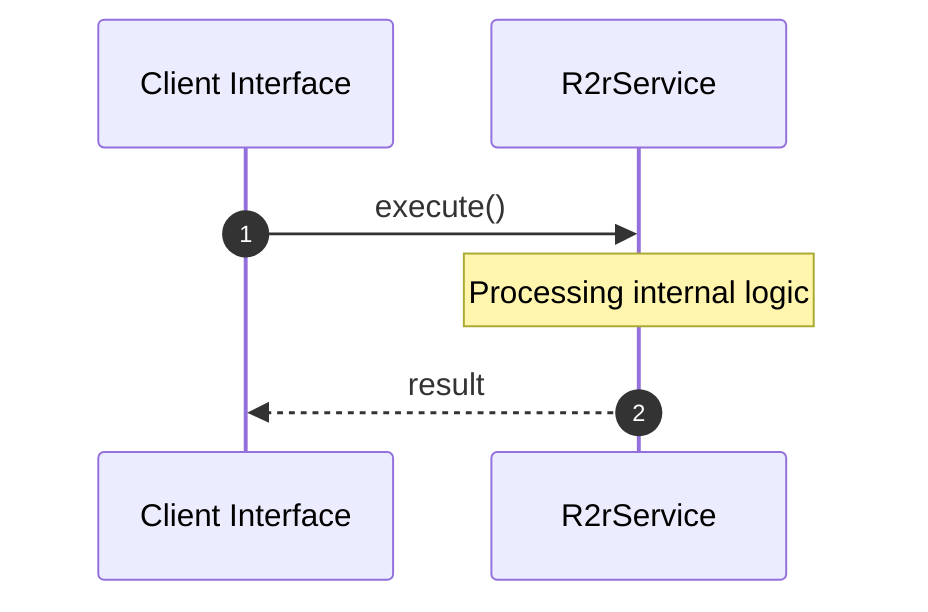

# File: r2r.rs

**Source Path:** `crates/factory-infrastructure/src/r2r.rs`

## Overview

### Purpose
Provides implementation for r2r.rs.

### Responsibilities
* Handles logic related to r2r.

### Dependencies
* serde_json::json, wiremock::{Mock, MockServer, ResponseTemplate}, wiremock::matchers::{method, path}, async_trait::async_trait, super::*

### Imported modules
*

### Exported classes
* HttpR2rClient

### Exported interfaces
* R2rClient

### Exported functions
* None

## Public API

### Exported Classes / Structs / Interfaces

#### R2rClient

**Overview:**
Why it exists:
Provides capabilities related to R2rClient.

What business capability it provides:
Supports core domain concepts.

How it collaborates with other classes:
Works with related entities to process logic.

**Constructor:**

Default constructor.

**Attributes:**

None.

**Public Methods:**

None.

**Private Methods:**

None.

#### HttpR2rClient

**Overview:**
Why it exists:
Provides capabilities related to HttpR2rClient.

What business capability it provides:
Supports core domain concepts.

How it collaborates with other classes:
Works with related entities to process logic.

**Constructor:**

##### `new(url: String (Any), user: String (Any), pwd: String (Any))`
Parameters: url: String (Any), user: String (Any), pwd: String (Any)
Dependencies: Inherited from context
Initialization: Sets up HttpR2rClient

**Attributes:**

* `url` (String): Purpose - Stores url data. Constraints - Valid String.
* `user` (String): Purpose - Stores user data. Constraints - Valid String.
* `pwd` (String): Purpose - Stores pwd data. Constraints - Valid String.
* `client` (reqwest::Client): Purpose - Stores client data. Constraints - Valid reqwest::Client.

**Public Methods:**

None.

**Private Methods:**

* `get_token() -> anyhow::Result<String>`: Internal helper logic.
* `search(query: &str (Any)) -> anyhow::Result<String>`: Internal helper logic.
* `push_osr_metric(metric: &factory_core::OsrMetric (Any)) -> anyhow::Result<()>`: Internal helper logic.

### Exported Functions

None.

## Internal architecture



## Execution flow & Sequence explanation




## Examples

```
// Example usage of r2r.rs components
import { ... } from 'crates/factory-infrastructure/src/r2r.rs';
```


## Cross References
* **Parent module:** `crates/factory-infrastructure/src`
* **Dependencies:** serde_json::json, wiremock::{Mock, MockServer, ResponseTemplate}, wiremock::matchers::{method, path}, async_trait::async_trait, super::*
