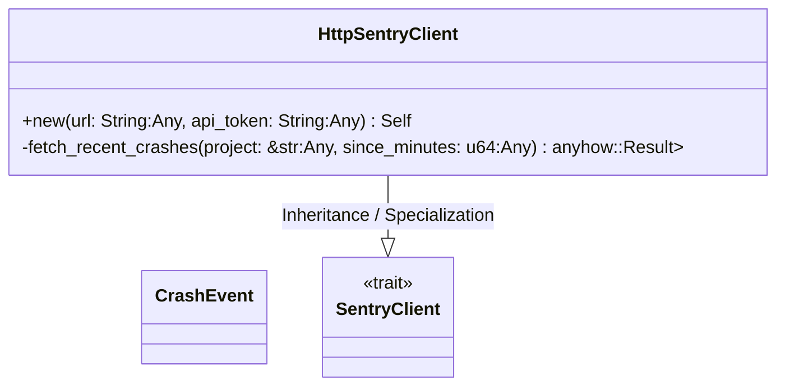
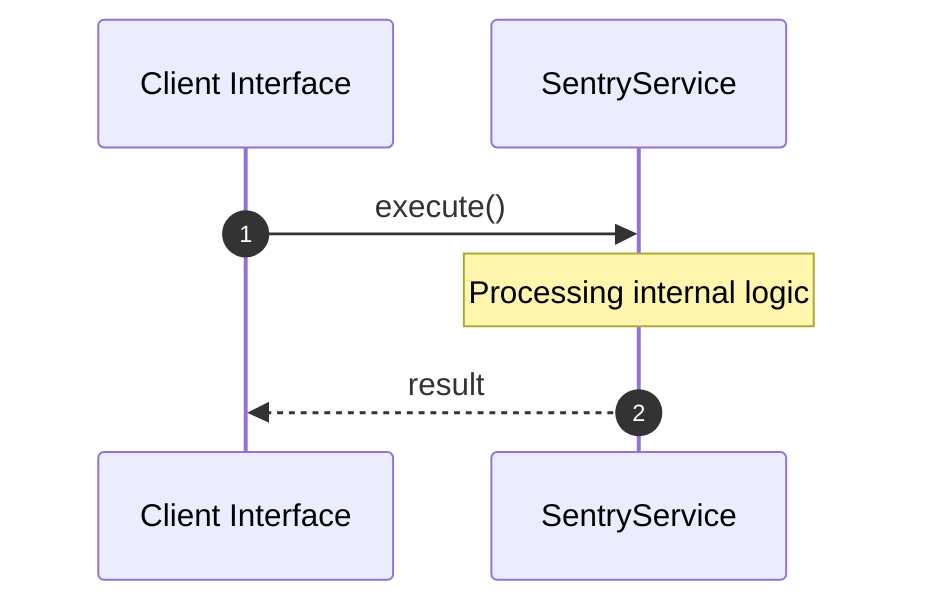

# File: sentry.rs

**Source Path:** `crates/factory-infrastructure/src/sentry.rs`

## Overview

### Purpose
Provides implementation for sentry.rs.

### Responsibilities
* Handles logic related to sentry.

### Dependencies
* serde_json::json, wiremock::matchers::{header, method, path, query_param}, wiremock::{Mock, MockServer, ResponseTemplate}, serde::{Deserialize, Serialize}, async_trait::async_trait, super::*

### Imported modules
*

### Exported classes
* CrashEvent, HttpSentryClient

### Exported interfaces
* SentryClient

### Exported functions
* None

## Public API

### Exported Classes / Structs / Interfaces

#### CrashEvent

**Overview:**
Why it exists:
Provides capabilities related to CrashEvent.

What business capability it provides:
Supports core domain concepts.

How it collaborates with other classes:
Works with related entities to process logic.

**Constructor:**

Default constructor.

**Attributes:**

* `event_id` (String): Purpose - Stores event_id data. Constraints - Valid String.
* `project` (String): Purpose - Stores project data. Constraints - Valid String.
* `message` (String): Purpose - Stores message data. Constraints - Valid String.
* `level` (String): Purpose - Stores level data. Constraints - Valid String.
* `timestamp` (String): Purpose - Stores timestamp data. Constraints - Valid String.
* `culprit` (Option<String>): Purpose - Stores culprit data. Constraints - Valid Option<String>.

**Public Methods:**

None.

**Private Methods:**

None.

#### SentryClient

**Overview:**
Why it exists:
Provides capabilities related to SentryClient.

What business capability it provides:
Supports core domain concepts.

How it collaborates with other classes:
Works with related entities to process logic.

**Constructor:**

Default constructor.

**Attributes:**

None.

**Public Methods:**

None.

**Private Methods:**

None.

#### HttpSentryClient

**Overview:**
Why it exists:
Provides capabilities related to HttpSentryClient.

What business capability it provides:
Supports core domain concepts.

How it collaborates with other classes:
Works with related entities to process logic.

**Constructor:**

##### `new(url: String (Any), api_token: String (Any))`
Parameters: url: String (Any), api_token: String (Any)
Dependencies: Inherited from context
Initialization: Sets up HttpSentryClient

**Attributes:**

* `url` (String): Purpose - Stores url data. Constraints - Valid String.
* `api_token` (String): Purpose - Stores api_token data. Constraints - Valid String.
* `client` (reqwest::Client): Purpose - Stores client data. Constraints - Valid reqwest::Client.

**Public Methods:**

None.

**Private Methods:**

* `fetch_recent_crashes(project: &str (Any), since_minutes: u64 (Any)) -> anyhow::Result<Vec<CrashEvent>>`: Internal helper logic.

### Exported Functions

None.

## Internal architecture



## Execution flow & Sequence explanation




## Examples

```
// Example usage of sentry.rs components
import { ... } from 'crates/factory-infrastructure/src/sentry.rs';
```


## Cross References
* **Parent module:** `crates/factory-infrastructure/src`
* **Dependencies:** serde_json::json, wiremock::matchers::{header, method, path, query_param}, wiremock::{Mock, MockServer, ResponseTemplate}, serde::{Deserialize, Serialize}, async_trait::async_trait, super::*
