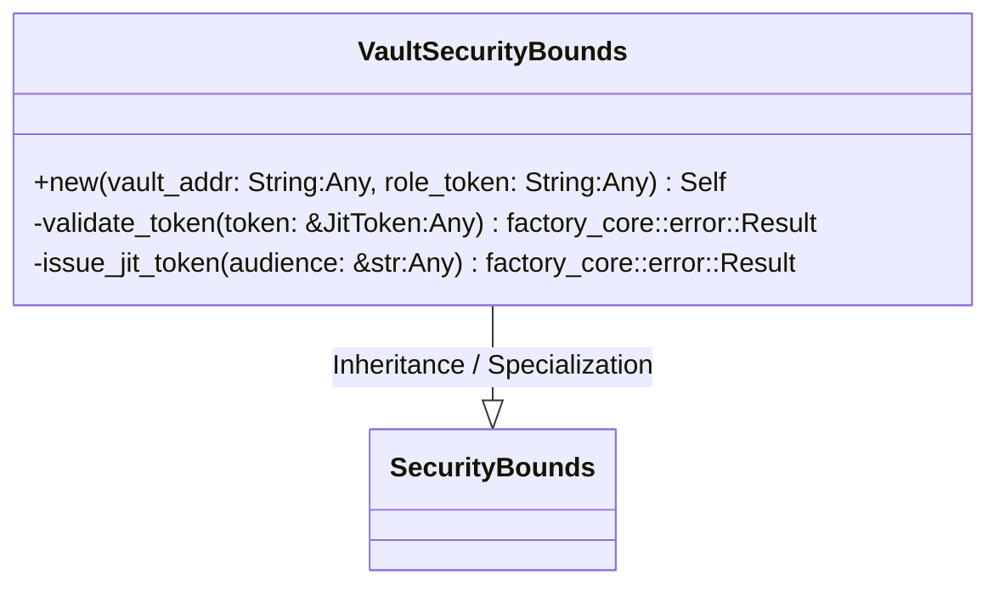
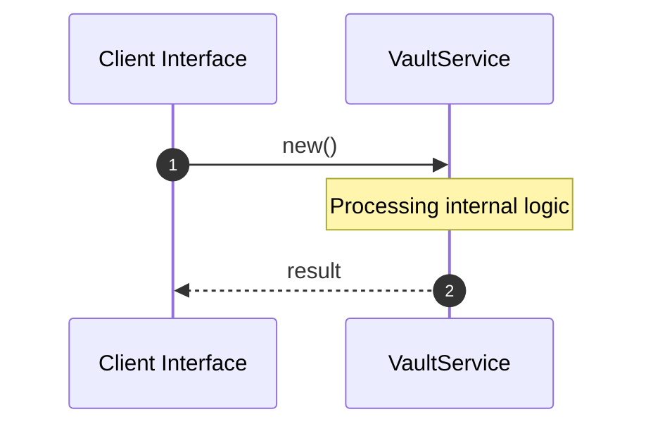

# File: vault.rs

**Source Path:** `crates/factory-infrastructure/src/vault.rs`

## Overview

### Purpose
Provides implementation for vault.rs.

### Responsibilities
* Handles logic related to vault.

### Dependencies
* async_trait::async_trait, factory_core::security::{JitToken, SecurityBounds}, wiremock::{Mock, MockServer, ResponseTemplate}, reqwest::Client, wiremock::matchers::{header, method, path}, super::*, serde_json::json

### Imported modules
*

### Exported classes
* VaultSecurityBounds

### Exported interfaces
*

### Exported functions
* None

## Public API

### Exported Classes / Structs / Interfaces

#### VaultSecurityBounds

**Overview:**
Why it exists:
Provides capabilities related to VaultSecurityBounds.

What business capability it provides:
Supports core domain concepts.

How it collaborates with other classes:
Works with related entities to process logic.

**Constructor:**

##### `new(vault_addr: String (Any), role_token: String (Any))`
Parameters: vault_addr: String (Any), role_token: String (Any)
Dependencies: Inherited from context
Initialization: Sets up VaultSecurityBounds

**Attributes:**

* `client` (Client): Purpose - Stores client data. Constraints - Valid Client.
* `vault_addr` (String): Purpose - Stores vault_addr data. Constraints - Valid String.
* `role_token` (String): Purpose - Stores role_token data. Constraints - Valid String.

**Public Methods:**

None.

**Private Methods:**

* `validate_token(token: &JitToken (Any)) -> factory_core::error::Result<bool>`: Internal helper logic.
* `issue_jit_token(audience: &str (Any)) -> factory_core::error::Result<JitToken>`: Internal helper logic.

### Exported Functions

None.

## Internal architecture



## Execution flow & Sequence explanation



## Examples

```
// Example usage of vault.rs components
import { ... } from 'crates/factory-infrastructure/src/vault.rs';
```

## Cross References
* **Parent module:** `crates/factory-infrastructure/src`
* **Dependencies:** async_trait::async_trait, factory_core::security::{JitToken, SecurityBounds}, wiremock::{Mock, MockServer, ResponseTemplate}, reqwest::Client, wiremock::matchers::{header, method, path}, super::*, serde_json::json
