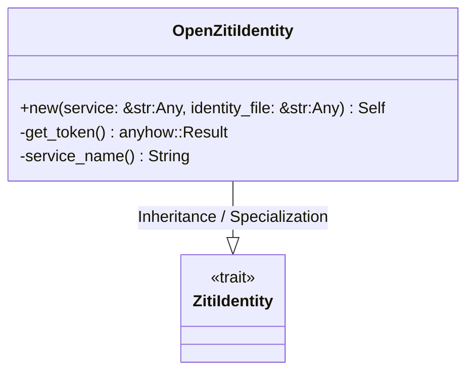
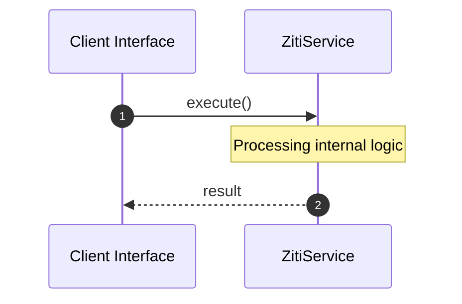

# File: ziti.rs

**Source Path:** `crates/factory-infrastructure/src/ziti.rs`

## Overview

### Purpose
Provides implementation for ziti.rs.

### Responsibilities
* Handles logic related to ziti.

### Dependencies
* super::*, async_trait::async_trait

### Imported modules
*

### Exported classes
* OpenZitiIdentity

### Exported interfaces
* ZitiIdentity

### Exported functions
* None

## Public API

### Exported Classes / Structs / Interfaces

#### ZitiIdentity

**Overview:**
Why it exists:
Provides capabilities related to ZitiIdentity.

What business capability it provides:
Supports core domain concepts.

How it collaborates with other classes:
Works with related entities to process logic.

**Constructor:**

Default constructor.

**Attributes:**

None.

**Public Methods:**

None.

**Private Methods:**

None.

#### OpenZitiIdentity

**Overview:**
Why it exists:
Provides capabilities related to OpenZitiIdentity.

What business capability it provides:
Supports core domain concepts.

How it collaborates with other classes:
Works with related entities to process logic.

**Constructor:**

##### `new(service: &str (Any), identity_file: &str (Any))`
Parameters: service: &str (Any), identity_file: &str (Any)
Dependencies: Inherited from context
Initialization: Sets up OpenZitiIdentity

**Attributes:**

* `service` (String): Purpose - Stores service data. Constraints - Valid String.
* `identity_file` (String): Purpose - Stores identity_file data. Constraints - Valid String.

**Public Methods:**

None.

**Private Methods:**

* `get_token() -> anyhow::Result<String>`: Internal helper logic.
* `service_name() -> String`: Internal helper logic.

### Exported Functions

None.

## Internal architecture



## Execution flow & Sequence explanation




## Examples

```
// Example usage of ziti.rs components
import { ... } from 'crates/factory-infrastructure/src/ziti.rs';
```


## Cross References
* **Parent module:** `crates/factory-infrastructure/src`
* **Dependencies:** super::*, async_trait::async_trait
