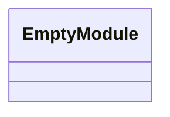
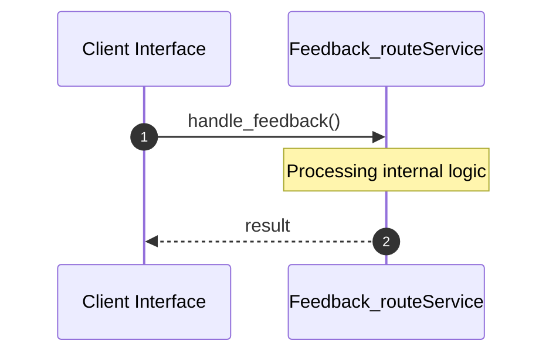

# File: feedback_route.rs

**Source Path:** `crates/factory-mcp-server/src/feedback_route.rs`

## Overview

### Purpose
Provides implementation for feedback_route.rs.

### Responsibilities
* Handles logic related to feedback_route.

### Dependencies
* axum::{
    extract::{Json, State},
    http::StatusCode,
    response::IntoResponse,
}, crate::McpServer, factory_core::UserFeedbackPayload, factory_infrastructure::GitlabClient, factory_infrastructure::HttpGitlabClient, std::sync::Arc

### Imported modules
*

### Exported classes
* None

### Exported interfaces
* None

### Exported functions
* handle_feedback

## Public API

### Exported Classes / Structs / Interfaces

### Exported Functions

#### `handle_feedback(State(_server): State<Arc<McpServer>> (Any), Json(payload): Json<UserFeedbackPayload> (Any)) -> impl IntoResponse`
Executes handle_feedback.

## Internal architecture



## Execution flow & Sequence explanation



## Examples

```
// Example usage of feedback_route.rs components
import { ... } from 'crates/factory-mcp-server/src/feedback_route.rs';
```

## Cross References
* **Parent module:** `crates/factory-mcp-server/src`
* **Dependencies:** axum::{
    extract::{Json, State},
    http::StatusCode,
    response::IntoResponse,
}, crate::McpServer, factory_core::UserFeedbackPayload, factory_infrastructure::GitlabClient, factory_infrastructure::HttpGitlabClient, std::sync::Arc
