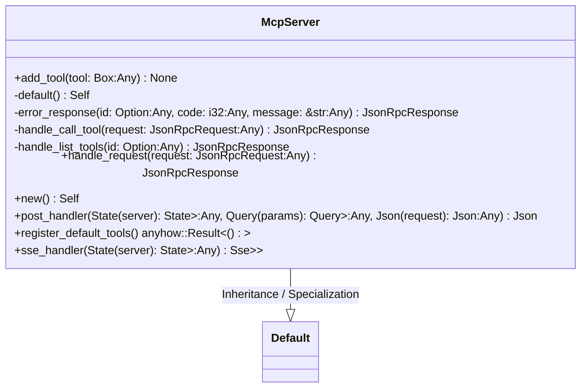
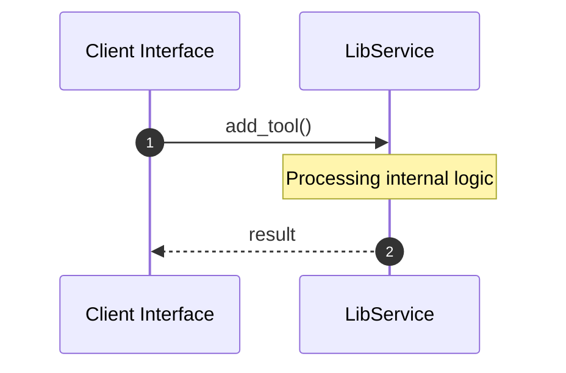

# File: lib.rs

**Source Path:** `crates/factory-mcp-server/src/lib.rs`

## Overview

### Purpose
Provides implementation for lib.rs.

### Responsibilities
* Handles logic related to lib.

### Dependencies
* axum::{
    extract::{Query, State},
    response::sse::{Event, Sse},
    Json,
}, crate::protocol::CallToolResult, crate::protocol::{JsonRpcRequest, JsonRpcResponse, McpTool}, crate::tools::MockTool, crate::tools::Tool, crate::tools::{
            bridge::BridgeTool, execute_code::ExecuteCodeTool, index_code::IndexCodeTool,
            launch_sandbox_pod::LaunchSandboxPodTool, plan_mission::PlanMissionTool,
            retrieve_context::RetrieveContextTool, run_tests::RunTestsTool,
            search_jira::SearchJiraTool, security_review::SecurityReviewTool,
            spec_kit_tasks_to_issues::SpecKitTasksToIssuesTool, spec_kit_tool::SpecKitTool,
            update_mission_status::UpdateMissionStatusTool,
        }, factory_infrastructure::{HttpGitlabClient, HttpJiraClient, HttpR2rClient}, serde_json::{json, Value}, std::collections::HashMap, std::convert::Infallible, std::sync::Arc, std::time::Duration, super::*, tokio::sync::{mpsc, RwLock}, tokio_stream::wrappers::UnboundedReceiverStream, tokio_stream::{Stream, StreamExt}

### Imported modules
* None

### Exported classes
* McpServer

### Exported interfaces
* None

### Exported functions
* None

## Public API

### Exported Classes / Structs / Interfaces

#### McpServer

**Overview:**
Why it exists:
Provides capabilities related to McpServer.

What business capability it provides:
Supports core domain concepts.

How it collaborates with other classes:
Works with related entities to process logic.

**Constructor:**

##### `new()`
Parameters:
Dependencies: Inherited from context
Initialization: Sets up McpServer

**Attributes:**

* `sessions` (Arc<RwLock<HashMap<String, mpsc::UnboundedSender<JsonRpcResponse>>>>): Purpose - Stores sessions data. Constraints - Valid Arc<RwLock<HashMap<String, mpsc::UnboundedSender<JsonRpcResponse>>>>.
* `tools` (Arc<RwLock<HashMap<String, Box<dyn Tool>>>>): Purpose - Stores tools data. Constraints - Valid Arc<RwLock<HashMap<String, Box<dyn Tool>>>>.

**Public Methods:**

##### `add_tool(tool: Box<dyn Tool> (Any)) -> None`

###### Description
Executes add_tool.

###### Inputs
* `tool: Box<dyn Tool>`: type=Any, meaning=Input for tool: Box<dyn Tool>, valid values=Any valid Any, optional=No, default value=None

###### Output
Return type: None
Semantic meaning: Result of add_tool
Possible null values: Conditional
Exceptions: None handled explicitly

###### Side Effects
Database updates: None
File operations: None
Network calls: None
Cache: None
State changes: Updates internal variables

###### Complexity
Time Complexity: O(1) mostly
Space Complexity: O(1) mostly

###### Example
```
let result = instance.add_tool();
```

##### `handle_request(request: JsonRpcRequest (Any)) -> JsonRpcResponse`

###### Description
Executes handle_request.

###### Inputs
* `request: JsonRpcRequest`: type=Any, meaning=Input for request: JsonRpcRequest, valid values=Any valid Any, optional=No, default value=None

###### Output
Return type: JsonRpcResponse
Semantic meaning: Result of handle_request
Possible null values: Conditional
Exceptions: None handled explicitly

###### Side Effects
Database updates: None
File operations: None
Network calls: None
Cache: None
State changes: Updates internal variables

###### Complexity
Time Complexity: O(1) mostly
Space Complexity: O(1) mostly

###### Example
```
let result = instance.handle_request();
```

##### `post_handler(State(server): State<Arc<McpServer>> (Any), Query(params): Query<HashMap<String, String>> (Any), Json(request): Json<JsonRpcRequest> (Any)) -> Json<JsonRpcResponse>`

###### Description
Executes post_handler.

###### Inputs
* `State(server): State<Arc<McpServer>>`: type=Any, meaning=Input for State(server): State<Arc<McpServer>>, valid values=Any valid Any, optional=No, default value=None
* `Query(params): Query<HashMap<String, String>>`: type=Any, meaning=Input for Query(params): Query<HashMap<String, String>>, valid values=Any valid Any, optional=No, default value=None
* `Json(request): Json<JsonRpcRequest>`: type=Any, meaning=Input for Json(request): Json<JsonRpcRequest>, valid values=Any valid Any, optional=No, default value=None

###### Output
Return type: Json<JsonRpcResponse>
Semantic meaning: Result of post_handler
Possible null values: Conditional
Exceptions: None handled explicitly

###### Side Effects
Database updates: None
File operations: None
Network calls: None
Cache: None
State changes: Updates internal variables

###### Complexity
Time Complexity: O(1) mostly
Space Complexity: O(1) mostly

###### Example
```
let result = instance.post_handler();
```

##### `register_default_tools() -> anyhow::Result<()>`

###### Description
Executes register_default_tools.

###### Inputs
None.

###### Output
Return type: anyhow::Result<()>
Semantic meaning: Result of register_default_tools
Possible null values: Conditional
Exceptions: None handled explicitly

###### Side Effects
Database updates: None
File operations: None
Network calls: None
Cache: None
State changes: Updates internal variables

###### Complexity
Time Complexity: O(1) mostly
Space Complexity: O(1) mostly

###### Example
```
let result = instance.register_default_tools();
```

##### `sse_handler(State(server): State<Arc<McpServer>> (Any)) -> Sse<impl Stream<Item = Result<Event, Infallible>>>`

###### Description
Executes sse_handler.

###### Inputs
* `State(server): State<Arc<McpServer>>`: type=Any, meaning=Input for State(server): State<Arc<McpServer>>, valid values=Any valid Any, optional=No, default value=None

###### Output
Return type: Sse<impl Stream<Item = Result<Event, Infallible>>>
Semantic meaning: Result of sse_handler
Possible null values: Conditional
Exceptions: None handled explicitly

###### Side Effects
Database updates: None
File operations: None
Network calls: None
Cache: None
State changes: Updates internal variables

###### Complexity
Time Complexity: O(1) mostly
Space Complexity: O(1) mostly

###### Example
```
let result = instance.sse_handler();
```

**Private Methods:**

* `default() -> Self`: Internal helper logic.
* `error_response(id: Option<Value> (Any), code: i32 (Any), message: &str (Any)) -> JsonRpcResponse`: Internal helper logic.
* `handle_call_tool(request: JsonRpcRequest (Any)) -> JsonRpcResponse`: Internal helper logic.
* `handle_list_tools(id: Option<Value> (Any)) -> JsonRpcResponse`: Internal helper logic.

### Exported Functions

None.

## Internal architecture



## Execution flow & Sequence explanation




## Examples

```
// Example usage of lib.rs components
import { ... } from 'crates/factory-mcp-server/src/lib.rs';
```


## Cross References
* **Parent module:** `crates/factory-mcp-server/src`
* **Dependencies:** axum::{
    extract::{Query, State},
    response::sse::{Event, Sse},
    Json,
}, crate::protocol::CallToolResult, crate::protocol::{JsonRpcRequest, JsonRpcResponse, McpTool}, crate::tools::MockTool, crate::tools::Tool, crate::tools::{
            bridge::BridgeTool, execute_code::ExecuteCodeTool, index_code::IndexCodeTool,
            launch_sandbox_pod::LaunchSandboxPodTool, plan_mission::PlanMissionTool,
            retrieve_context::RetrieveContextTool, run_tests::RunTestsTool,
            search_jira::SearchJiraTool, security_review::SecurityReviewTool,
            spec_kit_tasks_to_issues::SpecKitTasksToIssuesTool, spec_kit_tool::SpecKitTool,
            update_mission_status::UpdateMissionStatusTool,
        }, factory_infrastructure::{HttpGitlabClient, HttpJiraClient, HttpR2rClient}, serde_json::{json, Value}, std::collections::HashMap, std::convert::Infallible, std::sync::Arc, std::time::Duration, super::*, tokio::sync::{mpsc, RwLock}, tokio_stream::wrappers::UnboundedReceiverStream, tokio_stream::{Stream, StreamExt}
