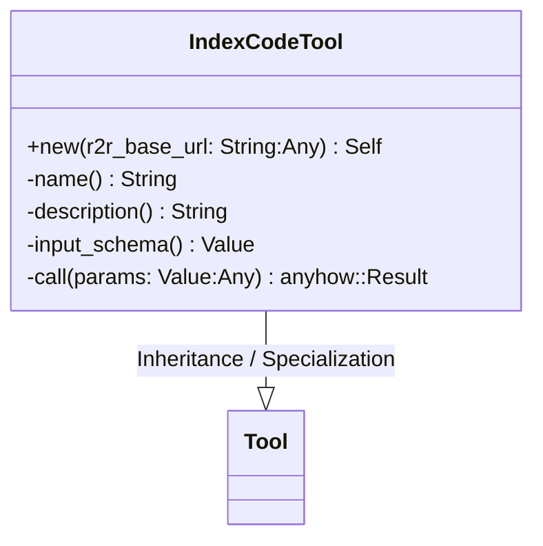
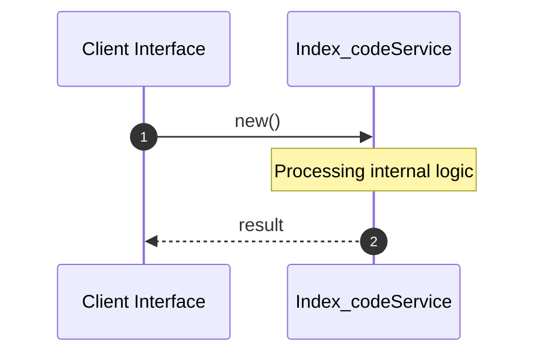

# File: index_code.rs

**Source Path:** `crates/factory-mcp-server/src/tools/index_code.rs`

## Overview

### Purpose
Provides implementation for index_code.rs.

### Responsibilities
* Handles logic related to index_code.

### Dependencies
* crate::protocol::{CallToolResult, McpContent}, serde_json::{json, Value}, crate::tools::Tool, async_trait::async_trait, super::*

### Imported modules
*

### Exported classes
* IndexCodeTool

### Exported interfaces
*

### Exported functions
* None

## Public API

### Exported Classes / Structs / Interfaces

#### IndexCodeTool

**Overview:**
Why it exists:
Provides capabilities related to IndexCodeTool.

What business capability it provides:
Supports core domain concepts.

How it collaborates with other classes:
Works with related entities to process logic.

**Constructor:**

##### `new(r2r_base_url: String (Any))`
Parameters: r2r_base_url: String (Any)
Dependencies: Inherited from context
Initialization: Sets up IndexCodeTool

**Attributes:**

* `r2r_base_url` (String): Purpose - Stores r2r_base_url data. Constraints - Valid String.
* `http_client` (reqwest::Client): Purpose - Stores http_client data. Constraints - Valid reqwest::Client.

**Public Methods:**

None.

**Private Methods:**

* `name() -> String`: Internal helper logic.
* `description() -> String`: Internal helper logic.
* `input_schema() -> Value`: Internal helper logic.
* `call(params: Value (Any)) -> anyhow::Result<CallToolResult>`: Internal helper logic.

### Exported Functions

None.

## Internal architecture



## Execution flow & Sequence explanation




## Examples

```
// Example usage of index_code.rs components
import { ... } from 'crates/factory-mcp-server/src/tools/index_code.rs';
```


## Cross References
* **Parent module:** `crates/factory-mcp-server/src/tools`
* **Dependencies:** crate::protocol::{CallToolResult, McpContent}, serde_json::{json, Value}, crate::tools::Tool, async_trait::async_trait, super::*
