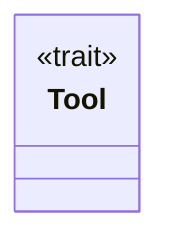
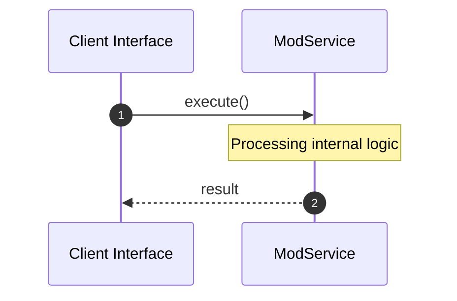

# File: mod.rs

**Source Path:** `crates/factory-mcp-server/src/tools/mod.rs`

## Overview

### Purpose
Provides implementation for mod.rs.

### Responsibilities
* Handles logic related to mod.

### Dependencies
* pub search_jira::SearchJiraTool, serde_json::Value, async_trait::async_trait, pub security_review::SecurityReviewTool, pub bridge::BridgeTool, crate::protocol::CallToolResult, pub launch_sandbox_pod::LaunchSandboxPodTool, pub retrieve_context::RetrieveContextTool, pub plan_mission::PlanMissionTool, pub run_tests::RunTestsTool, pub spec_kit_tasks_to_issues::SpecKitTasksToIssuesTool, pub spec_kit_tool::SpecKitTool, pub index_code::IndexCodeTool, pub execute_code::ExecuteCodeTool, pub update_mission_status::UpdateMissionStatusTool

### Imported modules
*

### Exported classes
*

### Exported interfaces
* Tool

### Exported functions
* None

## Public API

### Exported Classes / Structs / Interfaces

#### Tool

**Overview:**
Why it exists:
Provides capabilities related to Tool.

What business capability it provides:
Supports core domain concepts.

How it collaborates with other classes:
Works with related entities to process logic.

**Constructor:**

Default constructor.

**Attributes:**

None.

**Public Methods:**

None.

**Private Methods:**

None.

### Exported Functions

None.

## Internal architecture



## Execution flow & Sequence explanation



## Examples

```
// Example usage of mod.rs components
import { ... } from 'crates/factory-mcp-server/src/tools/mod.rs';
```

## Cross References
* **Parent module:** `crates/factory-mcp-server/src/tools`
* **Dependencies:** pub search_jira::SearchJiraTool, serde_json::Value, async_trait::async_trait, pub security_review::SecurityReviewTool, pub bridge::BridgeTool, crate::protocol::CallToolResult, pub launch_sandbox_pod::LaunchSandboxPodTool, pub retrieve_context::RetrieveContextTool, pub plan_mission::PlanMissionTool, pub run_tests::RunTestsTool, pub spec_kit_tasks_to_issues::SpecKitTasksToIssuesTool, pub spec_kit_tool::SpecKitTool, pub index_code::IndexCodeTool, pub execute_code::ExecuteCodeTool, pub update_mission_status::UpdateMissionStatusTool
