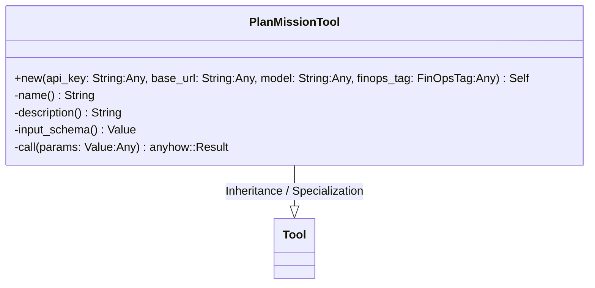
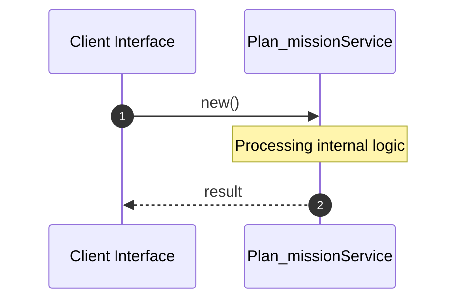

# File: plan_mission.rs

**Source Path:** `crates/factory-mcp-server/src/tools/plan_mission.rs`

## Overview

### Purpose
Provides implementation for plan_mission.rs.

### Responsibilities
* Handles logic related to plan_mission.

### Dependencies
* async_trait::async_trait, factory_core::FinOpsTag, reqwest::header::{HeaderMap, HeaderValue}, serde_json::{json, Value}, crate::tools::Tool, async_openai::{
    types::{
        ChatCompletionRequestSystemMessageArgs, ChatCompletionRequestUserMessageArgs,
        ChatCompletionResponseFormat, ChatCompletionResponseFormatType,
        CreateChatCompletionRequestArgs,
    },
    Client,
}, crate::protocol::{CallToolResult, McpContent}

### Imported modules
*

### Exported classes
* PlanMissionTool

### Exported interfaces
*

### Exported functions
* None

## Public API

### Exported Classes / Structs / Interfaces

#### PlanMissionTool

**Overview:**
Why it exists:
Provides capabilities related to PlanMissionTool.

What business capability it provides:
Supports core domain concepts.

How it collaborates with other classes:
Works with related entities to process logic.

**Constructor:**

##### `new(api_key: String (Any), base_url: String (Any), model: String (Any), finops_tag: FinOpsTag (Any))`
Parameters: api_key: String (Any), base_url: String (Any), model: String (Any), finops_tag: FinOpsTag (Any)
Dependencies: Inherited from context
Initialization: Sets up PlanMissionTool

**Attributes:**

* `client` (Client<async_openai::config::OpenAIConfig>): Purpose - Stores client data. Constraints - Valid Client<async_openai::config::OpenAIConfig>.
* `model` (String): Purpose - Stores model data. Constraints - Valid String.

**Public Methods:**

None.

**Private Methods:**

* `name() -> String`: Internal helper logic.
* `description() -> String`: Internal helper logic.
* `input_schema() -> Value`: Internal helper logic.
* `call(params: Value (Any)) -> anyhow::Result<CallToolResult>`: Internal helper logic.

### Exported Functions

None.

## Internal architecture



## Execution flow & Sequence explanation



## Examples

```
// Example usage of plan_mission.rs components
import { ... } from 'crates/factory-mcp-server/src/tools/plan_mission.rs';
```

## Cross References
* **Parent module:** `crates/factory-mcp-server/src/tools`
* **Dependencies:** async_trait::async_trait, factory_core::FinOpsTag, reqwest::header::{HeaderMap, HeaderValue}, serde_json::{json, Value}, crate::tools::Tool, async_openai::{
    types::{
        ChatCompletionRequestSystemMessageArgs, ChatCompletionRequestUserMessageArgs,
        ChatCompletionResponseFormat, ChatCompletionResponseFormatType,
        CreateChatCompletionRequestArgs,
    },
    Client,
}, crate::protocol::{CallToolResult, McpContent}
