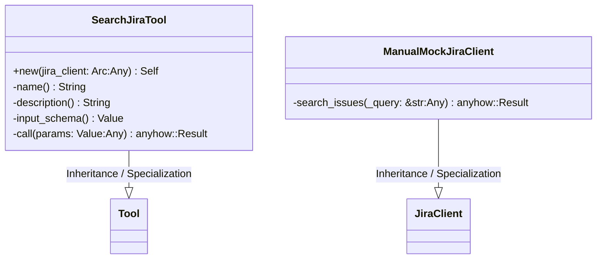
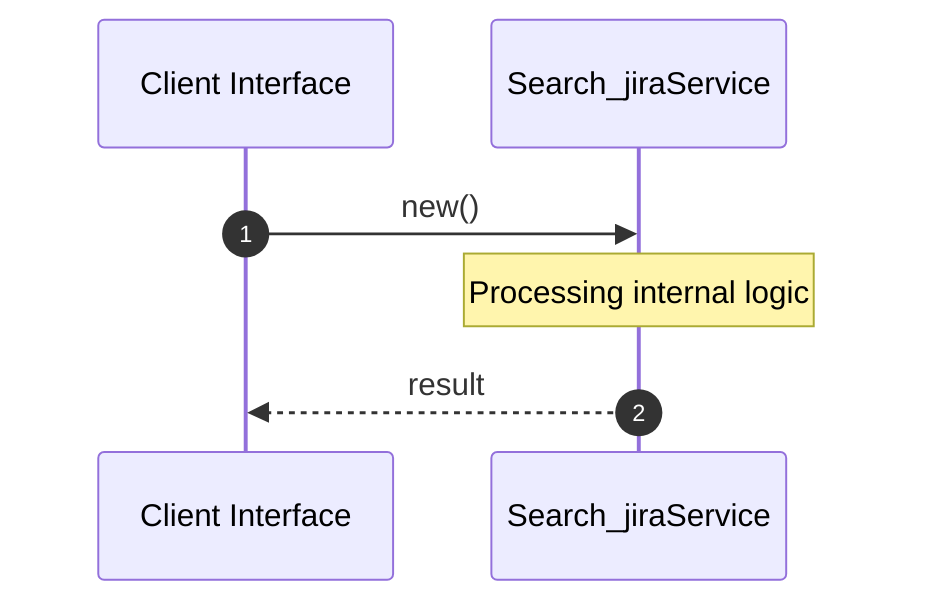

# File: search_jira.rs

**Source Path:** `crates/factory-mcp-server/src/tools/search_jira.rs`

## Overview

### Purpose
Provides implementation for search_jira.rs.

### Responsibilities
* Handles logic related to search_jira.

### Dependencies
* serde_json::{json, Value}, std::sync::Arc, super::*, factory_infrastructure::JiraClient, async_trait::async_trait, crate::tools::Tool, crate::protocol::{CallToolResult, McpContent}

### Imported modules
*

### Exported classes
* SearchJiraTool, ManualMockJiraClient

### Exported interfaces
*

### Exported functions
* None

## Public API

### Exported Classes / Structs / Interfaces

#### SearchJiraTool

**Overview:**
Why it exists:
Provides capabilities related to SearchJiraTool.

What business capability it provides:
Supports core domain concepts.

How it collaborates with other classes:
Works with related entities to process logic.

**Constructor:**

##### `new(jira_client: Arc<dyn JiraClient> (Any))`
Parameters: jira_client: Arc<dyn JiraClient> (Any)
Dependencies: Inherited from context
Initialization: Sets up SearchJiraTool

**Attributes:**

* `jira_client` (Arc<dyn JiraClient>): Purpose - Stores jira_client data. Constraints - Valid Arc<dyn JiraClient>.

**Public Methods:**

None.

**Private Methods:**

* `name() -> String`: Internal helper logic.
* `description() -> String`: Internal helper logic.
* `input_schema() -> Value`: Internal helper logic.
* `call(params: Value (Any)) -> anyhow::Result<CallToolResult>`: Internal helper logic.

#### ManualMockJiraClient

**Overview:**
Why it exists:
Provides capabilities related to ManualMockJiraClient.

What business capability it provides:
Supports core domain concepts.

How it collaborates with other classes:
Works with related entities to process logic.

**Constructor:**

Default constructor.

**Attributes:**

* `should_fail` (bool): Purpose - Stores should_fail data. Constraints - Valid bool.

**Public Methods:**

None.

**Private Methods:**

* `search_issues(_query: &str (Any)) -> anyhow::Result<String>`: Internal helper logic.

### Exported Functions

None.

## Internal architecture



## Execution flow & Sequence explanation



## Examples

```
// Example usage of search_jira.rs components
import { ... } from 'crates/factory-mcp-server/src/tools/search_jira.rs';
```

## Cross References
* **Parent module:** `crates/factory-mcp-server/src/tools`
* **Dependencies:** serde_json::{json, Value}, std::sync::Arc, super::*, factory_infrastructure::JiraClient, async_trait::async_trait, crate::tools::Tool, crate::protocol::{CallToolResult, McpContent}
