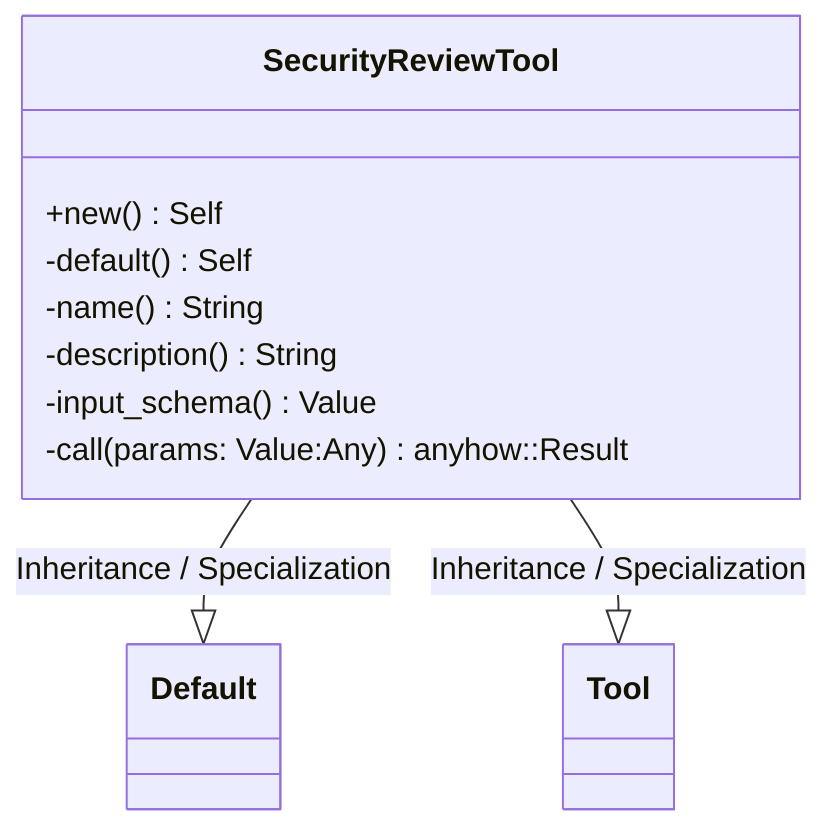
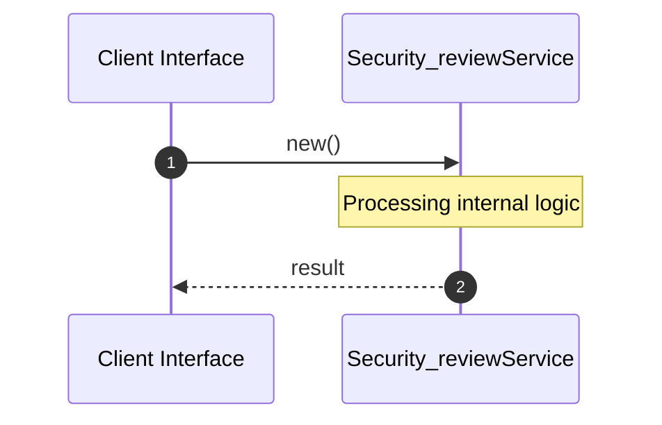

# File: security_review.rs

**Source Path:** `crates/factory-mcp-server/src/tools/security_review.rs`

## Overview

### Purpose
Provides implementation for security_review.rs.

### Responsibilities
* Handles logic related to security_review.

### Dependencies
* async_openai::Client, async_openai::config::OpenAIConfig, async_trait::async_trait, crate::protocol::{CallToolResult, McpContent}, crate::tools::Tool, serde_json::{json, Value}, std::env

### Imported modules
*

### Exported classes
* SecurityReviewTool

### Exported interfaces
*

### Exported functions
* None

## Public API

### Exported Classes / Structs / Interfaces

#### SecurityReviewTool

**Overview:**
Why it exists:
Provides capabilities related to SecurityReviewTool.

What business capability it provides:
Supports core domain concepts.

How it collaborates with other classes:
Works with related entities to process logic.

**Constructor:**

##### `new()`
Parameters:
Dependencies: Inherited from context
Initialization: Sets up SecurityReviewTool

**Attributes:**

* `client` (Client<OpenAIConfig>): Purpose - Stores client data. Constraints - Valid Client<OpenAIConfig>.

**Public Methods:**

None.

**Private Methods:**

* `default() -> Self`: Internal helper logic.
* `name() -> String`: Internal helper logic.
* `description() -> String`: Internal helper logic.
* `input_schema() -> Value`: Internal helper logic.
* `call(params: Value (Any)) -> anyhow::Result<CallToolResult>`: Internal helper logic.

### Exported Functions

None.

## Internal architecture



## Execution flow & Sequence explanation



## Examples

```
// Example usage of security_review.rs components
import { ... } from 'crates/factory-mcp-server/src/tools/security_review.rs';
```

## Cross References
* **Parent module:** `crates/factory-mcp-server/src/tools`
* **Dependencies:** async_openai::Client, async_openai::config::OpenAIConfig, async_trait::async_trait, crate::protocol::{CallToolResult, McpContent}, crate::tools::Tool, serde_json::{json, Value}, std::env
