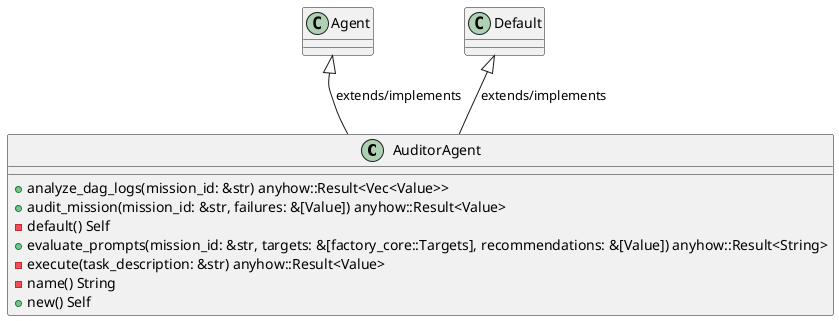
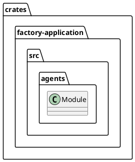
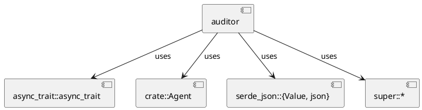
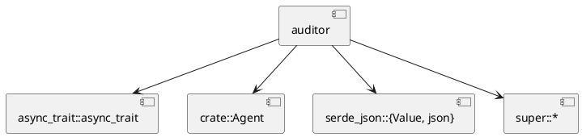
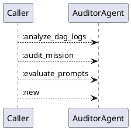
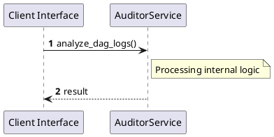

# File: auditor.rs

**Source Path:** `crates/factory-application/src/agents/auditor.rs`

## Overview

### Purpose
Provides implementation for auditor.rs.

### Responsibilities
* Handles logic related to auditor.

### Dependencies
* async_trait::async_trait, crate::Agent, serde_json::{Value, json}, super::*

### Imported modules
* None

### Exported classes
* AuditorAgent

### Exported interfaces
* None

### Exported functions
* None

## Public API

### Exported Classes / Structs / Interfaces

#### AuditorAgent

**Overview:**
No description provided.

**Constructor:**

##### `new()`
Parameters:
Dependencies: Inherited from context
Initialization: Sets up AuditorAgent

**Attributes:**

None.

**Public Methods:**

##### `analyze_dag_logs(mission_id (&str)) -> anyhow::Result<Vec<Value>>`

###### Description
/// Queries Hatchet API for recent failed mission DAGs.

###### Inputs
* `mission_id`: type=&str, meaning=Input for mission_id, valid values=Any valid &str, optional=No, default value=None

###### Output
Return type: anyhow::Result<Vec<Value>>
Semantic meaning: Result of analyze_dag_logs
Possible null values: Conditional
Exceptions: None handled explicitly

###### Side Effects
Database updates: None
File operations: None
Network calls: None
Cache: None
State changes: Updates internal variables

###### Complexity
Time Complexity: O(1) mostly
Space Complexity: O(1) mostly

###### Example
```
let result = instance.analyze_dag_logs();
```

##### `audit_mission(mission_id (&str), failures (&[Value])) -> anyhow::Result<Value>`

###### Description
/// Uses LiteLLM to process failures and output recommendations.

###### Inputs
* `mission_id`: type=&str, meaning=Input for mission_id, valid values=Any valid &str, optional=No, default value=None
* `failures`: type=&[Value], meaning=Input for failures, valid values=Any valid &[Value], optional=No, default value=None

###### Output
Return type: anyhow::Result<Value>
Semantic meaning: Result of audit_mission
Possible null values: Conditional
Exceptions: None handled explicitly

###### Side Effects
Database updates: None
File operations: None
Network calls: None
Cache: None
State changes: Updates internal variables

###### Complexity
Time Complexity: O(1) mostly
Space Complexity: O(1) mostly

###### Example
```
let result = instance.audit_mission();
```

##### `evaluate_prompts(mission_id (&str), targets (&[factory_core::Targets]), recommendations (&[Value])) -> anyhow::Result<String>`

###### Description
/// Self-Improving Prompt Engineering evaluation loop.

/// Analyzes Hatchet failure recommendations against Target ground truths to propose a new system prompt.

###### Inputs
* `mission_id`: type=&str, meaning=Input for mission_id, valid values=Any valid &str, optional=No, default value=None
* `targets`: type=&[factory_core::Targets], meaning=Input for targets, valid values=Any valid &[factory_core::Targets], optional=No, default value=None
* `recommendations`: type=&[Value], meaning=Input for recommendations, valid values=Any valid &[Value], optional=No, default value=None

###### Output
Return type: anyhow::Result<String>
Semantic meaning: Result of evaluate_prompts
Possible null values: Conditional
Exceptions: None handled explicitly

###### Side Effects
Database updates: None
File operations: None
Network calls: None
Cache: None
State changes: Updates internal variables

###### Complexity
Time Complexity: O(1) mostly
Space Complexity: O(1) mostly

###### Example
```
let result = instance.evaluate_prompts();
```

**Private Methods:**

* `default() -> Self`: Internal helper logic.
* `execute(task_description (&str)) -> anyhow::Result<Value>`: Internal helper logic.
* `name() -> String`: Internal helper logic.

### Exported Functions

None.

## Internal architecture



## Package Diagram



## Component Diagram



## Dependency Graph



## Call Graph



## Execution flow & Sequence explanation



## Examples

```
// Example usage of auditor.rs components
import { ... } from 'crates/factory-application/src/agents/auditor.rs';
```

## Cross References
* **Parent module:** `crates/factory-application/src/agents`
* **Dependencies:** async_trait::async_trait, crate::Agent, serde_json::{Value, json}, super::*
