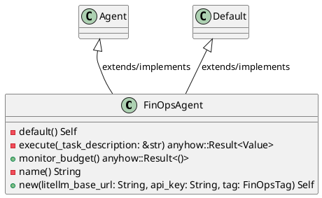
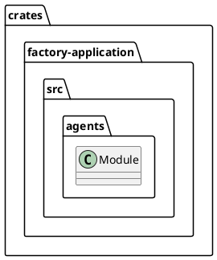
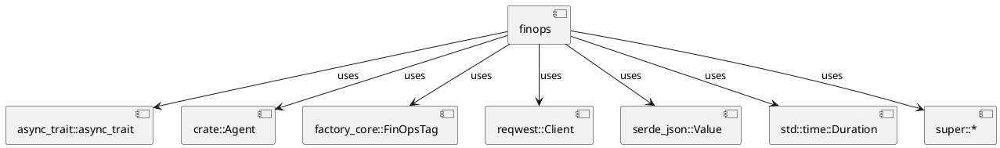
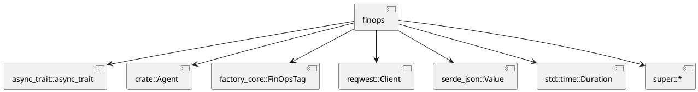
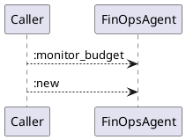
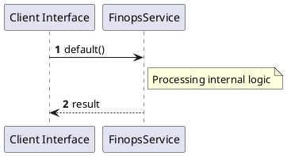

# File: finops.rs

**Source Path:** `crates/factory-application/src/agents/finops.rs`

## Overview

### Purpose
Provides implementation for finops.rs.

### Responsibilities
* Handles logic related to finops.

### Dependencies
* async_trait::async_trait, crate::Agent, factory_core::FinOpsTag, reqwest::Client, serde_json::Value, std::time::Duration, super::*

### Imported modules
* None

### Exported classes
* FinOpsAgent

### Exported interfaces
* None

### Exported functions
* None

## Public API

### Exported Classes / Structs / Interfaces

#### FinOpsAgent

**Overview:**
No description provided.

**Constructor:**

##### `new(litellm_base_url (String), api_key (String), tag (FinOpsTag))`
Parameters: litellm_base_url (String), api_key (String), tag (FinOpsTag)
Dependencies: Inherited from context
Initialization: Sets up FinOpsAgent

**Attributes:**

* `api_key` (String): Purpose - Stores api_key data. Constraints - Valid String.
* `client` (Client): Purpose - Stores client data. Constraints - Valid Client.
* `litellm_base_url` (String): Purpose - Stores litellm_base_url data. Constraints - Valid String.
* `tag` (FinOpsTag): Purpose - Stores tag data. Constraints - Valid FinOpsTag.

**Public Methods:**

##### `monitor_budget() -> anyhow::Result<()>`

###### Description
No description provided.

###### Inputs
None.

###### Output
Return type: anyhow::Result<()>
Semantic meaning: Result of monitor_budget
Possible null values: Conditional
Exceptions: None handled explicitly

###### Side Effects
Database updates: None
File operations: None
Network calls: None
Cache: None
State changes: Updates internal variables

###### Complexity
Time Complexity: O(1) mostly
Space Complexity: O(1) mostly

###### Example
```
let result = instance.monitor_budget();
```

**Private Methods:**

* `default() -> Self`: Internal helper logic.
* `execute(_task_description (&str)) -> anyhow::Result<Value>`: Internal helper logic.
* `name() -> String`: Internal helper logic.

### Exported Functions

None.

## Internal architecture



## Package Diagram



## Component Diagram



## Dependency Graph



## Call Graph



## Execution flow & Sequence explanation



## Examples

```
// Example usage of finops.rs components
import { ... } from 'crates/factory-application/src/agents/finops.rs';
```

## Cross References
* **Parent module:** `crates/factory-application/src/agents`
* **Dependencies:** async_trait::async_trait, crate::Agent, factory_core::FinOpsTag, reqwest::Client, serde_json::Value, std::time::Duration, super::*
