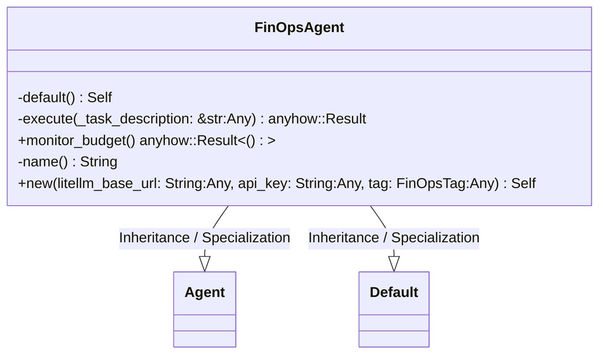
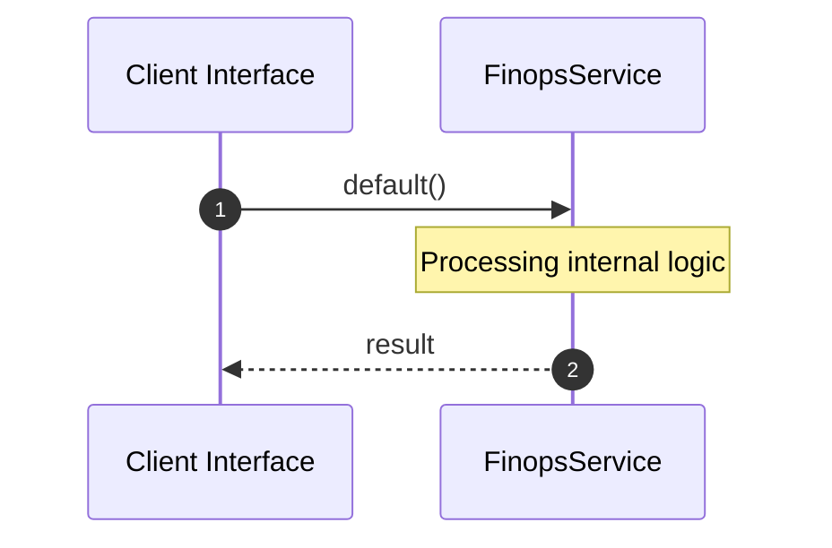
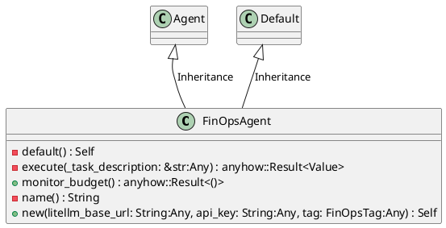
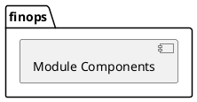
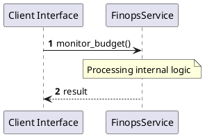
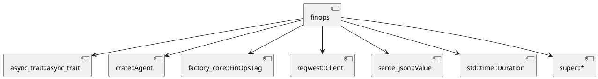
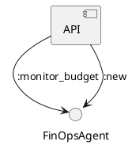

# File: finops.rs

**Source Path:** `crates/factory-application/src/agents/finops.rs`

## Overview

### Purpose
Provides implementation for finops.rs.

### Responsibilities
* Handles logic related to finops.

### Main Workflow
* Initialization and execution of finops logic.

### Dependencies
* async_trait::async_trait, crate::Agent, factory_core::FinOpsTag, reqwest::Client, serde_json::Value, std::time::Duration, super::*

### Imported modules
* None

### Exported classes
* FinOpsAgent

### Exported interfaces
* None

### Exported functions
* None

## Public API

### Exported Classes / Structs / Interfaces

#### FinOpsAgent

**Overview:**
Why it exists:
Provides capabilities related to FinOpsAgent.

What business capability it provides:
Supports core domain concepts.

How it collaborates with other classes:
Works with related entities to process logic.

**Constructor:**

##### `new(litellm_base_url: String (Any), api_key: String (Any), tag: FinOpsTag (Any))`
Parameters: litellm_base_url: String (Any), api_key: String (Any), tag: FinOpsTag (Any)
Dependencies: Inherited from context
Initialization: Sets up FinOpsAgent

**Attributes:**

* `api_key` (String): Purpose - Stores api_key data. Constraints - Valid String.
* `client` (Client): Purpose - Stores client data. Constraints - Valid Client.
* `litellm_base_url` (String): Purpose - Stores litellm_base_url data. Constraints - Valid String.
* `tag` (FinOpsTag): Purpose - Stores tag data. Constraints - Valid FinOpsTag.

**Public Methods:**

##### `monitor_budget() -> anyhow::Result<()>`

###### Description
Executes monitor_budget.

###### Inputs
None.

###### Output
Return type: anyhow::Result<()>
Semantic meaning: Result of monitor_budget
Possible null values: Conditional
Exceptions: None handled explicitly

###### Side Effects
Database updates: None
File operations: None
Network calls: None
Cache: None
State changes: Updates internal variables

###### Complexity
Time Complexity: O(1) mostly
Space Complexity: O(1) mostly

###### Example
```
let result = instance.monitor_budget();
```

**Private Methods:**

* `default() -> Self`: Internal helper logic.
* `execute(_task_description: &str (Any)) -> anyhow::Result<Value>`: Internal helper logic.
* `name() -> String`: Internal helper logic.

### Exported Functions

None.

## Internal architecture



## Execution flow & Sequence explanation



## UML

### Class Diagram


### Package Diagram


### Sequence Diagram


### Component Diagram
```plantuml
@startuml
component "finops" as comp
component "async_trait::async_trait" as async_trait::async_trait
comp --> async_trait::async_trait
component "crate::Agent" as crate::Agent
comp --> crate::Agent
component "factory_core::FinOpsTag" as factory_core::FinOpsTag
comp --> factory_core::FinOpsTag
component "reqwest::Client" as reqwest::Client
comp --> reqwest::Client
component "serde_json::Value" as serde_json::Value
comp --> serde_json::Value
component "std::time::Duration" as std::time::Duration
comp --> std::time::Duration
component "super::*" as super::*
comp --> super::*
@enduml

```

### Dependency Graph


### Call Graph


## Examples

```
// Example usage of finops.rs components
import { ... } from 'crates/factory-application/src/agents/finops.rs';
```

## Cross References
* **Parent module:** `crates/factory-application/src/agents`
* **Dependencies:** async_trait::async_trait, crate::Agent, factory_core::FinOpsTag, reqwest::Client, serde_json::Value, std::time::Duration, super::*
