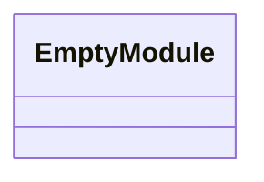
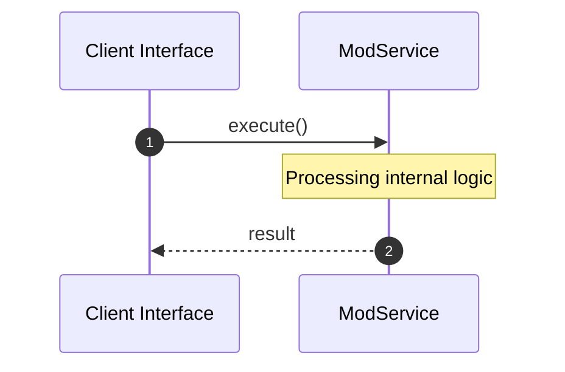
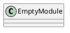
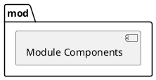
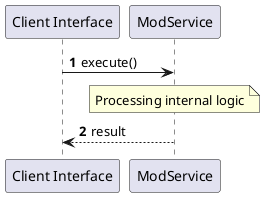
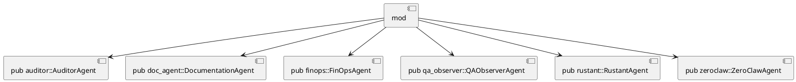
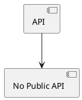

# File: mod.rs

**Source Path:** `crates/factory-application/src/agents/mod.rs`

## Overview

### Purpose
Provides implementation for mod.rs.

### Responsibilities
* Handles logic related to mod.

### Main Workflow
* Initialization and execution of mod logic.

### Dependencies
* pub auditor::AuditorAgent, pub doc_agent::DocumentationAgent, pub finops::FinOpsAgent, pub qa_observer::QAObserverAgent, pub rustant::RustantAgent, pub zeroclaw::ZeroClawAgent

### Imported modules
* None

### Exported classes
* None

### Exported interfaces
* None

### Exported functions
* None

## Public API

### Exported Classes / Structs / Interfaces

### Exported Functions

None.

## Internal architecture



## Execution flow & Sequence explanation



## UML

### Class Diagram


### Package Diagram


### Sequence Diagram


### Component Diagram
```plantuml
@startuml
component "mod" as comp
component "pub auditor::AuditorAgent" as pub auditor::AuditorAgent
comp --> pub auditor::AuditorAgent
component "pub doc_agent::DocumentationAgent" as pub doc_agent::DocumentationAgent
comp --> pub doc_agent::DocumentationAgent
component "pub finops::FinOpsAgent" as pub finops::FinOpsAgent
comp --> pub finops::FinOpsAgent
component "pub qa_observer::QAObserverAgent" as pub qa_observer::QAObserverAgent
comp --> pub qa_observer::QAObserverAgent
component "pub rustant::RustantAgent" as pub rustant::RustantAgent
comp --> pub rustant::RustantAgent
component "pub zeroclaw::ZeroClawAgent" as pub zeroclaw::ZeroClawAgent
comp --> pub zeroclaw::ZeroClawAgent
@enduml

```

### Dependency Graph


### Call Graph


## Examples

```
// Example usage of mod.rs components
import { ... } from 'crates/factory-application/src/agents/mod.rs';
```

## Cross References
* **Parent module:** `crates/factory-application/src/agents`
* **Dependencies:** pub auditor::AuditorAgent, pub doc_agent::DocumentationAgent, pub finops::FinOpsAgent, pub qa_observer::QAObserverAgent, pub rustant::RustantAgent, pub zeroclaw::ZeroClawAgent
