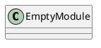
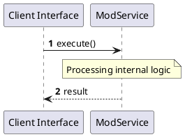

# File: mod.rs

**Source Path:** `crates/factory-application/src/agents/mod.rs`

## Overview

### Purpose
Provides implementation for mod.rs.

### Responsibilities
* Handles logic related to mod.

### Dependencies
* pub auditor::AuditorAgent, pub doc_agent::DocumentationAgent, pub finops::FinOpsAgent, pub qa_observer::QAObserverAgent, pub rustant::RustantAgent, pub zeroclaw::ZeroClawAgent

### Imported modules
* None

### Exported classes
* None

### Exported interfaces
* None

### Exported functions
* None

## Public API

### Exported Classes / Structs / Interfaces

### Exported Functions

None.

## Internal architecture



## Execution flow & Sequence explanation



## Examples

```
// Example usage of mod.rs components
import { ... } from 'crates/factory-application/src/agents/mod.rs';
```

## Cross References
* **Parent module:** `crates/factory-application/src/agents`
* **Dependencies:** pub auditor::AuditorAgent, pub doc_agent::DocumentationAgent, pub finops::FinOpsAgent, pub qa_observer::QAObserverAgent, pub rustant::RustantAgent, pub zeroclaw::ZeroClawAgent
