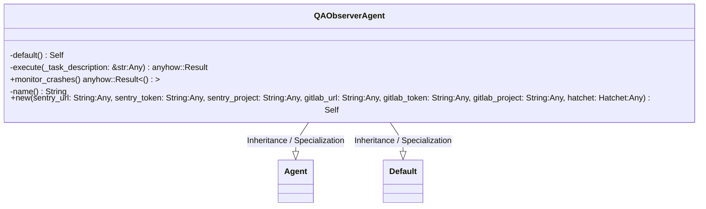
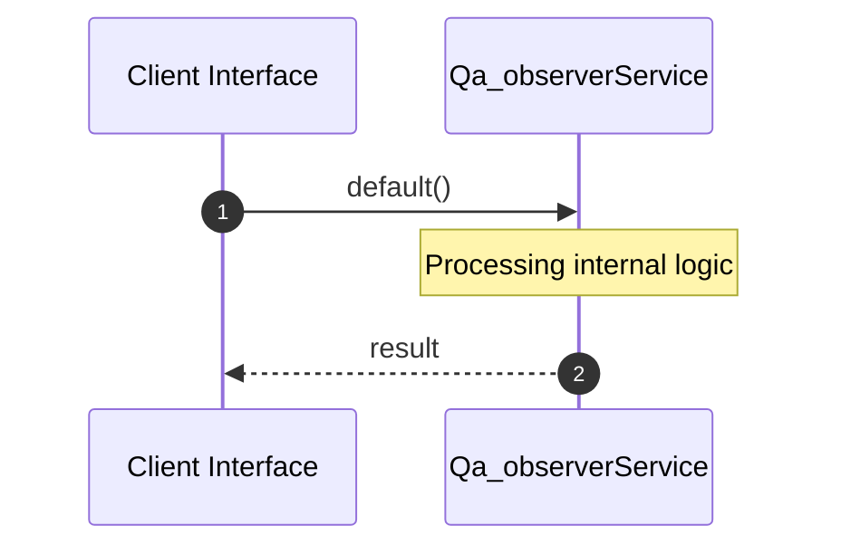
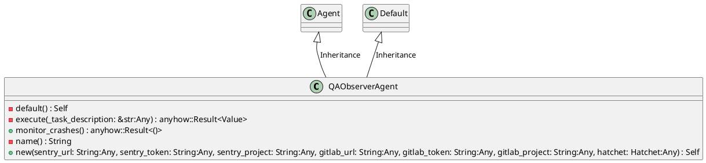
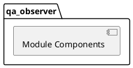
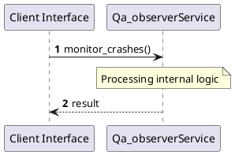
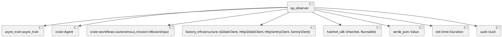
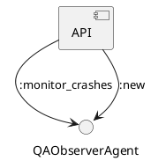

# File: qa_observer.rs

**Source Path:** `crates/factory-application/src/agents/qa_observer.rs`

## Overview

### Purpose
Provides implementation for qa_observer.rs.

### Responsibilities
* Handles logic related to qa_observer.

### Main Workflow
* Initialization and execution of qa_observer logic.

### Dependencies
* async_trait::async_trait, crate::Agent, crate::workflows::autonomous_mission::MissionInput, factory_infrastructure::{GitlabClient, HttpGitlabClient, HttpSentryClient, SentryClient}, hatchet_sdk::{Hatchet, Runnable}, serde_json::Value, std::time::Duration, uuid::Uuid

### Imported modules
* None

### Exported classes
* QAObserverAgent

### Exported interfaces
* None

### Exported functions
* None

## Public API

### Exported Classes / Structs / Interfaces

#### QAObserverAgent

**Overview:**
Why it exists:
Provides capabilities related to QAObserverAgent.

What business capability it provides:
Supports core domain concepts.

How it collaborates with other classes:
Works with related entities to process logic.

**Constructor:**

##### `new(sentry_url: String (Any), sentry_token: String (Any), sentry_project: String (Any), gitlab_url: String (Any), gitlab_token: String (Any), gitlab_project: String (Any), hatchet: Hatchet (Any))`
Parameters: sentry_url: String (Any), sentry_token: String (Any), sentry_project: String (Any), gitlab_url: String (Any), gitlab_token: String (Any), gitlab_project: String (Any), hatchet: Hatchet (Any)
Dependencies: Inherited from context
Initialization: Sets up QAObserverAgent

**Attributes:**

* `gitlab_client` (Box<dyn GitlabClient>): Purpose - Stores gitlab_client data. Constraints - Valid Box<dyn GitlabClient>.
* `gitlab_project` (String): Purpose - Stores gitlab_project data. Constraints - Valid String.
* `hatchet` (Hatchet): Purpose - Stores hatchet data. Constraints - Valid Hatchet.
* `sentry_client` (Box<dyn SentryClient>): Purpose - Stores sentry_client data. Constraints - Valid Box<dyn SentryClient>.
* `sentry_project` (String): Purpose - Stores sentry_project data. Constraints - Valid String.

**Public Methods:**

##### `monitor_crashes() -> anyhow::Result<()>`

###### Description
Executes monitor_crashes.

###### Inputs
None.

###### Output
Return type: anyhow::Result<()>
Semantic meaning: Result of monitor_crashes
Possible null values: Conditional
Exceptions: None handled explicitly

###### Side Effects
Database updates: None
File operations: None
Network calls: None
Cache: None
State changes: Updates internal variables

###### Complexity
Time Complexity: O(1) mostly
Space Complexity: O(1) mostly

###### Example
```
let result = instance.monitor_crashes();
```

**Private Methods:**

* `default() -> Self`: Internal helper logic.
* `execute(_task_description: &str (Any)) -> anyhow::Result<Value>`: Internal helper logic.
* `name() -> String`: Internal helper logic.

### Exported Functions

None.

## Internal architecture



## Execution flow & Sequence explanation



## UML

### Class Diagram


### Package Diagram


### Sequence Diagram


### Component Diagram
```plantuml
@startuml
component "qa_observer" as comp
component "async_trait::async_trait" as async_trait::async_trait
comp --> async_trait::async_trait
component "crate::Agent" as crate::Agent
comp --> crate::Agent
component "crate::workflows::autonomous_mission::MissionInput" as crate::workflows::autonomous_mission::MissionInput
comp --> crate::workflows::autonomous_mission::MissionInput
component "factory_infrastructure::{GitlabClient, HttpGitlabClient, HttpSentryClient, SentryClient}" as factory_infrastructure::{GitlabClient, HttpGitlabClient, HttpSentryClient, SentryClient}
comp --> factory_infrastructure::{GitlabClient, HttpGitlabClient, HttpSentryClient, SentryClient}
component "hatchet_sdk::{Hatchet, Runnable}" as hatchet_sdk::{Hatchet, Runnable}
comp --> hatchet_sdk::{Hatchet, Runnable}
component "serde_json::Value" as serde_json::Value
comp --> serde_json::Value
component "std::time::Duration" as std::time::Duration
comp --> std::time::Duration
component "uuid::Uuid" as uuid::Uuid
comp --> uuid::Uuid
@enduml

```

### Dependency Graph


### Call Graph


## Examples

```
// Example usage of qa_observer.rs components
import { ... } from 'crates/factory-application/src/agents/qa_observer.rs';
```

## Cross References
* **Parent module:** `crates/factory-application/src/agents`
* **Dependencies:** async_trait::async_trait, crate::Agent, crate::workflows::autonomous_mission::MissionInput, factory_infrastructure::{GitlabClient, HttpGitlabClient, HttpSentryClient, SentryClient}, hatchet_sdk::{Hatchet, Runnable}, serde_json::Value, std::time::Duration, uuid::Uuid
