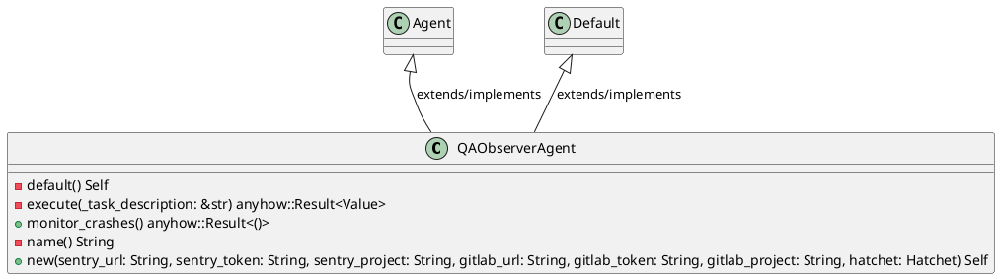
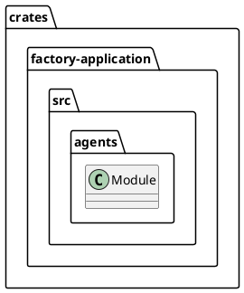
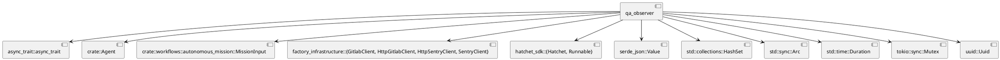
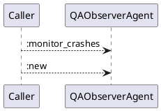
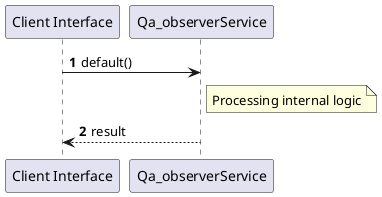

# File: qa_observer.rs

**Source Path:** `crates/factory-application/src/agents/qa_observer.rs`

## Overview

### Purpose
Provides implementation for qa_observer.rs.

### Responsibilities
* Handles logic related to qa_observer.

### Dependencies
* async_trait::async_trait, crate::Agent, crate::workflows::autonomous_mission::MissionInput, factory_infrastructure::{GitlabClient, HttpGitlabClient, HttpSentryClient, SentryClient}, hatchet_sdk::{Hatchet, Runnable}, serde_json::Value, std::collections::HashSet, std::sync::Arc, std::time::Duration, tokio::sync::Mutex, uuid::Uuid

### Imported modules
* None

### Exported classes
* QAObserverAgent

### Exported interfaces
* None

### Exported functions
* None

## Public API

### Exported Classes / Structs / Interfaces

#### QAObserverAgent

**Overview:**
No description provided.

**Constructor:**

##### `new(sentry_url (String), sentry_token (String), sentry_project (String), gitlab_url (String), gitlab_token (String), gitlab_project (String), hatchet (Hatchet))`
Parameters: sentry_url (String), sentry_token (String), sentry_project (String), gitlab_url (String), gitlab_token (String), gitlab_project (String), hatchet (Hatchet)
Dependencies: Inherited from context
Initialization: Sets up QAObserverAgent

**Attributes:**

* `gitlab_client` (Box<dyn GitlabClient>): Purpose - Stores gitlab_client data. Constraints - Valid Box<dyn GitlabClient>.
* `gitlab_project` (String): Purpose - Stores gitlab_project data. Constraints - Valid String.
* `hatchet` (Hatchet): Purpose - Stores hatchet data. Constraints - Valid Hatchet.
* `processed_events` (Arc<Mutex<HashSet<String>>>): Purpose - Stores processed_events data. Constraints - Valid Arc<Mutex<HashSet<String>>>.
* `r2r_client` (Option<Arc<dyn factory_infrastructure::R2rClient>>): Purpose - Stores r2r_client data. Constraints - Valid Option<Arc<dyn factory_infrastructure::R2rClient>>.
* `sentry_client` (Box<dyn SentryClient>): Purpose - Stores sentry_client data. Constraints - Valid Box<dyn SentryClient>.
* `sentry_project` (String): Purpose - Stores sentry_project data. Constraints - Valid String.

**Public Methods:**

##### `monitor_crashes() -> anyhow::Result<()>`

###### Description
No description provided.

###### Inputs
None.

###### Output
Return type: anyhow::Result<()>
Semantic meaning: Result of monitor_crashes
Possible null values: Conditional
Exceptions: None handled explicitly

###### Side Effects
Database updates: None
File operations: None
Network calls: None
Cache: None
State changes: Updates internal variables

###### Complexity
Time Complexity: O(1) mostly
Space Complexity: O(1) mostly

###### Example
```
let result = instance.monitor_crashes();
```

**Private Methods:**

* `default() -> Self`: Internal helper logic.
* `execute(_task_description (&str)) -> anyhow::Result<Value>`: Internal helper logic.
* `name() -> String`: Internal helper logic.

### Exported Functions

None.

## Internal architecture



## Package Diagram



## Component Diagram

```plantuml
@startuml
component "qa_observer" as Main
component "async_trait::async_trait" as async_trait__async_trait
Main --> async_trait__async_trait : uses
component "crate::Agent" as crate__Agent
Main --> crate__Agent : uses
component "crate::workflows::autonomous_mission::MissionInput" as crate__workflows__autonomous_mission__MissionInput
Main --> crate__workflows__autonomous_mission__MissionInput : uses
component "factory_infrastructure::{GitlabClient, HttpGitlabClient, HttpSentryClient, SentryClient}" as factory_infrastructure___GitlabClient__HttpGitlabClient__HttpSentryClient__SentryClient_
Main --> factory_infrastructure___GitlabClient__HttpGitlabClient__HttpSentryClient__SentryClient_ : uses
component "hatchet_sdk::{Hatchet, Runnable}" as hatchet_sdk___Hatchet__Runnable_
Main --> hatchet_sdk___Hatchet__Runnable_ : uses
component "serde_json::Value" as serde_json__Value
Main --> serde_json__Value : uses
component "std::collections::HashSet" as std__collections__HashSet
Main --> std__collections__HashSet : uses
component "std::sync::Arc" as std__sync__Arc
Main --> std__sync__Arc : uses
component "std::time::Duration" as std__time__Duration
Main --> std__time__Duration : uses
component "tokio::sync::Mutex" as tokio__sync__Mutex
Main --> tokio__sync__Mutex : uses
component "uuid::Uuid" as uuid__Uuid
Main --> uuid__Uuid : uses
@enduml

```



## Dependency Graph



## Call Graph



## Execution flow & Sequence explanation



## Examples

```
// Example usage of qa_observer.rs components
import { ... } from 'crates/factory-application/src/agents/qa_observer.rs';
```

## Cross References
* **Parent module:** `crates/factory-application/src/agents`
* **Dependencies:** async_trait::async_trait, crate::Agent, crate::workflows::autonomous_mission::MissionInput, factory_infrastructure::{GitlabClient, HttpGitlabClient, HttpSentryClient, SentryClient}, hatchet_sdk::{Hatchet, Runnable}, serde_json::Value, std::collections::HashSet, std::sync::Arc, std::time::Duration, tokio::sync::Mutex, uuid::Uuid
