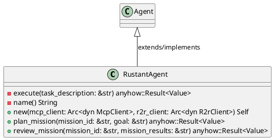
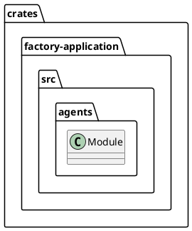
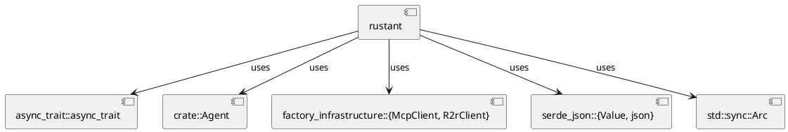
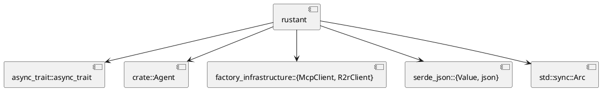
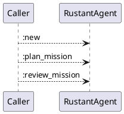
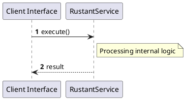

# File: rustant.rs

**Source Path:** `crates/factory-application/src/agents/rustant.rs`

## Overview

### Purpose
Provides implementation for rustant.rs.

### Responsibilities
* Handles logic related to rustant.

### Dependencies
* async_trait::async_trait, crate::Agent, factory_infrastructure::{McpClient, R2rClient}, serde_json::{Value, json}, std::sync::Arc

### Imported modules
* None

### Exported classes
* RustantAgent

### Exported interfaces
* None

### Exported functions
* None

## Public API

### Exported Classes / Structs / Interfaces

#### RustantAgent

**Overview:**
No description provided.

**Constructor:**

##### `new(mcp_client (Arc<dyn McpClient>), r2r_client (Arc<dyn R2rClient>))`
Parameters: mcp_client (Arc<dyn McpClient>), r2r_client (Arc<dyn R2rClient>)
Dependencies: Inherited from context
Initialization: Sets up RustantAgent

**Attributes:**

* `mcp_client` (Arc<dyn McpClient>): Purpose - Stores mcp_client data. Constraints - Valid Arc<dyn McpClient>.
* `r2r_client` (Arc<dyn R2rClient>): Purpose - Stores r2r_client data. Constraints - Valid Arc<dyn R2rClient>.

**Public Methods:**

##### `plan_mission(mission_id (&str), goal (&str)) -> anyhow::Result<Value>`

###### Description
No description provided.

###### Inputs
* `mission_id`: type=&str, meaning=Input for mission_id, valid values=Any valid &str, optional=No, default value=None
* `goal`: type=&str, meaning=Input for goal, valid values=Any valid &str, optional=No, default value=None

###### Output
Return type: anyhow::Result<Value>
Semantic meaning: Result of plan_mission
Possible null values: Conditional
Exceptions: None handled explicitly

###### Side Effects
Database updates: None
File operations: None
Network calls: None
Cache: None
State changes: Updates internal variables

###### Complexity
Time Complexity: O(1) mostly
Space Complexity: O(1) mostly

###### Example
```
let result = instance.plan_mission();
```

##### `review_mission(mission_id (&str), mission_results (&str)) -> anyhow::Result<Value>`

###### Description
No description provided.

###### Inputs
* `mission_id`: type=&str, meaning=Input for mission_id, valid values=Any valid &str, optional=No, default value=None
* `mission_results`: type=&str, meaning=Input for mission_results, valid values=Any valid &str, optional=No, default value=None

###### Output
Return type: anyhow::Result<Value>
Semantic meaning: Result of review_mission
Possible null values: Conditional
Exceptions: None handled explicitly

###### Side Effects
Database updates: None
File operations: None
Network calls: None
Cache: None
State changes: Updates internal variables

###### Complexity
Time Complexity: O(1) mostly
Space Complexity: O(1) mostly

###### Example
```
let result = instance.review_mission();
```

**Private Methods:**

* `execute(task_description (&str)) -> anyhow::Result<Value>`: Internal helper logic.
* `name() -> String`: Internal helper logic.

### Exported Functions

None.

## Internal architecture



## Package Diagram



## Component Diagram



## Dependency Graph



## Call Graph



## Execution flow & Sequence explanation



## Examples

```
// Example usage of rustant.rs components
import { ... } from 'crates/factory-application/src/agents/rustant.rs';
```

## Cross References
* **Parent module:** `crates/factory-application/src/agents`
* **Dependencies:** async_trait::async_trait, crate::Agent, factory_infrastructure::{McpClient, R2rClient}, serde_json::{Value, json}, std::sync::Arc
